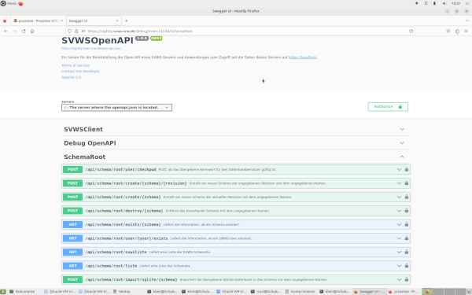

# Datenmigration

Neue Schemata oder vorhandene Schemata in der Datenbank des SVWS-Servers anlegen.

## Download von Testdaten

Für Testzwecke und Schulungen können Sie hier mehrere Schemata für verschieden Schulformen finden:
Hier findet man auch zu den Datenbanken passende Lupo Dateien etc., um sich passende Testfälle anzusehen.  
**Die Daten sind vollständig anonymisiert!**


[https://github.com/SVWS-NRW/SVWS-TestMDBs](https://github.com/SVWS-NRW/SVWS-TestMDBs)

## Übersicht

Es gibt mehrer Möglichkeiten ein Schemata in der Datenbank anzulegen bzw. zu befüllen: 

+ per GUI
+ per Swagger UI
+ per Curl Befehl
+ per Shell Skript
+ aus einer SQ-Lite Datensicherung 
+ aus einem SQL-Dump


## Einfügen per SwaggerUI

Eine Übersicht über die Webservices bietet die SwaggerUI. 
Hier kann man über *Try it Out* - Buttons jeweils die Services ausprobieren bzw. benutzen.
Die Swagger UI aufrufen:

```bash
		https://YourServerDomainName/debug/
```




   
**Achtung:** Um auf der SwaggerUI diesen Service bzw. die mit "Root" gekennzeichneten Services nutzen zu können, muss man sich zuerst authentisieren, indem man auf ein rechts abgebildetes Schloss klickt. 


Hier nun den User `root` der Maria-DB Installation und das entsprechende Passwort angeben. 


**Hinweis** Möchte man andere - nicht "root - Services" nutzen, so muss man sich mit dem Schild 3.0-Benutzer bzw. SVSW-Benutzer authorisieren.
 


Dann unter dem Abschnitt  
	-> "SchemaRoot /api/schema/root/migrate/mdb/{schema}"   
	-> *Try it Out*-Button  
drücken, so dass man diese Ansicht erhält:


Anschließend die folgenden Einträge unter der Maske ausfüllen:

+ **schema**: Hier steht der Name, der auch auf der Anmeldemaske dargestellt wird, z.B. Testschule. 
+ **Databasefile**: Hier können Sie z.B. eine Schild2.0-MDB-Datenbank aus der o.g. SVWS-TestMDBs einstellen.
+ **databasePassword**: Hier das Schild2.0-Datenbankpasswort angeben.
+ **SchemaUsername**: Einen beliebigen Usernamen angeben, z.B. svwsadmin, der bei der Einrichtung des Schemas auf der Datenbank für dieses Schema GRAND-Rechte erhält. 

Es kann auch schon ein existierender Benutzer genommen werden. 
Falls ein schon existierender user genommen wird, muss das anschließend abgefragte Passwort natürlich passen.

++ **SchemaUserPasswort**: Passwort der o.g. (neu angelegte) Maria-DB Users. 


# Schemata per Curl erstellen

```bash
 --user "%1:%2" -k -X POST "https://localhost/api/schema/root/migrate/mdb/%3" 
-H "accept: application/json" 
-H "Content-Type: multipart/form-data" 
-F "databasePassword=%4" 
-F "schemaUsername=%5" 
-F "schemaUserPassword=%6" 
-F "database=@%7"
```

+ %1: Benutzer der Datenbank mit GRAND-Rechten zum Anlegen neuer Datenbanken
+ %2: Passwort der o.g. Benutzers
+ %3: Name der neu anzulegenden Datenbank - Achtung: existierende Datenbanken werden überschrieben!
+ %4: Das allseits bekannte Schild 2.0 - Passwort, um die MDB-Datenbank zu öffnen. 
+ %5: Der neue MariaDB User für die neue Datenbank (Schuldatenbankadmin im Backend)
+ %6: Passwort der o.g. Benutzers
+ %7: vollständiger Pfad zur MDB auf dem Server - MIT @ davor!


Beispiel: 
```bash
curl --user "root:mariabd_root_pw" -k -X "POST" "https://server.svws-nrw.de/api/schema/root/migrate/mdb/svwsdb" \
	-H "accept: application/json"  \
	-H "Content-Type: multipart/form-data" \
	-F "databasePassword=kannManWissen" \
	-F "schemaUsername=svwsadmin" \
	-F "schemaUserPassword=svwsadmin_PW" \
	-F "database=@/root/SVWS-TestMDBs/GOST_Abitur/Abi-Test-Daten-01/GymAbi.mdb"
```


