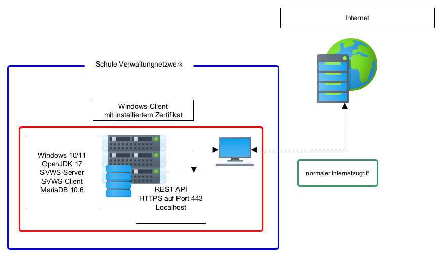

# IT-Umgebungen

## Szenarien

Der SVSW-Server ist so ausgelegt, dass er in allen schulischen Umfeldern eingesetzt werden kann. 
Wichtige Grundlage ist dabei weiterhin der dezentrale Ansatz, der im Land NRW vertreten wird:   
Kleine Grundschulen haben die Schulverwaltungssoftware ggf. auf einem Rechner installiert, größere Schulen besitzen unter Umständen einen oder mehrere Server. 
Andere Schulen haben IT-Dienstleister, die sie mit Serverinstallationen unterstützen. Denkbar ist ebenso der zentrale Einsatz in Rechenzentren. 

## Einzelplatz-Rechner
Mit Hilfe des Windows Installers kann der SVWS-Server und Schild3.0 auf einem einfachen Windows-10-64-Bit-Client-Rechner installiert werden. 
Der SVWS-Server öffnet dabei den Port 443, so dass der SVWS-Client auch von anderen Computern im Netzwerk erreicht werden kann.
Ein echter Server-Betrieb ist dadurch allerdings nicht gewährleistet, da der Einzelplatzrechner i.d.R. herunter gefahren wird.
Diese Installationsvariante ist für sehr kleine Schulen ohne weitere IT-Umgebung bzw. IT-Unterstützung denkbar.

## Eigener Server im Schulverwaltungsnetz
Die Variante, einen eigenen Server in der Schule zu betreiben, der im Verwaltungsnetzwerk abgekoppelt vom pädagogischen Netzwerk betrieben wird, 
ist die häufigste Installations-Art. Auch hier wird der Port 443 intern geöffnet, so das man den SVWS-webclient mit einem Webbrowser erreichen kann. 
Der SVWS-Server kann hierbei solwohl auf Basis eines Windows- als auch auf Basis eines Linuxbetriebssystems betrieben werden. 
Die Installtion auf Linuxbasis ermöglich den Schulen bzw. den Schulrägern eine lizenskostenfreie Installation des SVWS-Servers basierend auf Open Source Software. 

Das Zertifikat, welches bei der Installation erstellt wurde, sollte dann an die Clients per Gruppenrichtlinie oder manuell verteilt 
werden, damit der Browser die Verbindung auch als sicher einstuft. 
Alternativ kann der Server per Certbot ggf. über einem dazwischengeschalteten ReverseProxy zertifiziert werden. 

Über eine Dateifreigabe im lokalen Netz oder eine Gruppenrichtlinie kann Schild 3 auf den Windows-Clients verteilt werden. Um dann mit Schild 3 den Zugang zum SVWS-Server zu 
gewährleisten, muss in einer Übergangsphase noch der direkte Zugang zur MariaDB des SVWS-Servers geöffnet sein. Dieser Zugriff wird perspektivisch von Schild 3 auch über webservices erfolgen.

## Kommunaler Server im Rechenzentrum

In großeren Umgebungen sind verschiedene Varianten der Installation denkbar. Der SVWS-Server soll perspektivisch natürlich auch die Funktionalität von Schild-Zentral übernehmen können. 
Die Trennung der Schemata ist hier eine wichtige Datenschutz-Maßnahme. Aber auch die Aufteilung in verschiedene Container wird hier in Betracht gezogen.
In Rechenzentren macht es aus Lizenzgründen Sinn auf Linux-Systeme zu setzen.

---
