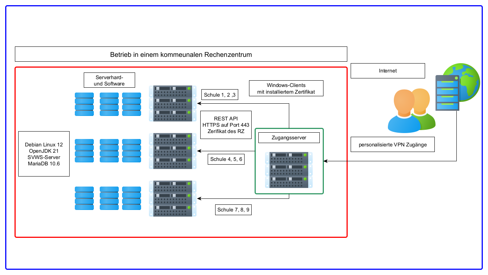

# SVWS - Deployment

## Deployment-Szenarien

Der SVSW-Server ist grundsätzlich so ausgelegt, dass er in quasi allen schulischen Umfeldern eingesetzt werden kann. 
Wichtige Grundlage ist dabei weiterhin der dezentrale Ansatz, der im Land NRW vertreten wird: 
Kleine Grundschulen haben die Schulverwaltungssoftware ggf. auf einem Rechner installiert, größere Schulen besitzen unter Umständen einen oder mehrere Server. 
Andere Schulen haben IT-Dienstleister, die sie mit Serverinstallationen unterstützen. Denkbar ist ebenso der zentrale Einsatz in Rechenzentren. 

## Einzelplatz-Rechner
Grundsätzlich kann der SVWS-Server und die Schild3.0-Installation auf einem Windows-10-64Bit-Client ausgeführt werden. 
Der SVWS-Server öffnet dabei den Port 443, so dass der SVWS-Client auch von anderen Computern im Netzwerk erreicht werden kann.
Ein echter Server-Betrieb ist hier allerdings nicht gewährleistet, da der Einzelplatzrechner ja unter Umständen herunter gefahren wird.
Diese Installationsvariante ist für sehr kleine Schulen ohne weitere IT-Umgebung bzw. IT-Unterstützung vorgesehen.

## Eigener Server im Verwaltungsnetz der Schule
Die Variante, einen eigenen Server in der Schule zu betreiben, der im Verwaltungsnetzwerk abgekoppelt vom pädagogischen Netzwerk betrieben wird, 
ist die häufigste Installations-Art. Auch hier wird der Port 443 intern geöffnet, so das der Client den SVWS-Client mit einem Webbrowser erreichen können sollte. 
Der SVWS-Server kann dabei auf Basis eines Windows- oder auf Linuxbetriebssystems betrieben werden. 

Dabei kann der SVWS-Installer auf einem Windows-10-64Bit-Server mit dem Windows-Installer installiert werden. 
Das Zertifikat, welches bei der Installation erstellt wurde, sollte dann an die Clients per Gruppenrichtlinie oder manuell verteilt werden, damit der Browser die Verbindung auch als sicher einstuft.

Mittelfristiges Ziel soll es auch sein, den SVWS-Server auch für Linux zur Verfügung zu stellen. Es ist geplant, dafür ein eigenes NPM-Reposotories aufzubauen. Dies soll zum einen die Abhängigkeit von Windows reduzieren, da der SVWS-Client ja grundsätzlich in jedem Browser angezeigt werden kann. Zum anderen soll es den Schulen helfen, Lizenzkosten zu sparen.

## Kommunaler Server im Rechenzentrum

In großeren Umgebungen sind verschiedene Varianten der Installation denkbar. Der SVWS-Server soll perspektivisch natürlich auch die Funktionalität von Schild-Zentral übernehmen können. 
Die Trennung der Schemata ist hier eine wichtige Datenschutz-Maßnahme. Aber auch die Aufteilung in verschiedene Container wird hier in Betracht gezogen.
In Rechenzentren macht es aus Lizenzgründen Sinn auf Linux-Systeme zu setzen.

---
