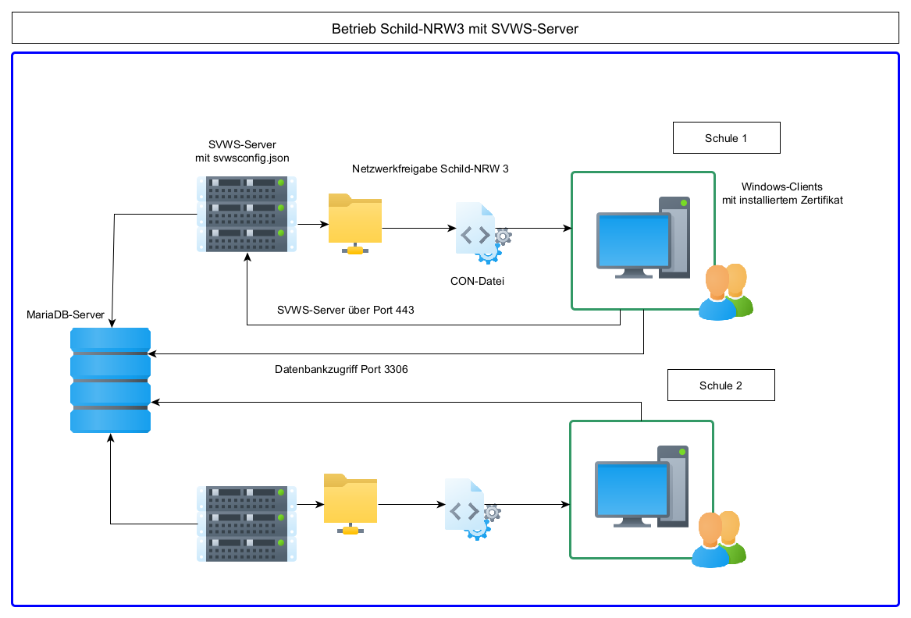

# Betrieb von Schild-NRW 3 und dem SVWS-Server

Grundsätzlich benötigt Schild-NRW 3 immer einen laufenden SVWS-Server.
Schild-NRW 3 prüft beim Start, ob der SVWS-Server erreichbar ist und vergleicht über die jeweiligen Versionsnummern, ob eine gültige Kombination vorliegt. Die gültigen Kombinationen können aus der Versionsgeschichte (Release Notes) entnommen werden.

Der SVWS-Server läuft unter Linux und Windows und ist in Java geschrieben.
Über die API können nicht nur die Daten zur Visualisierung abgerufen werden, sondern auch Statistik-Kataloge.
Zusätzlich können Operationen wie Backups oder Migrationen über den SVWS-Server abgewickelt werden.
Momentan benötigt Schild-NRW 3 aber noch den direkten Zugriff auf die MAriDB-Datenbank.

Es ist geplant im Laufe des Jahres 2025 Schild-NRW 3 so umzustellen, dass Schild-NRW 3 alle notwendigen Operationen über die API ausführen kann.
Dann würde der Zugriff auf die MAriaDB entfallen können. Ob das mit den zur Verfügung stehenden Ressourcen leistbar ist, ist momentan noch unklar.

## Übersicht

Der SVWS-Server kann auf Linux oder Windows betrieben werden.
Dazu muss ein JDK installiert werden. Beider Installer, sowohl Linux, als auch Windows bringen das JDK mit.
Die MariaDB-Datenbank kann separat betrieben werden. Diese kann aber auch auf dem selben Server installiert sein.

## Installation SVWS-Server

## Installation Schild-NRW 3

## Konfigurationen
