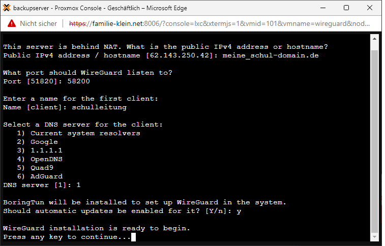

# Installation des VPN-Servers

## Vorbereitungen

### Auswahl der Maschine 

Es gibt mehrer Möglichkeiten wie ein VPN-Server betrieben werden kann:

- in einer Virtualisierungsumgebung (Proxmox, ESXi, ...) 
- im Containersystem (Docker, LXH, ...)
- direkt auf echter Hardware (Raspberry, PC, Server ...)
- im Router (Fritzbox, ...)
- als Teil einer Firewall (OpenSense, ...)

### Beipiele für Hardwarelösungen:

Hier gibt es mehrer Anbieter, die auch Hardwarelösungen anbieten. Ein paar wenige Beispiele sind hier nach kurzer Suche im Internet exemplarisch zu finden:

Fritzbox:  
https://www.computerbild.de/artikel/cb-News-Software-FritzOS-7.39-AVM-integriert-WireGuard-VPN-FritzBox-31230305.html

Shellfire:  
https://www.shellfire.de/blog/shellfire-box-4k-wireguard-vpn-router-power/

OpenSense:  
https://www.ovpn.com/de/guides/wireguard/opnsense

## WireGuard VPN-Server

Die Entscheidung für den Wireguard VPN-Server in der Testumgebung des SVWS-Servers ist aufgrund verschiedener Rahmenbedingungen gefallen: 

 - performant, da fest im Linux-Kernel verankert
 - Open Source
 - einfache Installation per Skript
 - installierbar auf einem Server oder einer virtuellen Maschine 
 - ebenfalls als Hardware erhältlich
 - einfache Wartung und Konfiguration per script
 - mögliche Weiterentwicklung (Konfiguration der VPN-Zugänge von außen)

Im Weitern wird als Basis eine virtuelle Debian 11 Maschine auf einem Proxmoxsystem verwendet. 

Ebenso ist die installation in einem LXH-Container möglich, jedoch mit einigen Konfigurationen auf dem Muttersystem verbunden, auf die hier nicht weiter eingegangen wird. 
Die Installation unterscheidet sich im Wesentlichen nicht von anderen Installationen auf anderen Virtualisierungen (ESXi, ...) oder echter Hardware.

### Installation des Debian 11 System

#### download debian 11 net install:  
https://cdimage.debian.org/debian-cd/current/amd64/iso-cd/debian-11.1.0-amd64-netinst.iso

Eine typische Debian Installation ausführen - einfach der Menueführung folgen und je nach Bedarf auch auf das grafische Frontend verzichten. 
Den SSH-Server direkt mit installieren, es wird in der Regel der SSH Zugang für die Wartung benötigt.

#### ggf aktualisieren

Bei einem frisch installierten System sollte dieser Schritt nicht nötig sein, 
man kann es aber trotzdem einmal ausführen, um auch die letzten Aktualisierungen geladen zu haben: 

		apt update
		apt upgrade -y
				
Nützliche Helfer installieren: 		
		
		apt install -y nmap curl git net-tools

#### ggf das root login per ssh zulassen:

Wenn man eine Fernsteuerung des Wireguard-Servers über SSH zulassen möchte sollte eine Anmeldung per root Account zumindest aus dem lokalen Netz heraus ermöglicht werden. 
Der ssh-root-login ist ohnehin in vielen Debian Installationen schon aktiviert, dies ist jedoch im Grunde ein vermeidbares Sicherheitsrisiko bei Maschinen, die auf diesem Port
 über das Internet erreichbar sind. Abhilfe schafft hier entweder das Abschalten des rootlogins, eine vorgelagerte Firewall oder die Absicherung 
 zum Beispiel mit [fail2ban](https://www.thomas-krenn.com/de/wiki/SSH_Login_unter_Debian_mit_fail2ban_absichern). 

Falls der ssh-root-login zugelassen werden soll, muss die Datei sshd_config editiert werden: 

		nano /etc/ssh/sshd_config

unter der auskommentierten Zeile

		#PermitRootLogin prohibit-password
		
Folgendes einfügen: 

		PermitRootLogin yes
		
SSH neu starten: 
		
		sudo service sshd restart
		

## Alternative: LXC Container

Hier müssen noch einige Voraussetzungen beachtet werden: 

## Installation von Wireguard per Script 

Benötigt wird eich echter IPv4 Anschluss. (kein ds-light)
Download des Installationsscrpits und Installation starten: 

		wget https://git.io/wireguard -O wireguard-install.sh && bash wireguard-install.sh

(Quellen werden noch nachgearbeitet.)
Als Port kann auch irgendein Port in den höheren Bereichen gewählt werden, wie hier dargestellt port 58200. 

(Die Nachfrage zum Installieren von BoringTun erfolgt nur bei LXH-Containern.)

## Portfreigabe

Um nun den Wireguard-Server aus dem Internet erreichen zu können und darüber eine VPN-Verbindung ins eigene Verwaltungsnetz herzustellen, 
benötigt man eine Portfreigabe auf dem Router bzw. der eingesetzten Firewall. 
Dies muss in der Regel durch den zuständigen IT-Dienstleister eingerichtet werden. 
Exemplarisch wird hier die [Einrichtung einer Portfreigabe bei einer Fritzbox](Einrichtung_Portfreigabe.md) gezeigt. 

## Fernsteuerung per ssh

Die Einrichtung der *Fernsteuerung per ssh* ermöglicht es auf dem SVWS-Server durch Absetzen einfacher Befehle VPN Verbindungen zu verwalten. 
Im Folgenden wird die Arbeit über die Konsole des SVWS-Servers ausgeführt.

### SSH autologin einrichten
 
Auf dem SVWS-Server als SVWS-Standart-Benutzer einen permanenten ssh Schlüssel mit dem Maschine *wireguard* austauschen:

		ssh-keygen -t rsa -b 4096
		ssh-copy-id -i ~/.ssh/id_rsa.pub root@wireguard

Nun können Root Befehle auf dem Wireguard-Server auch vom SVWS-Server aus abgesetzt werden. 

	
### wireguard_user einrichten		

Um einfach Wireguard-user einzurichten kann der Befehl wirguard_user benutzt werden. 
Dieses Skript muss jedoch erst einmal heruntergeladen und als ausführbare Datei im Wirguard-Server etabliert werden.
		
		ssh root@wireguard
		git clone https://github.com/familie-klein/wireguard_user/
		
(Quellen werden noch nachgearbeitet.)
Wiregurad_user systemweit für root aufrufbar machen.
		
		cp wireguard_user/wireguard_user /sbin/
		chmod a+x /sbin/wireguard_user	
		exit
		
### Benutzung vom terminal des SVWS-Servers aus

So können Sie alle Wirguard-Benutzer auflisten: 

		ssh wireguard -q -l root -t "wireguard_user -l"
		
#### Beispiel: Einrichten des Wireguard-Benutzers *test*: 
		
		ssh wireguard -q -l root -t "wireguard_user -u test -a"
		
Als Rückmeldung gibt die Konsole die config datei für den Wireguard client aus.  		

Alternativ kann diese Konfigurations-Datei auch gespeichert werden: 		

		ssh wireguard -q -l root -t "wireguard_user -u test -a" >> test-user.conf
		

Man das config file auch direkt als QR-Code im Terminal angezeigen lassen.
Dzu benötigt man das tool qrencode
		
		apt install qrencode
		
QR Code erzeugen: 
		
		qrencode -t UTF8 < test-user.conf
		
oder auch alles in Einem: 

		ssh wireguard -q -l root -t "wireguard_user -u test -a" | tee test-user.conf > qrencode -t UTF8
		
bzw. inklusive Speichern des QRcodes und der config Datei:  

		ssh wireguard -q -l root -t "wireguard_user -u test -a" | tee test-user.conf > qrencode -o test-user.png -t PNG

#### Beispiel: Löschen des users *test*:

		ssh wireguard -q -l root -t "wireguard_user -u test -d"

---------------------------------------------

## Quellen: 

https://github.com/angristan/wireguard-install 

https://www.bennetrichter.de/anleitungen/wireguard-linux/

https://www.bitblokes.de/wireguard-vpn-server-einrichten-ubuntu-raspberry-pi-linux-android/

https://github.com/angristan/wireguard-install/blob/88ae1c0d0f5d4f48252fd3be27b2f122e40edf83/wireguard-install.sh

https://blog.peterge.de/wireguard-lxc-unter-proxmox/

https://www.youtube.com/watch?v=D1zp6n7ushM

https://apfelcast.com/die-einfachste-opensource-vpn-wireguard-installation-auf-proxmox-lxc/