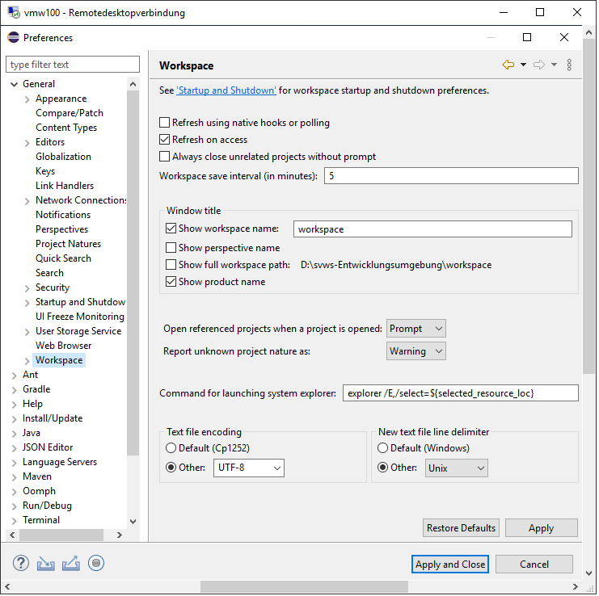

# Installation unter Windows 10 64bit


## Systemvoraussetzungen und Installationshinweise
Die gesamte Entwicklungsumgebung belegt in etwa 3 GB und sollte auf einem lokalem Laufwerk liegen.

### MariaDB installieren

+ download : MariaDB 10.6
+ root user einrichten

### Eclipse installieren und konfigurieren

+ Installieren von eclipse-inst-win64.zip (aktuelle Version) (Eclipse IDE for Java Developers)-> https://www.eclipse.org/downloads/
+ Einmalig Eclipse starten und den Workspace festlegen: `D:\\svws_Entwicklungsumgebung\workspace\`
+ Bei Bedarf den Speicher hochsetzen: per texteditor `D:\svws_Entwicklungsumgebung\workspace\eclipse.ini` entsprechend z.B. aus der 512 eine 2048 machen


+ Eclipse > Help > Eclipse Marcetplace... -> JSON editor suchen und "JSON Editor Plugin" installieren (empfohlen)


+ Eclipse > Window > Preferences > General > Editors > Text Editors > Spelling > UTF-8


+ Eclipse > Window > Preferences > General > Workspace > Text file encodig > Other UTF-8



## Git Repositories in Eclipse einrichten 

+ Eclipse > Windows > Perspektive > Open Perspective > Other  -> Git

### Quellen aus GitLab eintragen:

+ Repositories in Eclipse clonen: rechte Maustaste Git > Clone a Git Repository
+ URL eingeben
+ https://github.com/SVWS-NRW/SVWS-Server (Mono-Repository mit Core, DB, Client und UI-Components und Apps)

Anschließend git clone ausführen.

## Gradle Projekt laden

+ Nun müssen nur noch in der "java perspektive" die im git Verzeichnis liegenden gradle Projekte importiert werden.
+ Import Project > Import existing Gradle-Project
+ Als Zielordner das Git Repository auswählen

## SVWS Einstellungen

Die Beispiel-Config ins Zielverzeichnis kopieren und umbenennen.

```
 git/SVWS-Swerver/svws-server-app/src/main/resources/svwsconfig.json.example git/SVWS-Swerver/svws-server-app/svwsconfig.json
```
		
Beispiel einer svwsconfig.json, bitte die userdaten und Passwörter entspechend anpassen:
		
```json
{
"EnableClientProtection" : null,
"DisableDBRootAccess": false,
"DisableAutoUpdates" : false,
"UseHTTPDefaultv11": false,
"PortHTTPS": 443,
"UseCORSHeader": true,
"ClientPath": ".../git/SVWS-Server/svws-webclient/build/output",
"LoggingEnabled": true,
"LoggingPath": "logs",
"TempPath": "/home/svwsdeveloper/temp",
"TLSKeystorePath": ".",
"TLSKeystorePassword": "svwskeystore",
"DBKonfiguration": {
	"dbms": "MARIA_DB",
	"location": "localhost",
	"SchemaKonfiguration": [
		{
		"name": "schildtest",
		"svwslogin": false,
		"username": "svwsadmin",
		"password": "svwsadmin"
		}
		]
	}
}
```

# Checkstyle einrichten

+ Checkstyle Plugin aus dem Eclipse-Marketplace installieren.
+ Eclipse Neustart
+ rechte Maustaste auf das SVWS-Server-Projekt > Checkstyle > aktivate Checkstyle
+ Windows > Show View > Other > Checkstyle > Checkstyle Problems


# Sonatype Server einrichten

Der Sonartype Server wird nur von den Core-Team-Mitgliedern genutzt.

# Optionale Software 


## DBeaver
+ download: https://dbeaver.io/download/

## VSCodeUserSetup
+ Install VSCodeUserSetup-x64-latest.exe (optional)

## git per terminal auf Windows 

+ Ohne Administrationsrechte installierbar
+ hier die Anleitung auf heise.de -> https://www.heise.de/tipps-tricks/Git-auf-Windows-installieren-und-einrichten-5046134.html
+ download:  https://git-scm.com/download/win
+ Im MSB noch den Proxy eintragen: git config --global http.proxy http://10.64.128.22:3128

# Installation in einer Proxy-Umgebung

```
Eclipse > Windows > Preferences > General > Network Connection
````

den Http und den Https-Proxy eintragen. (Sollte er automatisch finden, wenn konfiguriert.)

Powershell öffnen im Ordner SVWS-Server
Proxy Config für NodeJS

```shell
		npm config set proxy http://proxy.company.com:8080
		npm config set https-proxy http://proxy.company.com:8080
```
