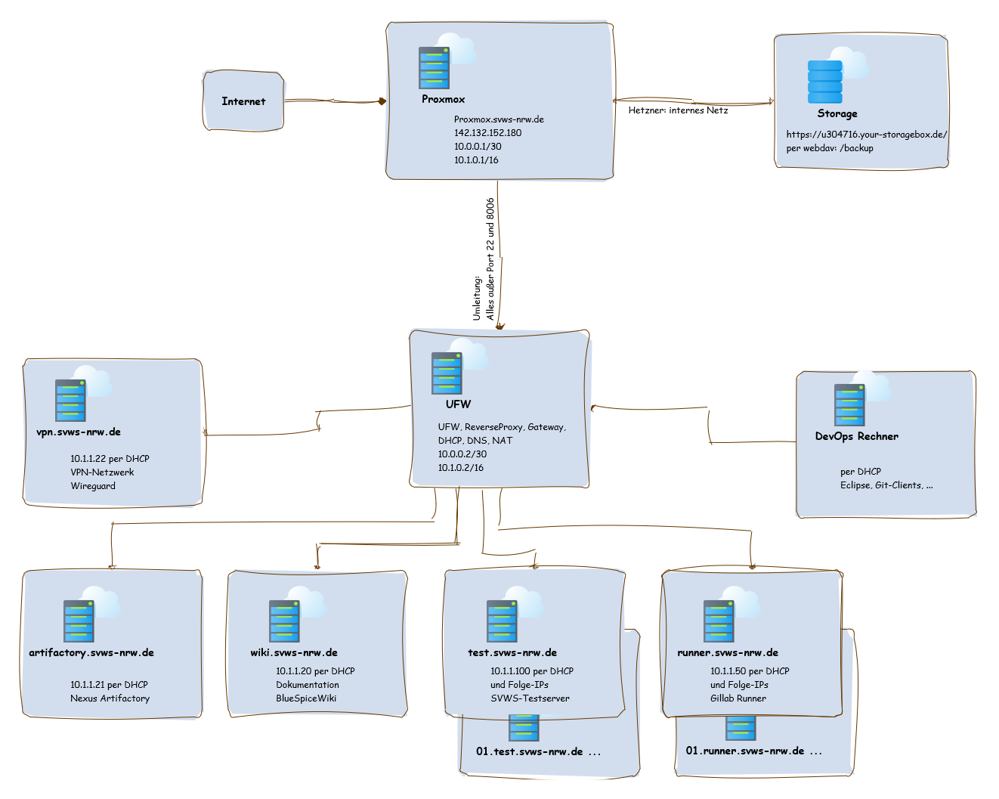

# Devops Server bei Hetzner

Wir haben viele Anbieter verglichen und nach ausgiebiger Prüfung und unter Berücksichtigung aller Vergabekriterien bei Hetzner und 1 blue 
unsere Server aufgebaut. 

# Produkte

Hier ein Angebot vom Frühjahr 2022: 

+ Produkte: AX Line NVME + 2 TB SSD in Deutschland  
69.02€/mntl.
+ Backup: 20% * 69.02€  
13,8€/mntl.
+ Storage zum Backup: 5 TB  
11,87€/mntl. 
+ Domain: 11,90€/a  
ca 1€/nmtl.

Summe bisher: 95,68€/mntl

# Hardware

## Server
+ RAM: 	128 GB DDR4 ECC
+ Disk: 	2 x 1.92 TB NVMe SSD Datacenter Edition
+ Connection: 	1 GBit/s-Port
+ Guaranteed bandwidth: 	1 GBit/s
+ Backup space: 	100 GB
+ Traffic: 	Unlimited

## Backupstorage
Storage: 5TB mit 20 täglichen automatischen Snapshots

# Abrechnung

- Monatlich 1/4 Jährlich und Jährlich 
- ebenso die passende Kündigungsfrist
- beim Dedivcated Server im Voraus zu bezahlen
- per Rechnung -> Überweisung auswählen

# Domain und Serverlandschaft

- svws-server.de  
Ist per DNS weiterhin bei 1 blue. Hier läuft der Testserver und das mailsystem.  
Alle anderen Anfragen werden zu Hetzner per A-Record \* Eintrag weitergegeben.

- gitlab.svws-server.de  
 5GB-10GB / 18GB+  
 1 blue 
- artefactory.svws-server.de  
5GB-10GB / 100GB  
Hetzner
- mattermost.svws-server.de  
1blue 
- server.svws-server.de  
SVWS-server zum testen oder zeigen  
Hetzner
- runner01.svws-server.de  
in Bearbeitung  
Hetzner
- wiki.svws-server.de  
Hetzner
- ldap.svws-server.de  
1GB / 8GB  
in Planung  
- nextcloud.svws-server.de  
2GB / 100Gb  
in Planung 
- wireguard.svws-server.de  
Hetzner
- UFW.svwsv-server.de  
reverseProxy, UFW, DHCP, DNS  
Hetzner
- mail xyz@svws-server.de  
per Weboberfläche  
1 blue 
- graphana.svws-server.de  
1GB / 20GB  
in Planung

# Monitoring und Updates

Ideen: ansible, telegraph und Graphana

# Vlans und Netzwerk

Ein internes Vlan einrichten für die ssh Zugänge zu den Servern und zu der ProxmoxOberflächen
Zughang nur per Wireguard oder über Hetznerkonsole. SSH rootlogin ist per se aus und es wird fail to ban eingerichtet. 

[Download GraphML](./graphics/Proxmox_Netzwerk.graphml)

# Backup 

Alle im Proxmox-Backup aufgeführten Maschinen werden in den dort konfiguriertem Rhythmus als Backup auf das Storage geschrieben. 
Das Backupstorage ist per mount auf dem Proxmox eingebunden. 
Im Storage wiederum werden für die letzten 20 Tage zyklisch Snapshots erstellt, die im Falle einer Ransom Attacke wiederhergestellt werden können.

