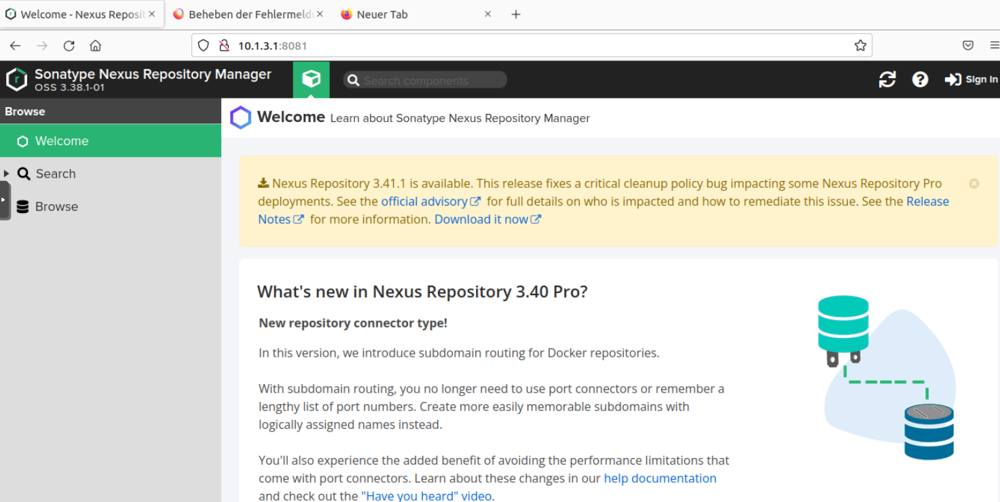

# Artifactory Server

## Vorüberlegungen

Wir benutzen den Artifactory Server von Sonatype Nexus

https://de.sonatype.com/products/nexus-repository?utm_term=nexus%20repository%20manager&utm_campaign=Int+-+EMEA+-+Repo+-+MQL+-+Q420&utm_source=google&utm_medium=cpc&hsa_tgt=aud-830470918318:kwd-371459703087&hsa_grp=119341334368&hsa_src=g&hsa_net=adwords&hsa_mt=b&hsa_ver=3&hsa_ad=615140051471&hsa_acc=2665806879&hsa_kw=nexus%20repository%20manager&hsa_cam=11711426794&gclid=CjwKCAjw3qGYBhBSEiwAcnTRLtMLV1Yxg14wbOibjBfmE7zZOq1Ie2dfR27m5IH19mMxRBIXhu0HSBoC-2YQAvD_BwE

Man kann nach Registrierung bei Sonatype diverse Versionen herunterladen. 

## Hardware

+ 2 cpu
+ 16 GB Ram
+ 2 GB swap
+ 250 GB HD

## Installation 

Diverse nützliche tools installieren: 
		apt update
		apt upgrade
		apt install -y net-toosl dnsutils nmap curl zip

nexus-3.38.1-01-mac.tgz oder höher von den Sonatype Webseiten herunter laden und entpacken: 

		tar zxvf nexus-3.38.1-01-mac.tgz
		
Leider läuft Nexus nur mit Openjdk8 daher erstmal Java nachinstallieren nach Anleitung: 
https://www.kernelhost.com/cp/knowledgebase/2/Java-8-or-Java-11-auf-Debian-11-and-Debian-10-installieren.html

		apt install apt-transport-https ca-certificates wget dirmngr gnupg software-properties-common -y
		wget -qO - https://adoptopenjdk.jfrog.io/adoptopenjdk/api/gpg/key/public | apt-key add -
		add-apt-repository --yes https://adoptopenjdk.jfrog.io/adoptopenjdk/deb/
		apt update
		apt install adoptopenjdk-8-hotspot -y

Einen user "arti" anlegen unter dem der artifactory laufen soll. 

		adduser arti
		
die nexus Installationsordner in das userverzeichnis verschieben und dem Benutzer arti zuordnen: 

		mv nexus-3.38.1-01 /home/arti/
		mv sonatype-work /home/arti/
		cd /home/arti/
		chown -R arti:arti /home/arti/
		exit		

Als user arti anmelden und die Installation ausführen:

		 nexus-3.38.1-01/bin/nexus start

Testen, ob alles läuft: 

		nexus-3.38.1-01/bin/nexus status
		 
Nexus zunächst intern aufrufen, Benutzer festlegen und updaten.

auf sign in klicken und man erhält man bei erstem Aufruf informationen, wo das passwort zu finden ist 