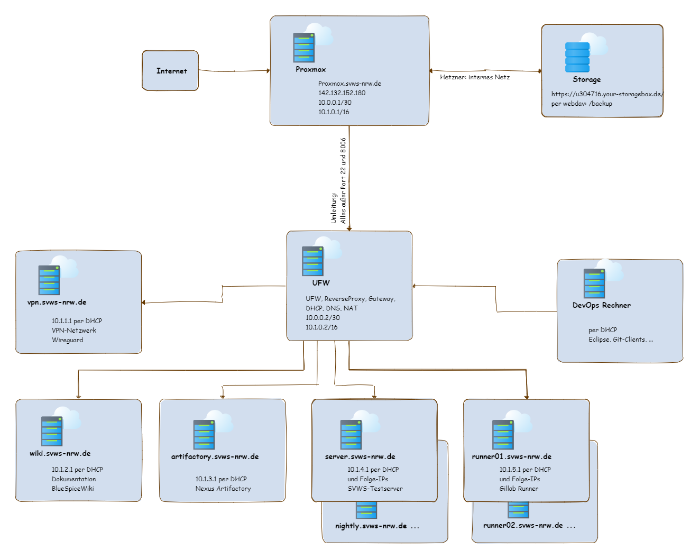

***Installation des Proxmox-Servers***
====================

# Literatur

Proxmox installation bei Hetzner: 
https://community.hetzner.com/tutorials/install-and-configure-proxmox_ve/de

Proxmox mit einer IP:
https://www.youtube.com/watch?v=_NIZxwzCSaM

vswitch von Hetzner im Proxmox einbinden
https://forum.proxmox.com/threads/hetzner-vswitch-vlan-konfig.58385/

# Architektur 

[Planung des Proxmoxservers](Planung_Proxmox.md) bei Hetzner.

[Download GraphML](./graphics/Proxmox_Netzwerk.graphml)

# Vorbereitung

Debian 11 updaten & upgraden

hostnamen  in /etc/hosts und /etc/hostname anpassen

in der Hertzner Webumgebung den Reverse einrichten, hier:

proxmox.svws-nrw.de 

Software: 

		apt install nmap sshfs cifs-utils 

## storage einbinden

eine Storage-Box kann hinzugebucht werden und in Debian gemountet werden: 

Vorgehen analog zu: 
https://docs.hetzner.com/de/robot/storage-box/access/access-samba-cifs

1) Einloggen per sft und als Hauptuser uXXXXXX 

		sftp -P 23 uXXXXXX@uXXXXXX.your-storagebox.de

Ein aussagekräftiges Backupverzeichnis anlegen. 

2) In der Web-Konfigurations-Oberfläche einen Unteruser anlegen. 
Passwörter neu erstellen und gut abspeichern Ggf samba aktivieren

3) Software nachinstallieren, wenn man  es noch nicht gemacht hat ... 		

 Backup Verzeichnis in Debian anlegen und mounten ausprobieren:

		mount.cifs -o user=uXXXXXX-sub1,pass=abcdefghi //uxxxxxx-sub1.your-storagebox.de/uxxxxxx-sub1 /backup

4) dauerhaftes Mounten: 

in /etc/fstab die folgenden eintrgäge machen: 

//uxxxxxx-sub1.your-storagebox.de/uxxxxxx-sub1 /backup cifs iocharset=utf8,rw,credentials=/etc/backup-credentials.txt,file_mode=0660,dir_mode=0770 0 0

		nano /etc/backup-credentials.txt

user=uxxxxxx-sub1
pass=abcdefg

Anschießend sollte das mounten funktionieren 

mount -a 

schreiben, löschen und reboot testen 

# proxmox installieren

https://pve.proxmox.com/wiki/Install_Proxmox_VE_on_Debian_11_Bullseye

"keine gültige Subsciprtion" popup entfernen: 

https://tfta.de/forum/thread/31-proxmox-ve-keine-g%C3%BCltige-subscription-meldung-entfernen-bzw-deaktivieren/

# postfix konfigurieren

https://www.digitalocean.com/community/tutorials/how-to-install-and-configure-postfix-as-a-send-only-smtp-server-on-ubuntu-18-04-de

mit leichten Anpassungen an der Firewall und certbot (s.u.) 

# Firewall bei Hetzner schärfen: 

[TODO]

# Firewall auf dem Proxmox [disabeld]

[haben wir mit iptables analog zum tutorial (s.u.) gelöst]

		#apt install ufw -y
		#ufw allow SSH
		#ufw allow 8006/tcp
		#ufw enable

# Nat per Iptables: 

		iptables -t nat -A PREROUTING -i enp7s0 -p udp -j DNAT --to 10.0.0.2 
		
		iptables-save

# encrypt

// wird nicht benutzt, sondern das auf der ProxmoxOberfläche generierte Certifikat

		#ufw disable 
		#apt install certbot -y
		#certbot certonly --standalone --rsa-key-size 4096 --agree-tos --preferred-challenges http -d proxmox.svws-nrw.de
		#ufw enable

		#systemctl enable certbot.timer
		#systemctl start certbot.timer

bei letsencrypt hat man zusätzlich das Problem, dass proxmox an einer anderen Stelle seine Zertifikate speichert. 
Daher besser direkt auf der Proxmoxoberfläche das Cert-generieren anstoßen.

# Proxmox Certifikate generieren

# Proxmox Backup einrichten

[ToDo]

# Benutzerverwaltung

Permissions: direkt unter Datacenter -> "permissions" (hier ... nicht in einem weiteren Unterverzeichnis) können group oder auch diskrete Userrechte zugefügt werden

User hinzufügen: unter "users" natürlich das Hinzufügen einzelner User, sinnvoll ist hier die Benutzung des PVE-Realms

Zweifaktor für den Realm aktivieren: unter "realms" -> PVE anschalten & oath auswählen

Für jeden user zum Beispiel mit Hilfe der Google Authentificator app einen TFA verknüpfen: 
	
## 	Zweifaktor Authentisierung einrichten: 
	-> two Factor 
	-> add -> totp 
	-> user auswählen 
	-> in Description MUSS irgendwas stehen 
	-> Issuer Name kann gerne angepasst werden (für den user lesbarer)
	-> Qr Code scannen 
	-> verify code 
	
und fertig ... 

# root login abschalten

Achtung: erst andere user anlegen!

		adduser username
		
login testet und dann den user login von root per ssh verbieten:

		nano /etc/ssh/sshd_config
		
Eintrag abändern auf: 
-> PermitRootLogin no

root login unter der Proxmoxoberfläche abschalten: 

 -> Datacenter
 -> permissions
 -> users
 -> root
 bei enabeled den Haken rausnehmen

# fail to ban

https://www.thomas-krenn.com/de/wiki/SSH_Login_unter_Debian_mit_fail2ban_absichern

# opensense (verworfen)

Beim Handling der OpenSense gab es Probleme mit der Durchreichung / Erreichbarkeit des DNS Dienstes und der Zertifikate zum Updaten der Opensense, 
so dass wir uns entschieden haben die Funktionalitäten des reverse Proxy und der Firewall auf einem Debian 11 zu installieren. (siehe nächstes Kapitel)
Dafür spricht, dass wir die personellen Ressourcen (im Gegensatz zur OpenSense) dazu haben.

pfSense oder OpenSense? -> OpenSense!

https://www.youtube.com/watch?v=79yuldjWccQ

https://www.youtube.com/watch?v=-mFEib0zQWg

https://www.youtube.com/watch?v=4p1lw4FEfok

# Hilfreiche Tools

apt install -y net-tools dnsutils nmap curl zip

# UFW, Gateway und Nginx als ReverseProxy

## Literatur: 

https://goneuland.de/debian-11-bullseye-ufw-uncomplicated-firewall-einrichten/

https://unknownworkspace.de/2022/05/10/reverse-proxy-unter-debian-11-installieren/

https://raymii.org/s/tutorials/Strong_SSL_Security_On_nginx.

https://linuxize.com/post/how-to-setup-a-firewall-with-ufw-on-debian-10/

https://askubuntu.com/questions/1151289/ufw-rules-with-nat-masquerading

https://en.wikipedia.org/wiki/Dnsmasq

# UFW einrichten

apt install ufw nmap net-tools dnsutils

ufw allow ssh 
ufw allow http
ufw allow https

ufw enable
ufw status

# DHCP & DNS einrichten

## Den alten resolved Dienst entfernen

		systemctl stop systemd-resolved

		systemctl disable systemd-resolved

		systemctl mask systemd-resolved

## Firewallregeln anpassen

		ufw allow bootps

Die Öffnung der Ports 53 kann man weglassen, wenn man wie weiter unten beschrieben, 
die ganze Komunikation über die innere Netzwerkkarte zulässt.
		ufw allow 53/udp
		ufw allow 53/tcp
		
## DNSMasq für DNS, DHCP einrichten:

		apt-get install dnsmasq

In der /etc/dnsmasq.conf folgende Anpassungen machen: 

		interface=eth1

		listen-address=127.0.0.1

		domain=svws-nrw.de

		dhcp-range=10.1.2.20,10.1.2.200,12h

bei Bedarf schon mal fixe Einrtäge für zukünftige Server setzen: 

		dhcp-host=92:FF:7C:A9:6A:52,wiki.svws-nrw.de,10.1.1.20
		...

Und Neustarten des Dienstes

		systemctl start dnsmasq

Ggf. müssen bei den DHCP-Clients auch die Netzwerkkarten neu gestartet werden, um die IP Zuweisung per DHCP auszulösen. 

## Gateway bzw. Masqerading einrichten

siehe: https://gist.github.com/kimus/9315140

In /etc/default/ufw folgenden Eintrag an entsprechender Stelle vornehmen
		
		DEFAULT_FORWARD_POLICY="ACCEPT"
		
In /etc/ufw/sysctl.conf folgende Zeile auskommentieren: 

		net.ipv4.ip_forward=1
		
Bei Bedarf auch für IPv6. (Info: wir haben nicht die /etc/systctl.conf angepasst)

Wichtig ist hierbei die Zuordnung der richtigen Netzwerkkarte: 
Das (de-) Masquerading der Pakete erfolgt auf der WAN-seitigen Netzwerkkarte - hier eth0.
Folgende Eintragung zu Begin der /etc/ufw/before.rules eintragen: 

		# NAT table rules
		*nat
		# Forward traffic through eth0 - Change to match you out-interface
		-A POSTROUTING -o eth0 -j MASQUERADE
		# don't delete the 'COMMIT' line or these nat table rules won't
		# be processed
		COMMIT

Dann noch, wie oben schon erwähnt, die innere Schnittstelle nach Innen hin öffnen

		ufw allow in on eth1 from any
		
und die Firewallregeln anwenden
		ufw disable && sudo ufw enable

# Troubleshooting: 

Route anzeigen
		ip route

Route neu setzen: 
		ip route replace default via 10.1.0.2 dev eth0

		
Firewallregeln anzeigen
		ufw status numbered
		
Firewallregeln ('Nummer' aus status ablesen) löschen
		ufw delete 'Nummer'

# Nginx als ReverseProxy einrichten

## Literatur: 

https://indibit.de/reverse-proxy-mit-nginx-mehrere-server-hinter-einer-ip-per-subdomain-ansprechen/

		apt-get install -y nginx nginx-extras
		unlink /etc/nginx/sites-enabled/default

		cd /etc/nginx/sites-available
		nano reverse-proxy.conf
		
folgendes Eintragen: 

		server {
			server_name wiki.svws-nrw.de;
			location / {
                proxy_pass      http://10.1.1.20;
        }
}

		ln -s /etc/nginx/sites-available/reverse-proxy.conf /etc/nginx/sites-enabled/reverse-proxy.conf

		nginx -t
		
		nginx -s reload

## Certifikate einrichten

		apt-get install -y certbot python3-certbot-nginx
		
Eine Emailadresse wird benötigt, um diese bei der Vergabe der Zertifikate zu hinterlegen. Hier werden Renewal-Erinnerungen hingeschickt.

VOR ausführen des python skripts "certbot --nginx" kann man schon eine einfache ReverseProxy.config anlegen mit den Domainnamen. Das Skript aktualisiert diese automatisch um die nötigen ssl Eintragungen: 

		nano /etc/nginx/sites-enable/reverse-proxy.conf 
		
Aufbau der Datei: 		

		server
		{
        server_name server.svws-nrw.de;
        location / {
                proxy_pass      http://10.1.1.20;
        }
		server
		{
        server_name wiki.svws-nrw.de;
        location / {
                proxy_pass      http://10.1.1.21;
        }

		certbot --nginx
		certbot renew --dry-run
		
Prüfen, ob die regelmäßge Aktivierung angeschaltet ist: 
		systemctl list-timers

[ToDo]

## http auf https umlenken

[ToDo]

# virtuelle Maschinen einrichten

siehe: [virtuelle Maschine einrichten](vm_einrichten.md)

## DNS Eintrag

unter der entsprechenden DNS eintragungsmöglichkeit, 
aktuell bei 1 blue, den entsprechenden eintrga vornehmen: 
