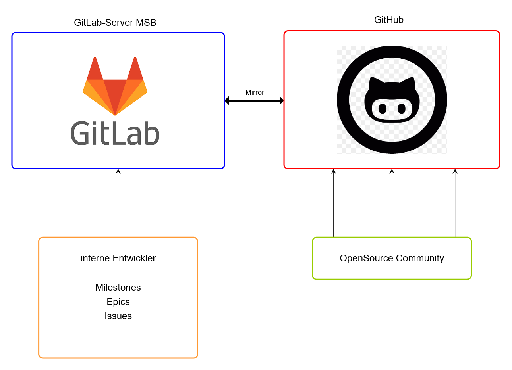

# Gitlab und GitHub

Der Code wird auf dem Gitlab-Server der MSB entwickelt.
https://git.svws-nrw.de

Jedes Repository wird automatisch nach Github gespiegelt.
https://github.com/SVWS-NRW

Aus historischen Gründen befindet sich das Server-Repository noch unter https://github.com/FPfotenhauer/SVWS-Server.
Dies wird beim OpenSource-Gang aber in die Organisation SVWS-NRW verschoben werden!

Insgesamt kann auf dem Gitlab-Server eingecheckt werden, wenn Entwickler die Zugänge erhalten haben.

## Information für Entwickler im SVWS-Server-Projekt

### Dokumentation:
https://git.svws-nrw.de/svws/svws-dokumentation
Hier steht die gesammelte Dokumentation zur Verfügung.
Diese wird mittels VitePress auch auf einer Seite zur Verfügung stehen, wenn das Projekt öffentlich wird.

