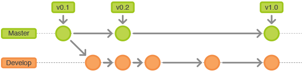

***Git Workflow***
=========================================================
# Software 

Um an den Repositories mitzuarbeiten benötigt man git: 
+ unter Linux: `apt install git`
+ unter Windows download [gitBash](https://gitforwindows.org/)

		

# Repositories 

Beim Development des SVWS-Servers soll die Versionierung (v0.1, v0.2, ... ) im Master branch festgehalten werden. 

Die eigentliche Arbeit des Developmentteams findet auf dem Develop-Branch statt:

Urheber der Grafik: [seibert-media.net](https://infos.seibert-media.net/display/Productivity/Git-Workflows+-+Der+Gitflow-Workflow) veröffentlicht unter [creative-common-lizens](https://infos.seibert-media.net/display/seibertmedia/Inhalte+von+Seibert+Media+unter+Creative-Commons-Lizenz)

## Übersicht: Git Projekte

Das Projekt maßgeblich auf [git.svws-nrw.de](https://git.svws-nrw.de) entwickelt: 

		git clone https://git.svws-nrw.de/svws/SVWS-Server
		git clone https://git.svws-nrw.de/svws/SVWS-UI-Framework
		git clone https://git.svws-nrw.de/svws/SVWS-Client

Diese drei genannten Repositories werden in Zukunft zu einem zusammengefasst. 
Ebenso findet man einen Spiegel der Repositries unter [Github](https://github.com/FPfotenhauer?tab=repositories):

+ [github.com/FPfotenhauer/SVWS-Client](https://github.com/FPfotenhauer/SVWS-Client)
+ [github.com/FPfotenhauer/SVWS-Server](https://github.com/FPfotenhauer/SVWS-Server)
+ [github.com/SVWS-NRW/SVWS-UI-Framework](https://github.com/SVWS-NRW/SVWS-UI-Framework)

Je nach Betätigungsfeld und Berechtigung macht es auch Sinn weitere Repositories zu clonen: 

		git clone https://git.svws-nrw.de/svws/svws-dokumentation
		git clone https://git.svws-nrw.de/svws/SVWS-TestMDBs
		git clone https://git.svws-nrw.de/svws/SVWS-Packages
		git clone https://git.svws-nrw.de/svws/SVWS-Transpiler
		git clone https://git.svws-nrw.de/svws/jbcrypt
		
## Workflow Development

### Erstellen eines Feature-Branch
Nachdem man die für seine Arbeit erforderlichen Repositories gecloned hat wechselt man für die Entwicklungsarbeit zunächst auf den Developer-Branch: 

		git checkout dev

Zur Kontrolle, auf welchen Branch man sich befindet: 

		git branch

Ausgehend vom Develeper Branch erstellt sich der einzelne Entwickler bzw die Kleinstgruppe einen eigenen Feature-Branch. Zum Beispiel: 

		git branch my_feature
		git checkout my_feature
		git push -u origin my_feature
		

Urheber der Grafik: [seibert-media.net](https://infos.seibert-media.net/display/Productivity/Git-Workflows+-+Der+Gitflow-Workflow) veröffentlicht unter [creative-common-lizens](https://infos.seibert-media.net/display/seibertmedia/Inhalte+von+Seibert+Media+unter+Creative-Commons-Lizenz)

### Tägliche Arbeit im Feature-Branch

In dem täglichen Ablauf wird auf dem lokal geclonten Verzeichnis der neue Code gespeichert ggf. neue Dateien abgelegt oder Dateien gelöscht. 
Alle neuen Dateien, die ins Verzeichnis gespeichert wurden werden im lokalen Repository beigefügt durch:
		
		git add -A
		
Alle diese Änderungen werden automatisch lokal versioniert mit:
		
		git commit -a
		
Am Ende eines Arbeitstages möchte man gerne die durch commit angelegten Versionen auch auf dem Server vorhalten durch: 

		git push

### Rückführung in den Develop-Branch

Nach mehreren Commits ist ggf. das Feature fertig bzw. auf dem Stand einer Beta-Version, die Einzug halten kann in den Develop-Branch. 
Per Pull-Requests bittet man nun die Zuständigen, das Feature in den Develop-Branch zu mergen. 
Je nach Berechtigung kann man es auch selbständig wie folgt in den lokalen Develop-Branch mergen und in das zentrale Repository pushen:

Aktualisieren und Wechseln ins Develop-Branch

		git pull origin develop
		git checkout develop
		
Zusammenführen und zum Git_Server pushen: 

		git merge my_feature
		git push

Falls die Entwicklung des Features abgeschlossen ist kann man ggf das lokale Branch löschen mit:

		git branch -d some-feature

### Problembehandlung

		git status 
		
Gibt den Stand des lokal vorgehaltenen Repositories bzgl. des ausgewählten Branches auf dem Git-Server an. 

Falls mehrere Developer auf einem Branch arbeiten ist es wichtig zunächst mit einem Pull die letzten Änderungen vom Server 
zum lokalen Repository zu syncronisieren. 

		git pull 

TODO: Frank fragen, wann er rebase einsetzt .... 

		git rebase
		

# Workflow Releases

## Anlegen eine neuen Release-Branch

		git checkout -b release-0.1 develop

Im Grunde wird ein Release analog zum oben beschriebenen Vorgehen bei einzelnen Features von Develop-Branch abgetrennt. 
Ziel ist dann jedoch nicht eine weiterführende Programmierung sondern ein intensieves Testen auf dem eingefrohrenen Zustand 
und eine Vorbereitung der Softwareauslieferung. 

Urheber der Grafik: [seibert-media.net](https://infos.seibert-media.net/display/Productivity/Git-Workflows+-+Der+Gitflow-Workflow) veröffentlicht unter [creative-common-lizens](https://infos.seibert-media.net/display/seibertmedia/Inhalte+von+Seibert+Media+unter+Creative-Commons-Lizenz)

## Hotfixes im laufenden Release

Urheber der Grafik: [seibert-media.net](https://infos.seibert-media.net/display/Productivity/Git-Workflows+-+Der+Gitflow-Workflow) veröffentlicht unter [creative-common-lizens](https://infos.seibert-media.net/display/seibertmedia/Inhalte+von+Seibert+Media+unter+Creative-Commons-Lizenz)
		
		

Urheber der Grafik: [seibert-media.net](https://infos.seibert-media.net/display/Productivity/Git-Workflows+-+Der+Gitflow-Workflow) veröffentlicht unter [creative-common-lizens](https://infos.seibert-media.net/display/seibertmedia/Inhalte+von+Seibert+Media+unter+Creative-Commons-Lizenz)
