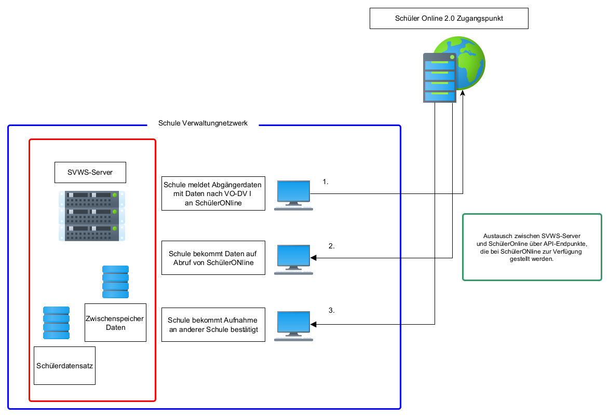

# Schüler Online 2.0

## Übersicht

Import und Exportvorgänge zu SchülerOnline 2.0 (SO2)

## Schule sendet Abgängerdaten an SO2

Im SVWS-Client kann ein User mit entsprechenden Zugriffsrechten die betroffenen Schüler als zu meldende Abgänger auswählen. Wenn alle Daten kontrolliert sind, kann eine Autenthifizierung stattfinden und die Daten gesendet.

## Schule empfängt Daten für neue SO2
Über den Menüpunkt Datenimport SO2 im SVWS-Webclient empfängt der berechtigte User die Daten und bekommt eine Übersichtsliste.
Der User wählt die Datensätze aus, die importiert werden sollen. Duplikate werden mit enem Warnhinweis angezeigt!
Danach werden die Schüler in den Status "Neuaufnahme" importiert.

## Schule empfängt Aufnahmebestätigung von anderer Schule über SO2
Die Schule erhält von den als abgehend gemeldeten Schülerinnen und Schülern die Schule und einen Bestätgungsvermerk, das die Aufnahme an anderer Schule erfolgt ist.

## möglicher Workflow in der Schule

### Fall 1:
Je nach Schulform verlassen nach dem Jahrgang 10 verlassen die meisten snoch schulplfichtigen Schülerinnen und Schüler die Schule. Diese müssen für SchülerOnline im Web-Client "markiert" werden. Unter Datenaustausch gibt des den Menüpunkt SchülerOnline, den man mit entsprechender Berechtigung aufrufen kann.
Hier wird nun die Liste der Schülerinnen und Schüler zur Kontrolle angeboten. Im Hintergrund laufen nun die folgenden Prozesse ab:   
Nach entsprechender Authentifizierung werden XSchule-XMLs erstellt und an SchülerOnline übergeben. Dort wird ein Merkmal gesetzt, sodass eine zweite Übermittlung erkannt werden kann. Die Schülerinnen und Schüler bzw. deren Erziehungsberechtigte bekommen dann einen Zugangscode, mit dem sie ihre Daten in SO2 kontrollieren können und sich eine neue Schule aussuchen können. 

### Fall 2:
Ein für SchülerOnline zuständige Lehrkraft mit entsprechenden Rechten meldet sich an und klick auf den Reiter Datenaustausch > SchülerOnline 2. Nach dem Klick auf den entsprechenden Button zum Abholen der Daten erscheint eine Meldung "Wir haben neue Schülerdaten für Sie!". Danach kann man in einer Übersichtstabelle die ankommenden Schülerdaten ansehen und kontrollieren. Es werden Duplikate mit einem Warnhinweis sehr deutich angezeigt! Der User kann dann die gewünschten Importdaten markieren und in die Datenbank übernehmen. Diese werden mit dem Status "Neuaufnahme" in den gewünschten Container importiert. 
