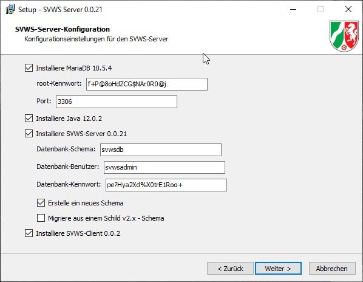

***SVWS-Installer***
====================

# Systemvoraussetzungen

+ Windows 10 64bit
+ 16 GB RAM
+ Auflösung min 1920x1080 fullHD
+ 300 MB freier Speicherplatz

# Installationshinweise

Der SVWS-Installer wird für Windows64bit mit InnoSetup erstellt. 
Er installiert die im Folgenden genannten Komponenten und startet alle Dienste. Eine Migration kann optional durchgeführt werden.

Der SVWS-Installer übernimmt die folgenden Aufgaben:

+ Installation einer MariaDB-Instanz, wenn nicht vorhanden
+ Update einer bestehenden MariaDB-Instanz
+ Installation der Java-Laufzeitumgebung, wenn nicht vorhanden
+ Update der Java-Umgebung
+ Installation des SVWS-Servers, wenn nicht vorhanden
+ Update des SVWS-Servers
+ Abfrage aller notwendigen Kennwörter für MariaDB und SVWS-Server
+ Abfrage aller benötigten Informationen für den Keystore und das SSL-Cert
+ Registrieren und Starten des MariaDB-Dienstes
+ Registrieren und Starten des SVWS-Server-Dienstes
+ Anlegen eines leeren Schemas in MariaDB
+ Anlegen eines selbst signierten SSL-Zertifikats
+ Abspeichern des Zertifikats unter User/Dokumente
+ Anlegen der Freigaben für die Windows Firewall, damit der Server auch für andere Clients erreichbar ist.
+ Ggf. Migration aus einer bestehenden Datenbank in das neue Schema

# Installationseinstellungen wählen

Zu Beginn des Installer erscheinen nach der Annahme der Lizenzvereinbarungen folgende Optionen:

### ***Achtung!***
	
*Es werden für MariaDB und den Datenbank-User Zufallskennwörter generiert!*

*Ändern Sie diese nach Ihren Wünschen, aber <b>dokumentieren Sie in jedem Fall Ihre Eingabe</b>.*	

*Ohne diese Kennwörter kann Ihnen später im Supportfall nicht geholfen werden!*

---

# Installation MariaDB

Der Installer erkennt anhand der Registry-Einträge, ob MariaDB bereits installiert ist und in welcher Version. 
Wenn ein eigener MariaDB-Server installiert wird, muss entweder ein anderer Port verwendet werden, oder es muss später eine Verbindung zum bestehenden Server hergestellt werden.
Ist die Option deaktiviert und es wird keine svwsconfig.json gefunden wird, dann erscheint eine Seite zur Angabe der Zugangsdaten zum bestehenden Server.
Ist die Installation aktiviert wird der MariaDB-Server in den Programm-Verzeichnissen installiert. Der Dienst wird als Windows-Service registriert und gestartet.
Mit dem Installer kann die MariaDB-Version zu zu späteren Zeitpunkten dann auch aktualisiert werden.

Programmverzeichnis MariaDB: `C:\Programme\SVWS-Server\db Datenverzeichnis MariaDB: C:\ProgramData\SVWSServer\data`

Die sort_buffer_size wird in der my.ini im data-Verzeichnis auf 16777216 gesetzt!

# Installation JDK
Mit dem Installer wird auch das verwendetet JDK ausgeliefert. 
Dieses ist an den SVWS-Server gekoppelt und kann in zukünftigen Versionen auch nur noch in Kombination mnit dem eigentlichen Server installiert 
oder geupdated werden.

Zielverzeichnis JDK: `C:\Programme\SVWS-Server\java`

# Installation SVWS-Server
Die notwendigen Dateien des SVWS-Server werden standardmäßig unter 
`C:/Programme/SVWS-Server/svws-server`  installiert. 
Da diese mit der ausgeliferten OpebJDK-Version zusammen passen müssen, werden diese beiden Teile miteinander verbunden und können nicht separat installiert werden.

Die Aufrufe werden in Form von Batch-Dateien mit der Endung .cmd im Hauptverezichnis ausgeliefert.
Die Dienste MariaDB und SVWS-Server werden in der Computerverwaltung registriert und automatisch gestartet.

# svwsconfig.json Konfigurationsdatei

C:\ProgramData\SVWS-Server\res

Svwsconfig.json.jpg

In dieser Datei wird die Serverkonfiguration gespeichert.

DisableDBRootAccess: Hier kann bei erhöhtem Sicherheitsbedarf der Root-Zugang zur Datenbank gesperrte werden.
UseHTTPDefaultv11: Hier kann auf HTTP/1.1 herunter geschaltet werden.
PortHTTPS: Hier kann der Port von 443 auf einen anderen Port gesetzt werden, falls dieser schon belegt.
UseCORSHeader: Die Verwendung des CORSHeader kann deaktiviert werden.
TLSKeystorePath: Pfad zum Keystore für das Zertifikat
TLSKeystorePassword: Das Passwort für den Keystore. (Wird automatisch generiert.)
ClientPath: Pfad: zu den Dateien des SVWS-Cllient. (Webanwendung in Entwicklung)
LoggingEnabled: Schaltet das Logging ein.
LoggingPath: Pfad zu den LOG-Dateien.

DBKonfiguration
dbms: Datenbanksystem (MariaDB oder MSSQL, SQLite für Schulungsumgebungen)
location: ServerURL
defaultschema: Standart-Schema. Es können mehrere Schema verwendet werden.
SchemaKonfiguration
name: Name des Datenbankschemas
svwslogin: LogIn-Prozess auch über das DBMS möglich. (User muss dann im DBMS angelegt sein.) Z.Z. nicht unterstützt!
username: Datenbankusername
password: Passwort des Datenbankusers
Registrierung der Dienste
SVWSDienste.jpg

Die beiden Server werden als Windows Dienst registriert. Diese können in der Computerverwaltung überprüft werden.

Erstellen des Keystore/Zertifikat
Im Keystore des SVWS-Server wird ein selbstsigniertes Zertifikat erstellt. Der öffentliche Teil wird in den Ordner C:\Users\{Username}\Dokumente gespeichert. Dieses Zertifikat muss dann in der Zertifikatsspeicher des Windowssystems installiert werden.

SVWSZertifikat.jpg

Ort: Vertrauenwürdige Stammzertifikate

Bitte beachten Sie das nur Chrome und Edge automatisch diese Zertifikate nutzen. Firefox muss in der about:config die Einstellung security.enterprise_roots.enabled auf true gesetzt haben.

Uninstaller
Im Programmverzeichnis des SVWS-Server befindet sich auch ein signierter Uninstaller mit dem alle Installationsdateien wieder entfernt werden können.

Bitte beachten Sie, dass Dateien, die nach der Installation hinzugefügt wurden nicht erfasst werden.

Außerdem sollte kontrolliert werden, ob auch alle Dienste entfernt wurden. Windows 10 gibt in einigen Fällen die Dienste nicht schnell genug frei, so dass die Löschung scheitert.

Wichtige Pfade zu den Ordnern
Als Default-Verzeichnisse werden vorgeschlagen:

C:\Program files\SVWS-Server
Für alle Prgramm-Dateien inklusive MariaDB und Java-Umgebung.

C:\ProgramData\SVWS-Server
Für alle Daten und Logs und Einstellungsdateien.
Außerdem werden hier die Dateien für den SVWS-Client abgelegt.

C:\Users\{Username}\AppData\Local\Temp
Hier werden die Log-Files des Installers und Uninstallers gespeichert.

C:\Users\{Username}\Dokumente
Hier wird das erzeugte Zertifikat für die Browser erzeugt.

Pakete im SVWS-Installer
Eine Auflistung aller benötigten Pakete und links zu den Quellen finden Sie in der Deployment-Übersicht:

https://schulverwaltungsinfos.nrw.de/svws/wiki/index.php?title=Deployment-%C3%9Cbersicht#Download_der_ben.C3.B6tigten_Pakete