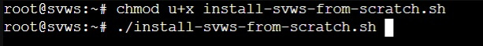
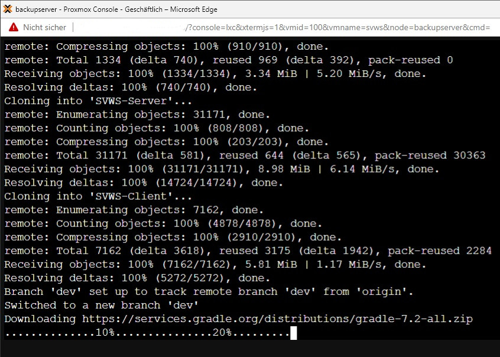

***Installation des SVWS-Servers***
====================

# per Script

Dieses Installations-Script ist wurde entwickelt für die vollständige Installation des SVWS-Servers auf Debian 11. 
Es wurde getestet in einem [Proxmox-Container](006_Einrichten_Proxmox-Container.md). 
Aktuell werden noch Token-Zugänge zum Github SVWS-Server und SVWS-Client Repository benötigt und im Script abgefragt. 
Dieser Schritt* entfällt bei Veröffnetlichung der SVWS-Servers auf Git Hub unter OpenSource-Lizens

+ Download [install-svws-from-scratch.sh](scripts/install-svws-from-scratch.sh)
+ ausführbar machen: `chmod -x install-svws-from-scratch.sh`
+ Script starten: `./install-svws-from-scratch`



+ geben Sie Ihren Github-Usernamen und das Token an*
+ geben Sie das MBD Passwort für Schild an



Die Angabe des Schild Passwortes ist nur nötig, wenn auch eine Schild2-Datenbank importiert werden soll. Dies kann im Anschluss an die Installation noch erfolgen. 

Nach etwa 10-15 min ist der SVWS-Server inklusive aller benötigten Bestandteile aus dem Quellcode heraus compiliert und mit beendigung des Scripts gestartet. 
Er läuft als Service im Debian System, wird beim Start des Systems automatisch gestartet und kann mit folgendem Befehl gestartet/gestopt werden: 

			systemctl start svws
			systemctl stop svws
			systemctl restart svws
			


# from Scratch 


# Einrichten des Servers als Dienst

Inhalt der svws.service unter /etc/systemd/systemd/

```

[Unit]
Description=SVWS Server

[Service]
User=svws
Type=simple
Environment="PATH=/usr/local/bin:/usr/bin:/bin:/opt/jdk-13/bin"
WorkingDirectory=/app/SVWS-Server
ExecStart=/bin/bash /app/SVWS-Server/start_server.sh
Restart=on-failure
RestartSec=5s
StandardOutput=journal

[Install]
WantedBy=multi-user.target

```
