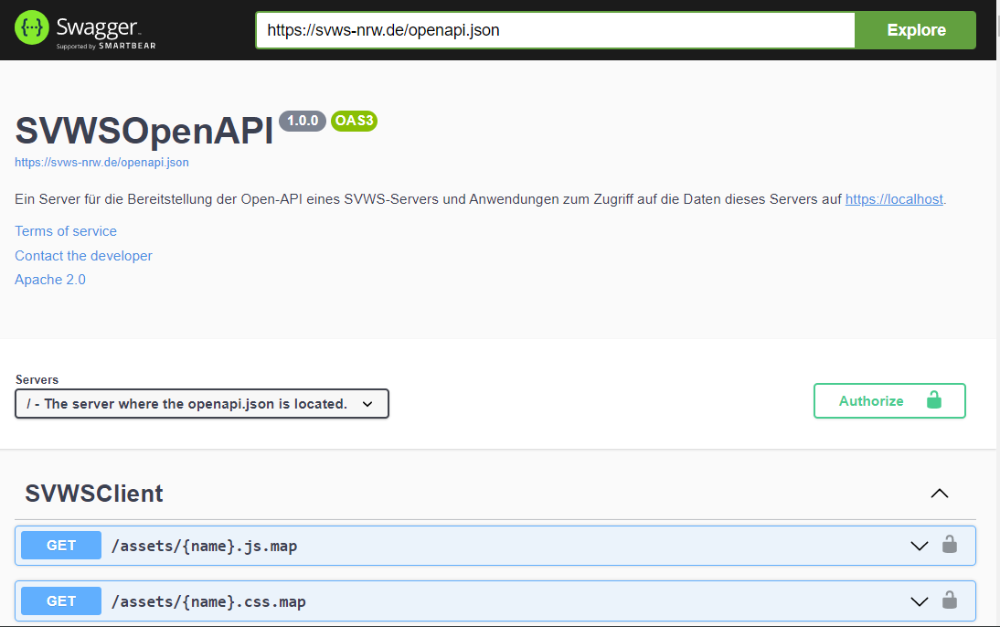
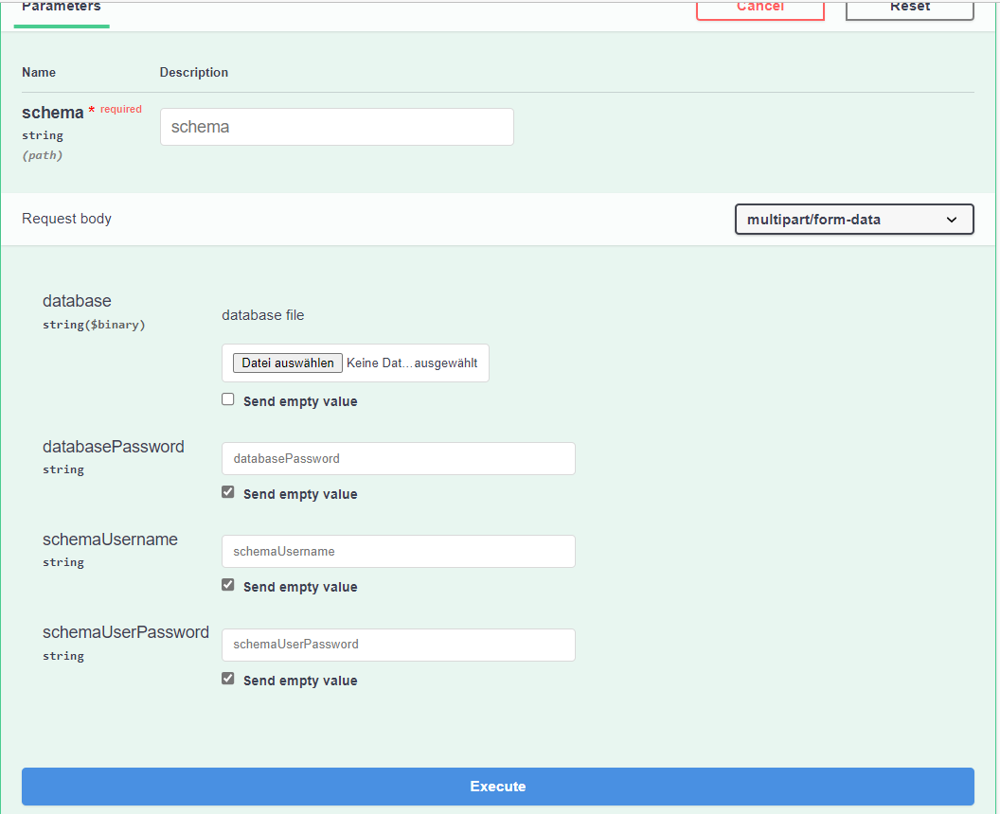

***Datenbank des SVWS-Servers - neue Schemata einfügen***
=========================================================
# Grundlagen

Ein laufender SVWS-Server wird benötigt - siehe hierzu: [Installationsanleitung](002_Installation_SVWS-Server.md)

# Testschemata 

Mehrere Schemata für verschieden Schulformen finden Sie unter `https://git.svws-nrw.de/svws/SVWS-TestMDBs`

```bash
		git clone https://git.svws-nrw.de/svws/SVWS-TestMDBs
```

# Testdatenbank per Curl befüllen

```bash
curl -X 'POST' \
  'https://svws/api/schema/root/migrate/mdb/testschule' \
  -H 'accept: application/json' \
  -H 'Content-Type: multipart/form-data' \
  -F 'database=~\SVWS-TestMDBs\GOST_Abitur\GymAbi.mdb' \
  -F 'databasePassword=DasUeblicheSchildMDB-PW' \
  -F 'schemaUsername=svwsadmin' \
  -F 'schemaUserPassword=svwsadmin'
```

# Einfügen über die SwaggerUI

Eine Übersicht über die Webservices bietet die SwaggerUI. 
Hier kann man über *Try it Out* - Buttons jeweils die Services ausprobieren bzw. benutzen. 
Die Swagger UI aufrufen:

```bash
		https://YourServerDomainName/debug/
```



Dann unter dem Abschnitt "SchemaRoot /api/schema/root/migrate/mdb/{schema}" den*Try it Out*-Button
drücken, so dass man diese Ansicht erhält:



**Achtung:** Um auf der SwaggerUI diesen Service nutzen zu können, muss man sich zuerst authentisieren, indem man auf das rechts abgebildete Schloss klickt. 
Hier nun den User `root` der Maria-DB Installation und das entsprechende Passwort angeben. 

Anschließend die folgenden Einträge unter der Maske ausfüllen:

+ **schema**: Hier steht der Name, der auch auf der Anmeldemaske dargestellt wird, z.B. Testschule. 
+ **Databasefile**: Hier können Sie z.B. eine Schild2.0-MDB-Datenbank aus der o.g. SVWS-TestMDBs einstellen.
+ **databasePassword**: Hier das Schild2.0-Datenbankpasswort angeben.
+ **SchemaUsername**: Einen beliebigen Usernamen angeben, z.B. svwsadmin, der bei der Einrichtung des Schemas auf der Datenbank für dieses Schema GRAND-Rechte erhält. 

Es kann auch schon ein existierender Benutzer genommen werden. 
Falls ein schon existierender user genommen wird, muss das anschließend abgefragte Passwort natürlich passen.

++ **SchemaUserPasswort**: Passwort der o.g. (neu angelegte) Maria-DB Users. 

# Einloggen auf dem SVWS-Client

Bei Aufruf von https://YourServerDomainName/ bzw dem Aktualisieren (F5) des Fensters sollte nun die neue "Testdatenbank" sichbar sein. 
Das Einloggen ist auf dieser Oberfläche nur mit den schon vorher vorhandenen Schild2.0-Usern möglich. 

In der Testdatenbank benutzen wir (oft) den user *Admin* mit leerem Kennwort. 


