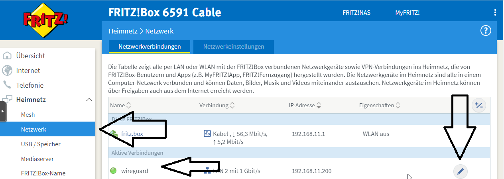
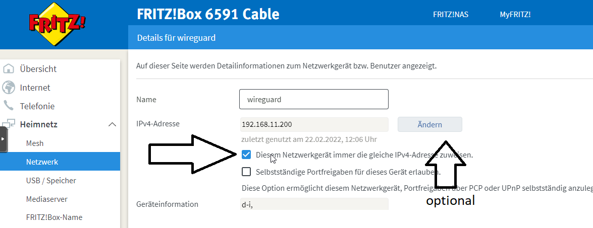
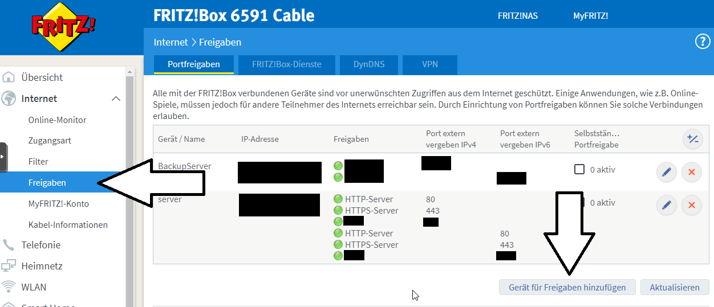
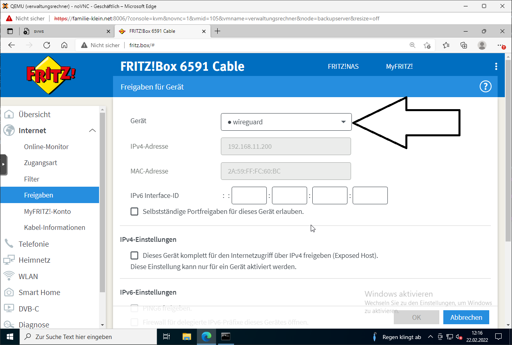
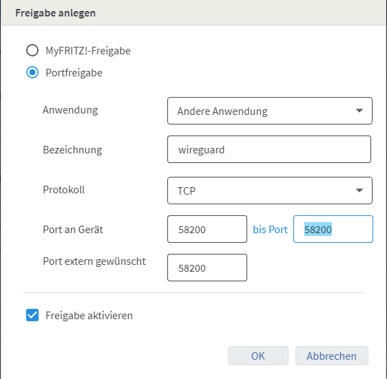

# Einrichten einer Portfreigabe

## Einsatzszenario

In unserem Einsatzszenario des SVWS-Servers kann es je nach IT-Betreuung und IT-Umfeld möglich sein 
über eine Portfreigabe des Routers Dienste vom Internet aus frei zu schalten. 
Hierbei sind die entsprechenden Datenschutzrichtilinien zu beachten. 
Denkbar sind hier VPN-Zugänge über einen [VPN-Server](../005_Installation_VPN-Server) oder auch den direkten Zugang zum Server über personifizierte SSL-Zertifikate
Bitte beachten Sie, dass hierbei Serverdienste direkt aus dem Internet aufrufbar sind. Grundsätzlich gilt daher:

***Sie müssen genau wissen, was Sie da konfigurieren !!!***
		
## Beispiel Fritzbox

### IP Adresse festlegen:

Es ist Vorteilhaft die Ip Adresse des Servers festzulegen bzw. dauerhaft Verknüpfen mit der MacAdresse. 

### Portfreigabe einrichten:

Die Portfreigabe eintragen, so dass die Portanfrage auf der Fritzbox umgeleitet wird auf genau diesen Rechner mit der vorher definierten IP:

#### Gerät auswählen und auf neue Freigabe klicken:

### Einstellungen für eine Freigabe auf Port 58200 - nur TCP:

## Wireguard & Portfreigabe

Für das Betreiben vom [Wireguard-VPN-Server](Installation_VPN-Server.md) ist unbedingt die **UPD und TCP** Freigabe nötig. Also müssen im oben beschriebenen Beispiel der FritzBox zwei Freugaben definiert werden. 

## Reverse Proxy & Portfreigabe

in Bearbeitung: [Reverse-Proxy-Server](Installation_ReverseProxy-Server.md)