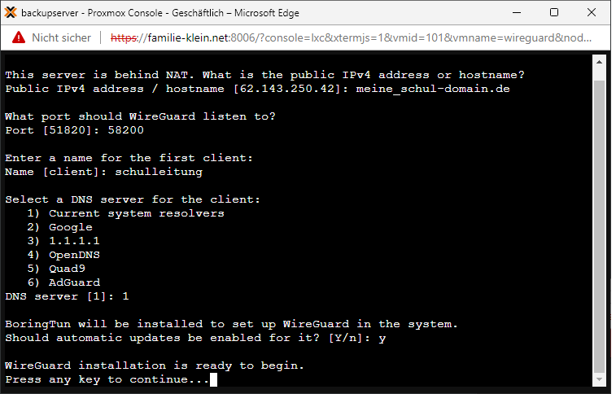

# Installation des VPN-Servers

## Vorbereitungen

### Auswahl der Maschine 

Es gibt mehrer Möglichkeiten wie ein VPN-Server betrieben werden kann:

- in einer Virtualisierungsumgebung (Proxmox, ESXi, ...) 
- im Containersystem (Docker, LXH, ...)
- direkt auf echter Hardware (Raspberry, PC, Server ...)
- im Router (Fritzbox, ...)
- als Teil einer Firewall (OpenSense, ...)

### Beipiele für Hardwarelösungen:

Hier gibt es mehrer Anbieter, die auch Hardwarelösungen anbieten. Ein paar wenige Beispiele sind hier nach kurzer Suche im Internet exemplarisch zu finden:

Fritzbox:  
https://www.computerbild.de/artikel/cb-News-Software-FritzOS-7.39-AVM-integriert-WireGuard-VPN-FritzBox-31230305.html

Shellfire:  
https://www.shellfire.de/blog/shellfire-box-4k-wireguard-vpn-router-power/

OpenSense:  
https://www.ovpn.com/de/guides/wireguard/opnsense

## WireGuard VPN-Server

Die Entscheidung für den Wireguard VPN-Server in der Testumgebung des SVWS-Servers ist aufgrund verschiedener Rahmenbedingungen gefallen: 

 - performant, da fest im Linux-Kernel verankert
 - Open Source
 - einfache Installation per Skript
 - installierbar auf einem Server oder einer virtuellen Maschine 
 - ebenfalls als Hardware erhältlich
 - einfache Wartung und Konfiguration per script
 - mögliche Weiterentwicklung (Konfiguration der VPN-Zugänge von außen)

Im Weitern wird als Basis eine virtuelle Debian 11 Maschine auf einem Proxmoxsystem verwendet. 

Ebenso ist die installation in einem LXH-Container möglich, jedoch mit einigen Konfigurationen auf dem Muttersystem verbunden, auf die hier nicht weiter eingegangen wird. 
Die Installation unterscheidet sich im Wesentlichen nicht von anderen Installationen auf anderen Virtualisierungen (ESXi, ...) oder echter Hardware.

### Installation des Debian 11 System

#### download debian 11 net install:  
https://cdimage.debian.org/debian-cd/current/amd64/iso-cd/debian-11.1.0-amd64-netinst.iso

Eine typische Debian Installation ausführen - einfach der Menueführung folgen und je nach Bedarf auch auf das grafische Frontend verzichten. 
Den SSH-Server direkt mit installieren, es wird in der Regel der SSH Zugang für die Wartung benötigt.

#### ggf aktualisieren

Bei einem frisch installierten System sollte dieser Schritt nicht nötig sein, 
man kann es aber trotzdem einmal ausführen, um auch die letzten Aktualisierungen geladen zu haben: 

		apt update
		apt upgrade -y
				
Nützliche Helfer installieren: 		
		
		apt install -y nmap curl net-tools

#### ggf das root login per ssh zulassen:

		nano /etc/ssh/sshd_config

unter der auskommentierten Zeile

		#PermitRootLogin prohibit-password
		
Folgendes einfügen: 

		PermitRootLogin yes
		
SSH neu starten: 
		sudo service sshd restart
		

## Installation von Wireguard per Script 

Download des Installationsscrpits und Installation starten: 

		wget https://git.io/wireguard -O wireguard-install.sh && bash wireguard-install.sh

Als Port kann auch irgendein Port in den höheren Bereichen gewählt werden, wie hier dargestellt port 58200. 
(Die Nachfrage zum Installieren von BoringTun erfolgt nur bei LXH-Containern.)

## Portfreigabe

## Fernsteuerung per ssh

SSH autologin aus fem svws-Server einrichten:

		ssh-keygen -t rsa -b 4096
		ssh-copy-id -i ~/.ssh/id_rsa.pub root@wireguard

Nun können Root Befehle auf dem wireguard auch vom svws abgesetzt werden. 

---------------------------------------------

## Quellen: 

https://github.com/angristan/wireguard-install 

https://www.bennetrichter.de/anleitungen/wireguard-linux/

https://www.bitblokes.de/wireguard-vpn-server-einrichten-ubuntu-raspberry-pi-linux-android/

https://github.com/angristan/wireguard-install/blob/88ae1c0d0f5d4f48252fd3be27b2f122e40edf83/wireguard-install.sh

https://blog.peterge.de/wireguard-lxc-unter-proxmox/

https://www.youtube.com/watch?v=D1zp6n7ushM