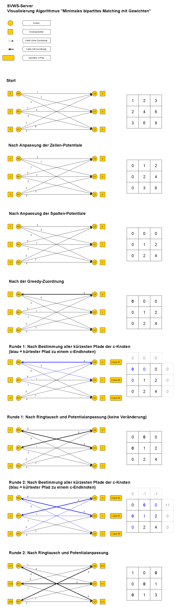
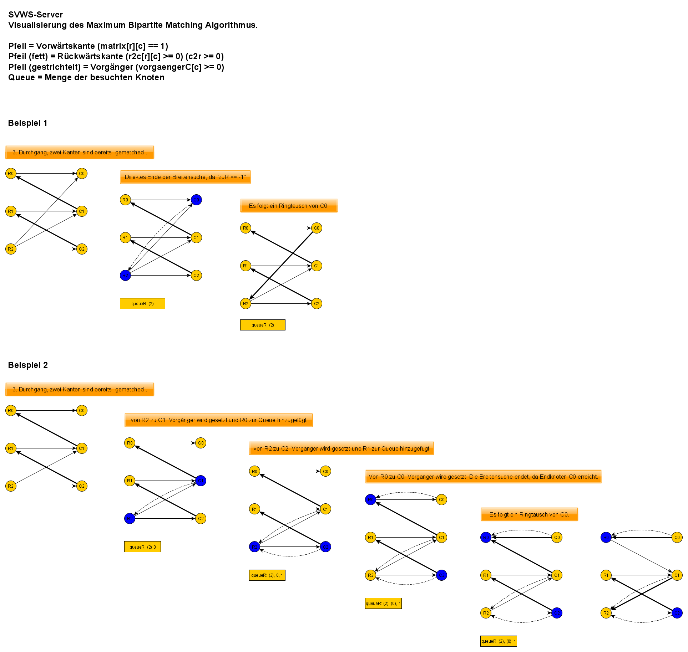

# Blockungsalgorithmen
## Minimum/Maximum Weight Bipartite Matching (Assignment Problem)

Ein minimales gewichtetes bipartites Matching ist ein Graphalgorithmus der eine Zuordnung auf einem gewichteten bipartiten Graphen minimiert.

https://en.wikipedia.org/wiki/Maximum_weight_matching

Man stelle sich eine linke Knotenmenge (z.B. SchülerInnen) und eine rechte Knotenmenge (z.B. Stühle bei wählbaren Projekte) vor. Zudem können die SchülerInnen die Projekte mit einer ganzen Zahl bewerten (kleine Zahl = beliebter). Intern werden die Zahlen in einer Matrix gespeichert. Eine Zeile entspricht der Bewertung einer SchülerIn, die Spalten der Stuhl eines bewerteten Projektes.
Der Algorithmus ordnet nun allen SchülerInnen genau einen Stuhl zu und minimiert dabei die Summe aller Zuordnungen, also die Gesamtzufriedenheit.
Die Methode "gibMinimalesBipartitesMatchingGewichtet" der Klasse "Matrix" implementiert diesen Algorithmus mit Hilfe des Dijkstra-Algorithmus als Subroutine.

https://en.wikipedia.org/wiki/Dijkstra%27s_algorithm

Die Laufzeit bei einer quadratischen Matrix mit Dimension n beträgt O(n³).

Es folgt eine Darstellung der internen Arbeitsweise des Algorithmus:

## Maximum Cardinality Bipartite Matching
Ein maximales (ungewichtetes) bipartites Matching ist ein Graphalgorithmus der eine Zuordnung auf einem (ungewichteten) bipartiten Graphen maximiert.

https://en.wikipedia.org/wiki/Maximum_cardinality_matching

Man stelle sich eine linke Knotenmenge (z.B. SchülerInnen) und eine rechte Knotenmenge (z.B. Stühle bei wählbaren Projekten) vor. Es sind nur linke Knoten mit rechten Knoten verbunden (= bipartiter Graph). Eine Kantenverbindung zu jedem Sitzplatz eines Projektes würde man dann setzen, wenn ein/e SchülerIn an einem Projekt teilnehmen möchte. Bei diesem Algorithmus gibt es keine Gewichtung/Priorisierung von Projekten.
Der Algorithmus ordnet nun die maximale Anzahl an SchülerInnen den gewünschten Projektes zu, ohne dabei die maximale Teilnehmerzahl (= Sitzplätze) pro Projekt zu überschreiten.
Die Methode "gibMaximalesBipartitesMatching" der Klasse "Matrix" implementiert diesen Algorithmus mit Hilfe einer Breitensuche als Subroutine. Die Laufzeit bei N Knoten beträgt O(n³). Schnellere Algorithmen existieren O(n^2.5), sind aber wesentlich komplizierter.

