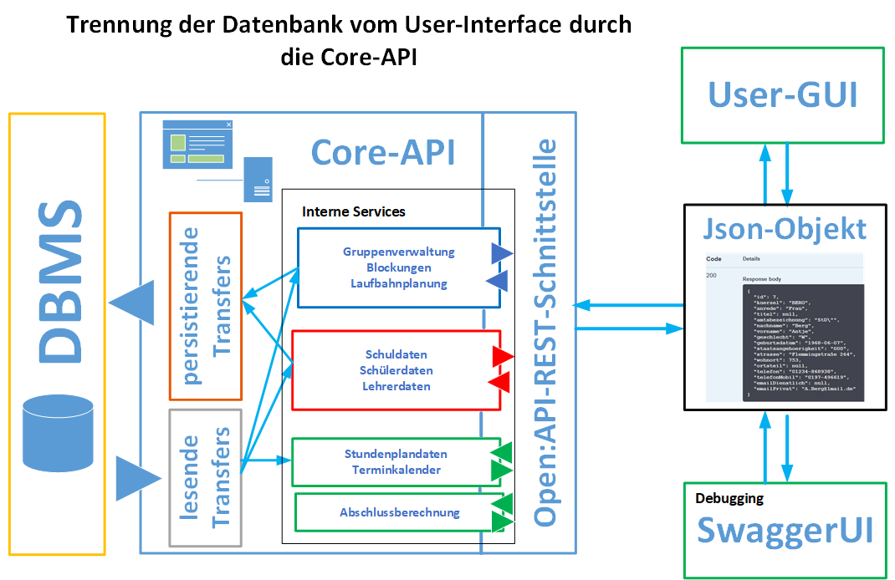
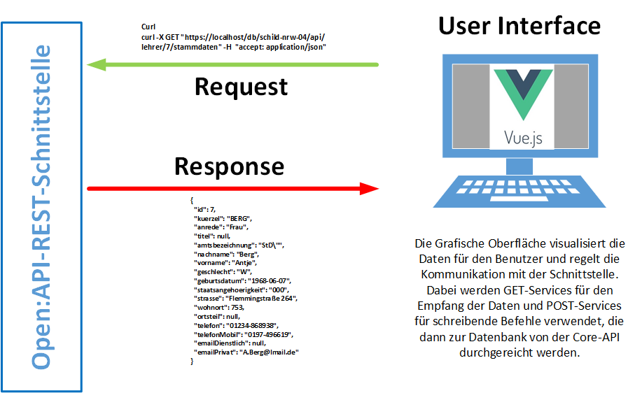
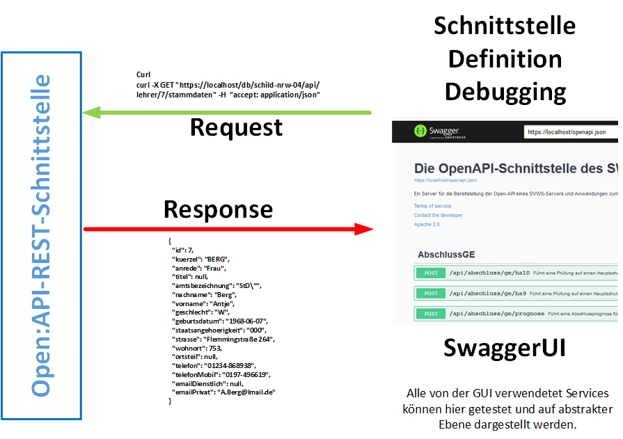

# SVWS-Server

## Zwiebelmodell Komponenten-Hierarchie

Von innen nach außen übernehmen die Schichten die folgenden Rollen:

SVWS-Server:
- svws-db: Basisprojekt für die Datenbank
- db-utils: Stellt Funktionalitäten zum Datenbank-Zugriff zur Verfügung.
- core: (Hier passiert das Meiste)
- open-API: Diese Schnittstelle nimmt Anfragen von Clients entgegen und liefert Antworten zurück.

SVWS-Client:
- te-lib: Diese Komponente des Clients ist für die Kommunikation mit der Open-API verwantwortlich. Sie enthält (auch) transpilierte Anteile aus den Server-Schichten 'core' und 'open-API'.
- Web-UI: Die graphische Benutzeroberfläche für den Benutzer (mit vue.js-Komponenten)

## Übersicht zur Funktionalität der CORE-API

Die Core-Api soll zukünftig alle User-Interaktionen mit der Datenbank kontrollieren. Sie ist damit maßgeblich für den Schutz der Daten vor unerlaubten Zugriffen, aber auch für den konsistenten Zugriff auf die Datenbank zuständig. Außerdem stellt sie eine standartisierte Schnittstelle für die User-Interfaces dar.

## Die OPEN-API
Die Schnittstelle ist auf Basis einer Open-API definiert:

## Debugging: SwaggerUI
Im Debugging kann die Schnittstelle mit der SwaggerUI aufgerufen werden, mit der die Eingaben und Ausgaben getestet werden können. Hier stehen alle GET-, PUT- und POST-Befehle zur Verfügung!

