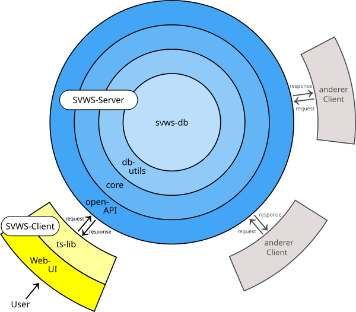

# **SVWS-Core**
Die untere Übersicht zeigt den Aufbau des Servers als Zwiebelmodell. Das Herzstück des Servers wird aus dem SVWS-core gebildet. Der SVWS-core besteht aus den implementierten Algorithmen, den core-types (Datentypen /Java-Klassenm, mit Hilfsmethoden), und aus den core-DTO's (data transferobject).
Der SVWS-core organisiert nicht nur serverseitig die Zugriffe und Verarbeitung von DTOs und copre-types und deren Speicherung, Update und Löschung in der Datenbank mit Hilfe der Packages svws-db und svws-db-utils, sondern er beantwortet auch die requests, die vom SVWS-Client kommen, über die Open-API-Schnittstelle.

 
- Jetzige Zustand  
 	Eigenständig gibt es das Paket svws-base (darin: Logger und csv-Definitionen).
	Der core generiert beim Build-Prozess Datenbanktabellen aus den csv-Dateien und erstellt ein Datenbankschema (dies wird in der SVWS-Datenbank geladen?)

- Baldiger Zustand  
	Die csv-Definitionen werden nicht mehr im svws-base sein. Hierbei werden die Pakete SVWS-base und SVWS-db in einem SVWS-db-Paket vereint.
	(wenn keine csv-Dateien mehr benötigt werden, was wird konkret geändert?)

	