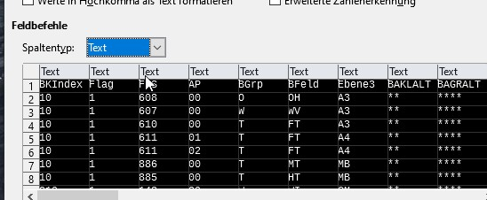
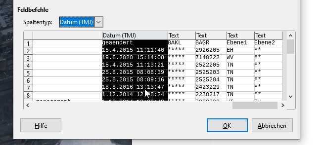
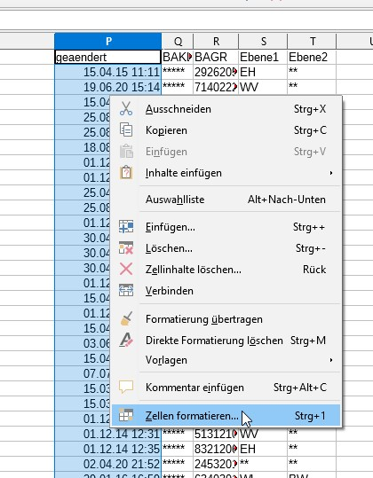
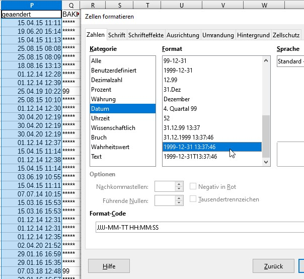
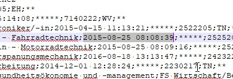

# Datumswerte korrekt in CSV importieren

In den Accessdatenbanken von IT.NRW liegen alle Datumswerte im Format
31.12.2020 12:03:02 vor.
In der Java-Umgebung wird folgendes Format verlangt:

		2020-24-12 12-00-00

Damit es beim Import nicht zu Problemen kommt, sollte folgendes beachtet werden.
Die Tabellen können wie beschrieben mit UTF-8 aus Access als csv exportiert werden.
Beim Import in LibreOffice werden alle Spalten markiert und als Text eingestellt.

Dann werden alle Datums-Spalten als Datum (TMJ) markiert.

Dann kann die Spalte ohne Kopfzeile in LibreOffice markiert und die Zellen formatiert werden.

Jetzt kann die in Java erwartete Formatierung gewählt werden.

Danach stehen die Datumswerte im Klartext korrekt zur Verfügung.

