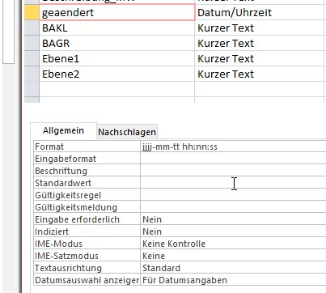

# Statkue Fachklasse einlesen

Änderung des Datumsformat in jjjj-mm-tt hh:mm:ss für die Spalte "geaendert":

+ Rechte Maustaste > Exportieren > Textdatei auf die Tabelle Fachklasse.
+ Speichertort wählen.
+ Im Export-Schema auf "erweitert" und auf UTF-8 mit "" als Textrenner einstellen. Feldnamen in erster Zeile mit einbeziehen!
+ Exportieren.
+ Dann einmal in LibreOffice öffnen. Beim Import darauf achten, dass die Spalte geändert als DATUM importiert wird!
+ Spalten in die gewünschte Reihenfolge kopieren.
+ Speichern.
+ Statkue_Fachklasse.csv in das Repository kopieren.
+ Compare with Index > Kontrolle der Änderungen.
+ Build ausführen, Migration testen und danach einchecken.