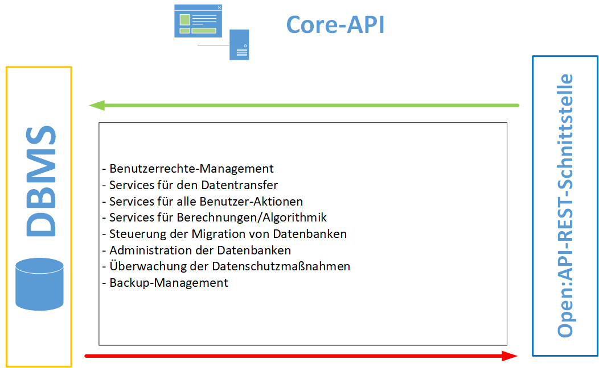

# SVWS-Datenbankstrukturen

## Übersicht Datenbankfunktionen

## Das Projekt SVWS-DB
In diesem Projekt werden in der Übergangsphase von SchILD-NRW 3.0 die Datenbank-Scripte erzeugt. 
Das bedeutet, dass sämtliche Tabellen-Strukturen über die CSV-Dateien festgehalten wird.
Zusätzlich werden hier alle Default-Daten in den Tabellen gepflegt. 
Dazu gehören die Statkue-, Schildintern, Schulver- und impexp-Tabellen. Die Defaultdaten werden teilweise von IT-NRW 
bereit gestellt, so dass diese eingepflegt werden müssen.
Die momentan in der Entwicklung befindlichen Scripte können hier heruntergeladen werden:

https://github.com/SVWS-NRW/SVWS-DB-Scripte

Die Verwendung für SchILD-NRW 2.0 Datenbanken ist nicht zu empfehlen, auch wenn das über die Abschaltung von Case-Sensitiven-Tabellennamen möglich wäre.
Mit diesen Scripten kann über ein SQL-Tool eine SchILD-NRW 3.0 Datenstruktur erzeugt werden. 
Es kann sogar mit dem Migrationstool von SchILD-NRW 2.0 in eine solche Datenbank migriert werden, so dass SchILD-NRW 3.0 betrieben werden kann.
Diese Arbeiten werden aber zukünftig vom SVWS-Server erledigt!

Ziel ist es, dass SchILD-NRW nur noch in einer Übergangsphase auf die Datenbank direkt zugreifen kann. 
Perspektivisch wird der SVWS-Server alle Zugriffe übernehmen, so dass die Daten nur noch über die OpenAPI verändert werden können. 
Dafür werden entsprechende Services geschrieben, die dann feststehende und dokumentierte Endpunkte schaffen.

Eine Verschlüsselung ist auf Datenbankebene zunächst nicht vorgesehen, sodass die Sicherheitsrichtlinien des Betriebssystem den Schutz der Daten gewährleisten müssen. 
Bei höheren Sicherheitsanspüchen kann der SVWS-Server später in Rechenzentren auch in verschlüsselten Containern ausgeführt werden. 
Dies sollte das Ziel für größere kommunale Umgebungen sein.

## Einbindung der Statistikdaten von IT.NRW
Für das SVWS-Server-Projekt ist es wichtig, dass alle Daten direkt statistikkonform gespeichert werden oder auf die Tabellen von IT-NRW gemapped werden können.
Dazu wurde die Entscheidung getroffen, alle verwendeten Tabellen der Schulver.mdb, STakue.mdb und dann direkt auch der Schildintern.mdb und der ImpExp.mdb 
in das Datenbankschema einzubinden.
Dadurch löst sich das Projekt von der Verwendung von Access-Datenbanken, schafft eine höhere Performance und bündelt die zu erledigenden Aktualisierungen 
im Repository, so dass Änderungen auch über DIFFs zurück verfolgt werden können.

Ein MDB-Genarator wird in der Übergangsphase die Keytabs MDBs für SchILD-NRW 2.0 erzeugen. So müssen die Defaultdaten von IT.nicht doppelt gepflegt werden müssen. Die vom Projekt erzeugten MDBs sind seit dem Update Schlild-NRW2.0.24.2 in Verwendung!
Eine Beschreibung, wie bestimmte Tabellen aktualisiert werden müssen gibt es an dieser Stelle, außerdem wird hier beschrieben warum und wie von den Tabellen von IT.NRW abgewichen wurde und wie das gepflegt werden sollte:

<!-- + [Schulver.mdb einlesen](Schulver_einlesen.md)
+ [Datumswerte korrekt in CSV importieren](Statkue_Datumswerte.md)
+ [Statkue_Fachklasse einlesen](Statkue_Fachklassen.md)
+ [Statkue_ZulFaecher mit Mapping](Statkue_zulaessige_Faecher.md)
+ [Statkue_SVWS_ZulaessigeJahrgaenge](Statkue_zulaessige_Jahrgaenge.md)
+ [Statkue_ZulKuArt](Statkue_zulaessigeKursarten.md)
+ [Statkue_SVWS_Fachgruppen mit Schulformen](Statkue_Fachgruppen.md) -->

## Modernisierung der Tabellenstrukturen
Ziel des Datenbankprojekts soll es sein, alle benötigten Informationen atomar und in normalisierter Form dargestellt werden.
Dazu werden zunächst die bestehenden Strukturen übernommen und dann schrittweise dem Ziel zugeführt. Die Diskussion über diese Vorgehensweise zeigt, dass dieser Weg kompliziert und Fehleranfällig ist, da für SchILD-NRW 3.0 unter Umständen die alten Strukture (ggf. über Views) noch benötigen wird.
Fest steht jedenfalls, dass redundate Stellen, nicht mehr verwendete Felder und Verletzungen der atomaren und normalisierten Speicherung sukzessiv abgestellt werden müssen.

## Rechtesystem und Benutzerführung in der Datenbanksoftware
Als Default-DBMS wird MariDB empfohlen. Für die SchILDzentral-Nachfolge wird aber weiterhin MS-SQL-Server unterstützt.

In beiden System kann der root oder sa Zugang für administrative Zwecke verwendet werden. Diese Zugänge sollten ausschließlich dem DBMS-Administrator zur Verfügung stehen. Wahlweise können hier auch Zugänge mit Schema-übergreifenden Rechten für Administratoren angelegt werden.

Bei Installationen für einzelne Schulen dient dieser Zugang ausschließlich der Schama-Verwaltung, falls es gewünscht ist, zwei oder mehr Schemata zu Testzwecken oder bei Schulverbünden zu nutzen. Es wird für den Zugriff auf die Daten im Client trotzdem ein Datenbankuser angelegt, der nur Berechtigungen auf das Schema hat!

In größeren System, in denen mehrere Schulen auf einem Datenbankserver betrieben werdne, wird für jede Schule ein Datenbankuser nur mit Rechten auf die jeweiligen Schemata der einzelnen Schule angelegt! So dass schon allein auf DBMS-Ebene kein Zugriff von einer Schule auf eine andere erfolgen kann.

