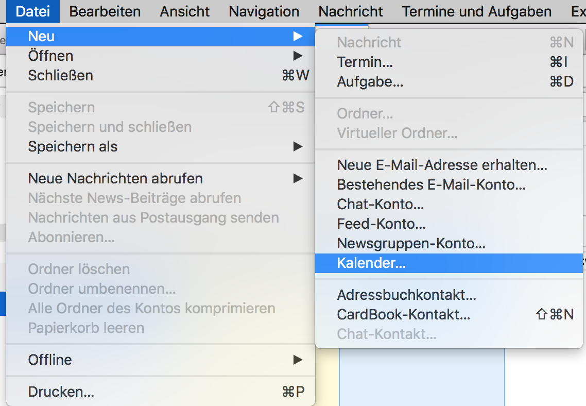
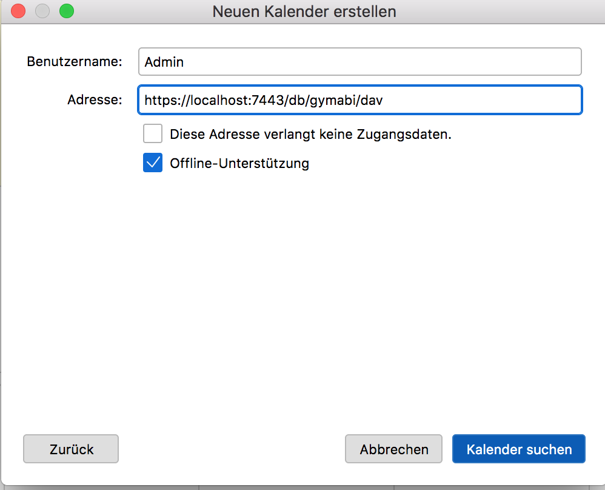
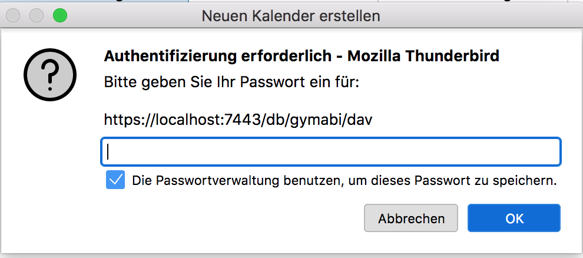
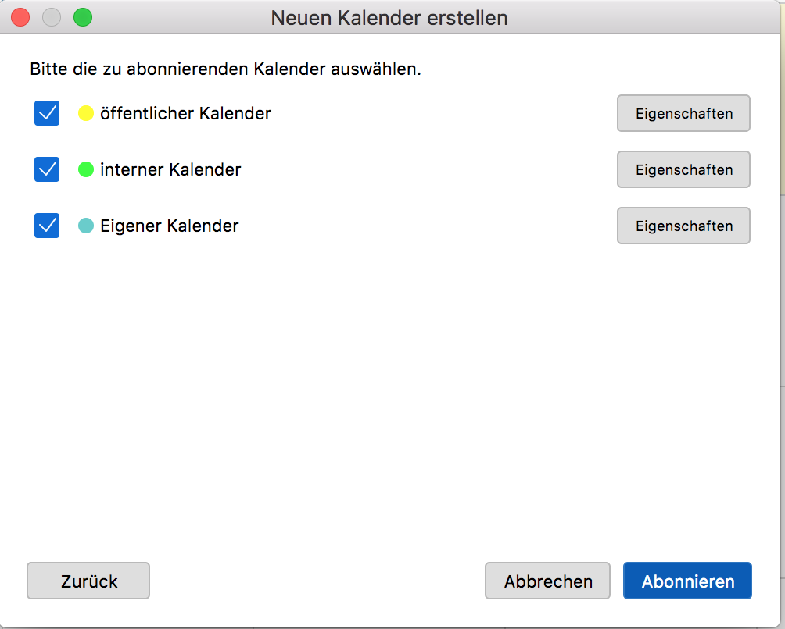
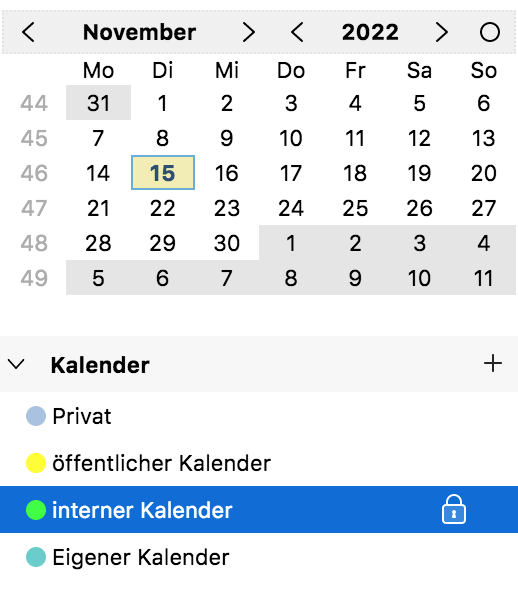

# CalDAV-API für Kalenderdaten


## Kalender
Folgende Kalender können im SVWS-Server in Clientprogrammen mit CalDav-Support importiert werden:
- eigene Kalender
- geteilte (öffentliche und schulinterne) Kalender
- ~~generierte Kalender~~

Eigene Kalender sind private Kalender, welche beim erstmaligen Anmelden eines Nutzers an der CalDav-API über ein entsprechendes Client-Programm angelegt werden. 

Geteilte Kalender müssen vom Admin angelegt und für die Nutzer mit Lese- und/oder Schreibrechten freigeschalten werden. Diese Kalender können als öffentliche und schulinterne Kalender verwendet werden.

Generierte Kalender sind aus den im SVWS-Server vorhandenen Daten erzeugte Kalender, in welchen es nur Leserechte für Nutzer gibt. Die hierbei vorhandenen Termine sind nicht editierbar und werden aus der Datenbank generiert, bspw. für Stundenpläne oder Prüfungstermine.

## Zugriffschutz auf Kalenderdaten

Die Kalender und darin enthaltenen Kalendereinträge unterliegen einem Zugriffsschutz. Der angemeldete Benutzer sieht nur diejenigen Kalender und Termine, für die er berechtigt ist. Dazu gibt es folgende Berechtigungen:
- Kalenderdaten ansehen als grundsätzliche Kompetenz für den Zugriff auf Kalender
- Kalenderdaten funktionsbezogen ansehen für den Zugriff auf generierte Kalender und deren Einträge abhängig von der Funktion des Nutzers
- Eigenen Kalender bearbeiten gibt dem Nutzer die Kompetenz, einen eigenen Kalender zu besitzen und bearbeiten zu können

Darüber hinaus werden editierbare Kalender über Zugriffschutzlisten (ACL) für mehrere Benutzer zur Verfügung gestellt. Dazu muss den einzelnen Nutzern zumindest das Leserecht zugeordnet werden. Für eigene Kalender wird dabei der Besitzer als solcher hinterlegt und ein ACL-Eintrag mit Lese- und Schreibrecht automatisch angelegt.


## Kompatibilität mit CalDAV-Clients

Das CalDAV API des SVWS-Servers liefert Adressdaten im iCalendar-Format
(ICS). Die Kompatibilität mit folgenden
Clientprogrammen ist gegeben:

| Client | Version               | Hinweis |
|--------|-----------------------|---------|
| OK     | Thunderbird: Kalender |         |
| OK     | Outlook: Kalender     | 4.3.0   |


# Anleitung: Import von Kalenderdaten über CalDAV
## Thunderbird Kalender (built-in)

Die Synchronisation kann mit einer Standardinstallation von Thunderbird
bewerkstelligt werden. Die Synchronisation mit dem SVWS-Server
wird in folgenden Schritten eingerichtet:

Kalenderanwendung öffnen und im Menü den Menüeintrag Datei \> Neu \>
Kalender… öffnen:



Im Dialog „Neuen Kalender erstellen“ wählen Sie die Option Netzwerk.


Im nun folgenden Dialog geben Sie den Benutzername des persönlichen SVWS-Benutzeraccounts sowie die Adresse ```https://\<server-adresse\>/db/\<svws-db-schema\>/dav``` an.



Im Anschluss erscheint ein Dialog zur Passworteingabe des persönlichen
SVWS-Benutzeraccounts:



Nach erfolgreicher Anmeldung können nun die zu synchronisierenden Kalender
ausgewählt werden. Eine Mehrfachauswahl ist möglich. Die Liste der
auswählbaren Kalender kann sich – abhängig von den Berechtigungen
des SVWS-Benutzeraccounts und den Leserechten an verschiedenen Kalendern – unterscheiden. Die Farben können frei gewählt werden und werden in der Anzeige des Thunderbird für Termine aus verschiedenen Kalendern genutzt.



Nach Bestätigung der Auswahl mit der Schaltfläche „Abonnieren“ werden die
Kalender in Thunderbird angezeigt.



Das Schloss am Kalender symbolisiert einen Kalender, auf den nur Lesend zugegriffen werden kann.
