# CardDAV API

Inhaltsverzeichnis
  * [Generierte Adressbücher](#generierte-adressbücher)
    * [Zugriffschutz auf Adressdaten](#zugriffschutz-auf-adressdaten)
    * [Kompatibilität mit CardDAV-Clients](#kompatibilität-mit-carddav-clients)
  * [Anleitung: Import von Adressdaten über CardDAV](#anleitung-import-von-adressdaten-über-carddav)
    * [Thunderbird Adressbuch (built-in)](#thunderbird-adressbuch-built-in)
    * [Thunderbird Cardbook-Addon](#thunderbird-cardbook-addon)
    * [Outlook CalDAV Synchonizer Addon](#outlook-caldav-synchroninizer-addon)

## Generierte Adressbücher

Folgende Adressbücher können vom SVWS-Server in Clientprogramme mit
CardDAV-Support importiert werden:

- Adressbuch „Schüler“

- Adressbuch „Lehrer“

- Adressbuch „Erzieher“

Bei diesen Adressbüchern handelt es sich um sogenannte „generierte
Adressbücher“, deren Kontakte aus den Stammdaten der SVWS-Datenbank
heraus generiert werden. Auf generierte Adressbücher kann über CardDAV
nur lesend zugegriffen werden. Änderungen an den Adressdaten können nur
über den SVWS-Client vorgenommen werden. Adressänderungen können nach
dem initialen Import in ein Clientprogramm automatisch synchronisiert
werden. Dazu kann in den jeweiligen Clientprogrammen ein
Synchronisationsintervall festgelegt werden.

## Zugriffschutz auf Adressdaten

<!---Die in den Adressbüchern angezeigten Kontakte unterliegen einem
Zugriffschutz. Der angemeldete Benutzer sieht nur diejenigen Kontakte,
für die er eine Berechtigung besitzt. Der Zugriffschutz erfolgt
regelbasiert:~~

| **Angemeldeter Benutzer** | **Sichtbare Kontakte**              |        |          |
|---------------------------|-------------------------------------|--------|----------|
|                           | Schüler                             | Lehrer | Erzieher |
| Schüler                   | Innerhalb der gleichen Klasse/Kurse | ?      | ?        |
| Lehrer                    | ?                                   | ?      | ?        |
| Erzieher                  | ?                                   | ?      | ?        |
| Admin                     | Alle                                | Alle   | Alle     |
| Sekretariat               | Alle                                | Alle   | Alle     |
-->
Die Adressbuecher und darin enthaltenen Kontakte unterliegen einem Zugriffsschutz. Der angemeldete Benutzer sieht nur diejenigen Adressbuecher und Kontakte, für die er berechtigt ist. Dazu gibt es folgende Berechtigungen:
- Adressdaten ansehen zum Einsehen der verfügbaren Adressbücher
- Lehrerdaten ansehen zum Einsehen und Laden der Visitenkarten von Lehrern
- Schüler Individualdaten ansehen zum Einsehen und Laden der Visitenkarten von Schülern
- Adressdaten Erzieher ansehen zum Einsehen und Laden der Visitenkarten von Erziehungsberechtigten

In https://git.svws-nrw.de/svws/SVWS-Server/-/issues/578 werden notwendige Änderungen/Eweiterungen diskutiert.

## Kompatibilität mit CardDAV-Clients

Das CardDAV API des SVWS-Servers liefert Adressdaten im VCard-Format
(VCF) in den Versionen 4.0. Die Kompatibilität mit folgenden
Clientprogrammen ist gegeben:

<table>
<colgroup>
<col style="width: 5%" />
<col style="width: 16%" />
<col style="width: 10%" />
<col style="width: 68%" />
</colgroup>
<thead>
<tr class="header">
<th></th>
<th><strong>Client</strong></th>
<th><strong>Version</strong></th>
<th><strong>Hinweis</strong></th>
</tr>
</thead>
<tbody>
<tr class="odd">
<td>OK</td>
<td>Thunderbird: Adressbuch</td>
<td></td>
<td></td>
</tr>
<tr class="even">
<td>OK</td>
<td>Thunderbird: Cardbook-Addon</td>
<td>76.7</td>
<td><a
href="https://addons.thunderbird.net/de/thunderbird/addon/cardbook/">https://addons.thunderbird.net/de/thunderbird/addon/cardbook/</a></td>
</tr>
<tr class="odd">
<td>X</td>
<td>Thunderbird: TbSync</td>
<td>
3.0.2

2.0.2
</td>
<td>
<a
href="https://addons.thunderbird.net/de/thunderbird/addon/tbsync">https://addons.thunderbird.net/de/thunderbird/addon/tbsync</a>

<a
href="https://addons.thunderbird.net/de/thunderbird/addon/dav-4-tbsync">https://addons.thunderbird.net/de/thunderbird/addon/dav-4-tbsync</a>
</td>
</tr>
<tr class="even">
<td>OK</td>
<td>Outlook: CalDAV Synchronizer</td>
<td>4.3.0</td>
<td><a
href="https://caldavsynchronizer.org/">https://caldavsynchronizer.org/</a></td>
</tr>
<tr class="odd">
<td>X</td>
<td>iOS</td>
<td>15.6.1</td>
<td>Einstellungen - Kontakte - Accounts - Account hinzufügen - Andere -
CardDAV-Account hinzufügen</td>
</tr>
</tbody>
</table>

# Anleitung: Import von Adressdaten über CardDAV
## Thunderbird Adressbuch (built-in)

Die Synchronisation von Adressbüchern über die CardDAV-Schnittelle des
SVWS-Servers kann mit einer Standardinstallation von Thunderbird
bewerkstelligt werden. Es ist also nicht zwingend erforderlich
Zusatzsoftware zu installieren. Die Synchronisation mit dem SVWS-Server
wird in folgenden Schritten eingerichtet:

Adressbuch-Anwendung öffnen und im Menü den Menüeintrag Datei \> Neu \>
CardDAV-Adressbuch… öffnen:

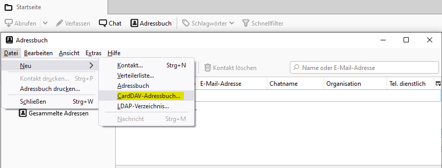

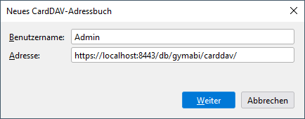

Im Dialog „Neues CardDAV Adressbuch“ die folgenden Eingaben machen:

- Benutzername: Benutzername des persönlichen SVWS-Benutzeraccounts

- Adresse: URL zum CardDAV API des SVWS-Servers:
  https://\<server-adresse\>/db/\<svws-db-schema\>/carddav/

Im Anschluss erscheint ein Dialog zur Passworteingabe des persönlichen
SVWS-Benutzeraccounts:

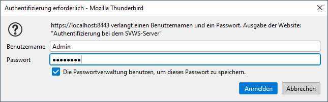

Nach erfolgreicher Anmeldung am CardDAV-API des SVWS-Servers können im
Dialog „Neues CardDAV-Adressbuch“ die zu synchronisierenden Adressbücher
ausgewählt werden. Eine Mehrfachauswahl ist möglich. Die Liste der
auswählbaren Adressbücher kann sich – abhängig von den Berechtigungen
des SVWS-Benutzeraccounts – unterscheiden.

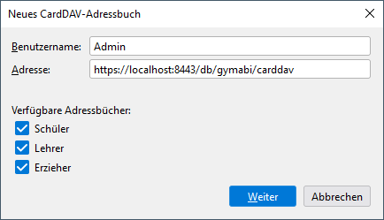

Nach Bestätigung der Auswahl mit der Schaltfläche „Weiter“ werden die
Adressbücher in Thunderbird angezeigt.

Hinweis: Das Thunderbird-Adressbuch unterstützt keine gruppierte Anzeige
der Kontakte innerhalb eines Adressbuchs (z.B. gruppiert nach Klasse,
Jahrgang, Kurszugehörigkeit o.ä.). Die Adresslisten können daher sehr
lange und unübersichtlich sein. Eine alternative Möglichkeit ist die
Verwendung des Thunderbird-Addons „Cardbook“, das eine gruppierte
Anzeige der Kontakte ermöglicht.

## Thunderbird Cardbook-Addon

Öffnen der CardBook-Anwendung und im Menü den Menüeintrag Adressbuch \>
Neues Adressbuch aufrufen, um eine Wizard zur Einrichtung des
Adressbuchs zu starten.

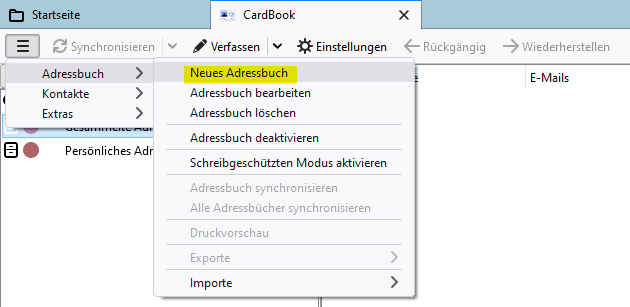

Im Wizard-Dialog „Neues Adressbuch hinzufügen“ die Option „Im Netzwerk“
auswählen und die Schaltfläche „Weiter“ betätigen.

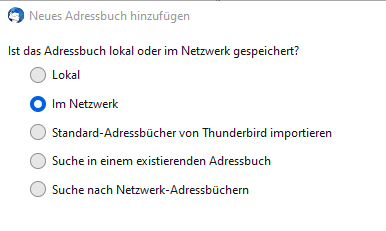

Im folgenden Wizard-Dialog dann unterhalb von „Art“ zunächst die Art des
Netzwerk-Adressbuchs auf „CardDAV“ festlegen und im Anschluss die
weiteren Angaben unterhalb von „Verbindung“ im Dialog ergänzen:

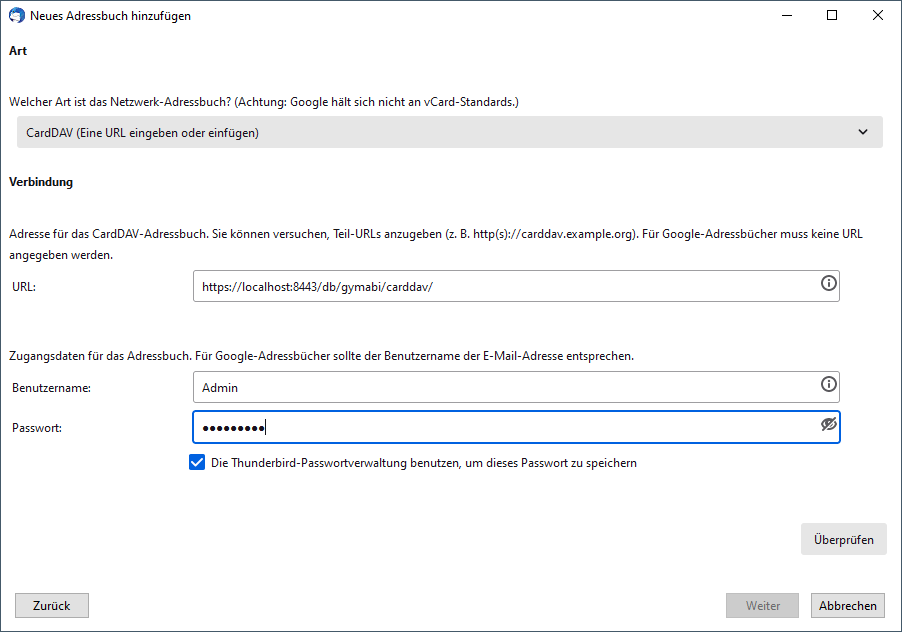

- URL: URL zum CardDAV API des SVWS-Servers:

- Benutzername: Benutzername des persönlichen SVWS-Benutzeraccounts

- Passwort: Passwort des persönlichen SVWS-Benutzeraccounts

Mit der Schaltfläche „Überprüfen“ die Angaben prüfen. Im Erfolgsfall
kann dann mit der Schaltfläche „Weiter“ der nächste Schritt des Wizards
aufgerufen werden, in dem die zu importierenden Adressbücher ausgewählt
werden können:

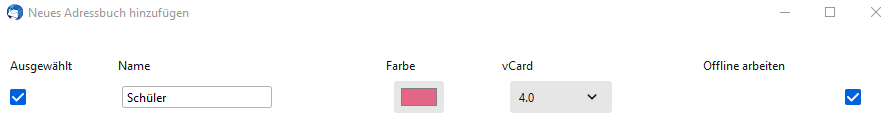

Eine Mehrfachauswahl wird unterstützt.

Für eine zügigere Synchronisation bitte folgende Cardbook-Einstellungen verwenden:

- Maximale Anzahl an Änderungen, die pro Synchronisation angestoßen werden: **1000**
- Bei GET-Anfrage Karten gruppieren nach: **1000**

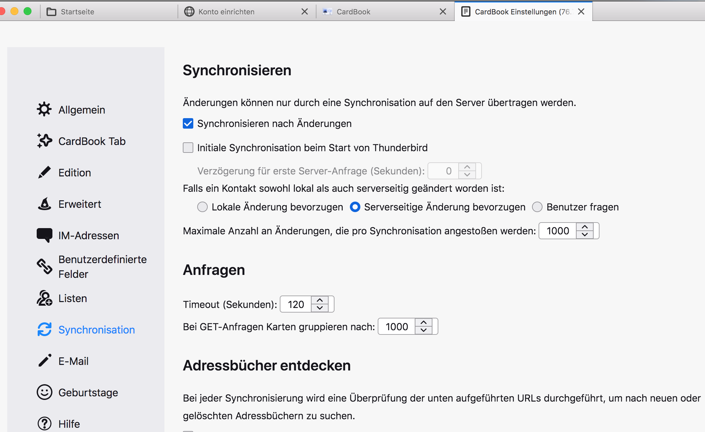

## Outlook CalDAV-Synchroninizer-Addon

In der Standardinstallation synchronisiert Outlook Termine und Adressen
nur mit Exchange und Microsofts Web-Kalender. Um die Adress- und
Kalenderdaten aus dem SVWS-Server mit Outlook abzugleichen, benötigt man
Zusatzsoftware: das kostenlose Programm Outlook CalDAV Synchronizer.

Installation:

Programm-Download: <https://caldavsynchronizer.org/de/download/>

Installationsanleitung:
<https://caldavsynchronizer.org/de/hilfe/dokumentation/#Install_instructions>

Nach der Installation erscheint beim Aufruf des Outlook-Kalender ein
neuer Menüeintrag „CalDav Synchronizer“:

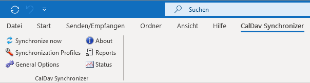

SVWS Adressbücher einrichten:

Um die Adressbücher vom SVWS-Server verbinden zu können, muss für jedes
relevante Adressbuch ein „Synchronization Profile“ eingerichtet werden.
Dies erfolgt über den Menüeintrag „Synchronisation Profiles“

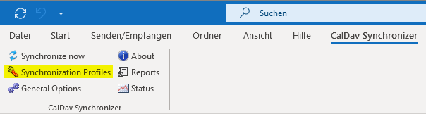

Es wird der Dialog „Options“ angezeigt. Dort die Schaltfläche „Add new
profile“ betätigen und im Dialog „Select Profile Type“ die Option
„Generisches Profil“ auswählen.

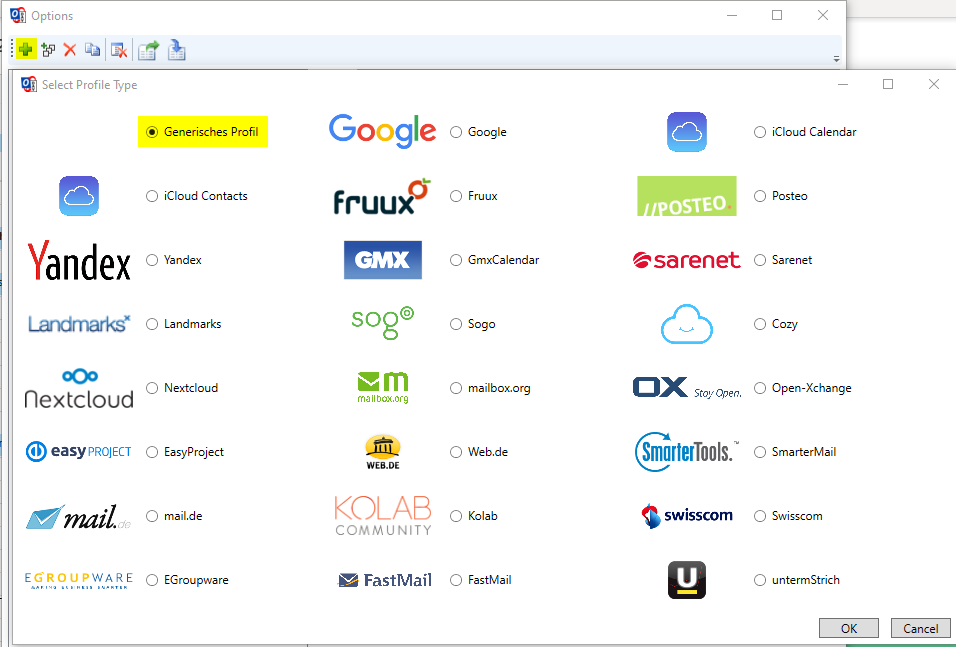

Die für die Verbindung erforderlichen Angaben im Profil-Dialog erfassen:

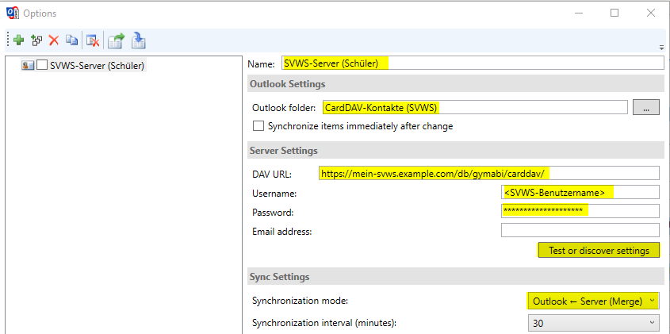

- Name: Beliebiger Name für das zu importierende Adressbuch. Entspricht
  dem späteren Anzeigenamen in Outlook.

- Outlook folder: Auswahl eines Kontakt-Verzeichnisses in Outlook. Bei
  Bedarf ein neues Verzeichnis anlegen und auswählen.

- DAV URL: URL zum CardDAV API des SVWS-Servers:
  https://\<server-adresse\>/db/\<svws-db-schema\>/carddav/

- Username: Benutzername des persönlichen SVWS-Benutzeraccounts

- Password: Passwort des persönlichen SVWS-Benutzeraccounts

- Synchronisation mode: Auf Outlook Server (Merge) stellen.

- Synchronisation interval (minutes): Taktung für den Datenabgleic
  zwischen Outlook und dem SVWS-Server in Minuten. Aufgrund der seltenen
  Änderungen an den Adressdaten, kann dieser Wert auch im Stundenbereich
  gewählt werden.

- Schaltfläche „Test oder discover settings“ betätigen.

Nach Betätigung der Schaltfläche „Test oder discover settings“ werden
alle Einstellungen geprüft und im Erfolgsfall alle Adressbücher in einem
Dialog angezeigt, für die der Benutzer Berechtigungen besitzt.

- Adressbuch auswählen (nur Einfachauswahl möglich) und Dialog mit „OK“
  bestätigen

- Die URL in Feld „DAV URL“ wird durch den absoluten URL-Pfad zum
  ausgewählten Adressbuch ersetzt.

- Weiteres Adressbuch hinzufügen, indem alle vorherigen Schritte
  wiederholt werden oder Dialog „Options“ mit „OK“ bestätigen.

Nach Betätigung von „Synchronize now“ werden nun alle Kontaktdaten der
Adressbücher (Synchronization Profiles) auf den Client heruntergeladen
und in Outlook angezeigt.

TIPP: Über die Sortierung der Kontaktliste nach dem Wert „Kategorien“
werden die heruntergeladenen Kontaktdaten gruppiert angezeigt, z.B. nach
Klasse, Jahrgang oder Kurs.

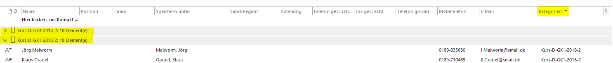
