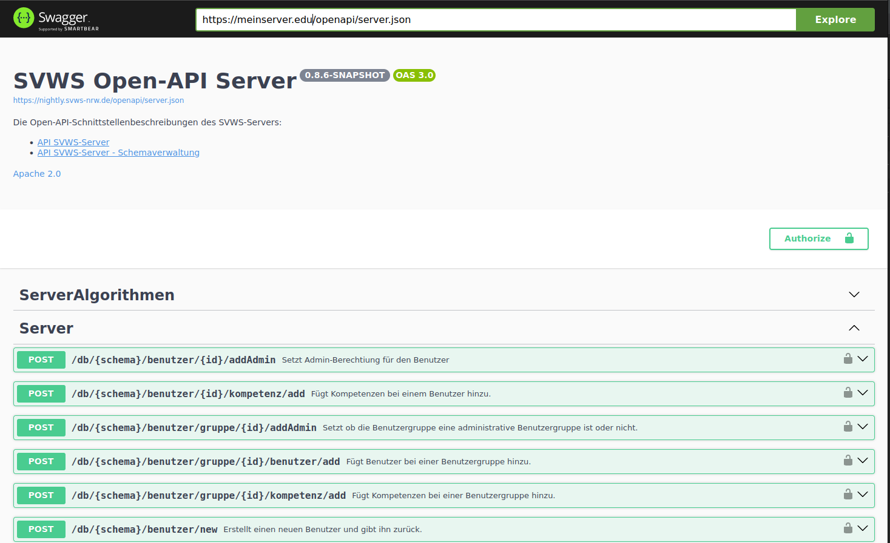

# svws-openapi

Die Open API Schnittstelle für Schulverwaltungssoftware ermöglicht Entwicklern den einfachen Zugriff auf die Funktionalitäten der Software. Über das Swagger Interface können Entwickler die verschiedenen Endpunkte aufrufen und testen. Die API ist so konzipiert, dass sie eine einfache Integration in bestehende Anwendungen ermöglicht und die Entwicklung neuer Anwendungen erleichtert. Mit der offenen Architektur der API können Entwickler schnell und einfach auf die Daten zugreifen, die sie benötigen, um ihre Anwendungen zu erstellen. Die Dokumentation der API ist umfassend und leicht verständlich, so dass Entwickler schnell damit arbeiten können. Die Open API Schnittstelle für Schulverwaltungssoftware ist eine leistungsstarke Lösung für Entwickler, die schnell und einfach auf die Daten zugreifen möchten, die sie benötigen, um ihre Anwendungen zu erstellen.

Die Schulverwaltungs Webapplikation wird auf Grundlage der Open API Schnittstelle entwickelt, um eine nahtlose Integration der Funktionalitäten der Schulverwaltungssoftware zu ermöglichen. Durch die Verwendung der API kann die Webapplikation auf alle Daten und Funktionen der Schulverwaltungssoftware zugreifen, ohne dass die Entwickler der Webapplikation selbst den Code für diese Funktionen schreiben müssen. Dies spart Zeit und Ressourcen und ermöglicht es den Entwicklern, sich auf die Entwicklung der Benutzeroberfläche und anderer wichtiger Funktionen der Webapplikation zu konzentrieren. Die Verwendung der Open API Schnittstelle stellt sicher, dass die Webapplikation stets auf dem neuesten Stand ist und von den neuesten Funktionen der Schulverwaltungssoftware profitieren kann.

Die Klasse "OpenAPIApplication" ist eine Java-Klasse, die als Grundlage für einen OpenAPI-Server dient und die Initialisierung der OpenAPI-Schnittstelle auf Basis der zugeordneten OpenAPI-Klassen übernimmt. 
Die Klasse erbt von der abstrakten Klasse "Application" aus dem "jakarta.ws.rs"-Paket und verwendet die Annotation "@ApplicationPath" zur Definition des Wurzelpfads der Anwendung ("/").

## Aufruf der Swaggerui

**SwaggerUI wird mit htts://meineserverdomain.edu/debug aufgerufen**

