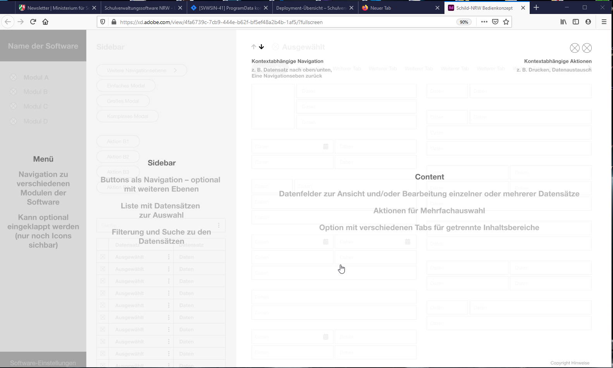
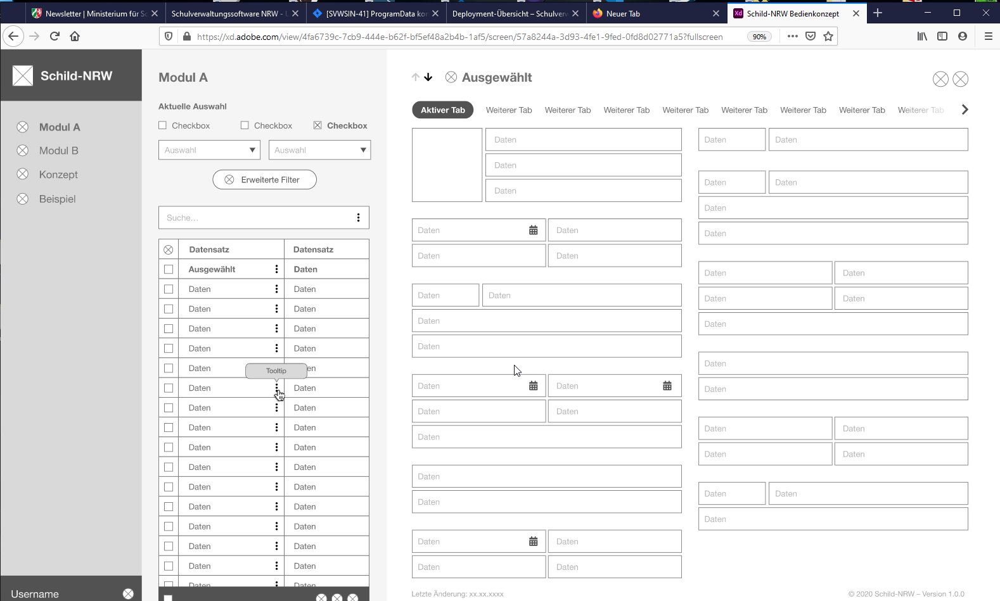
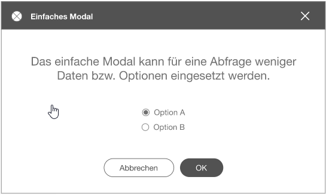
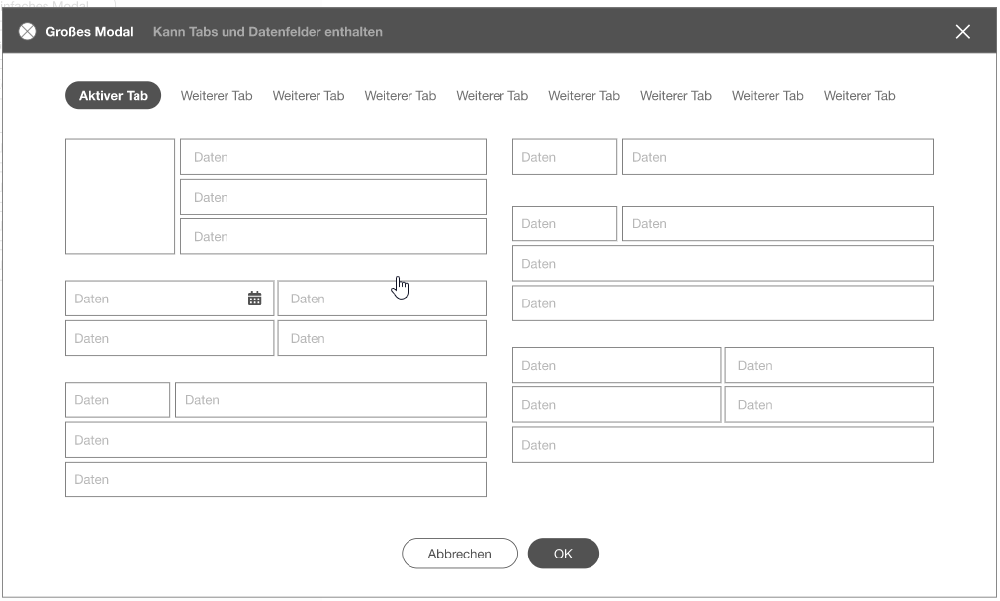
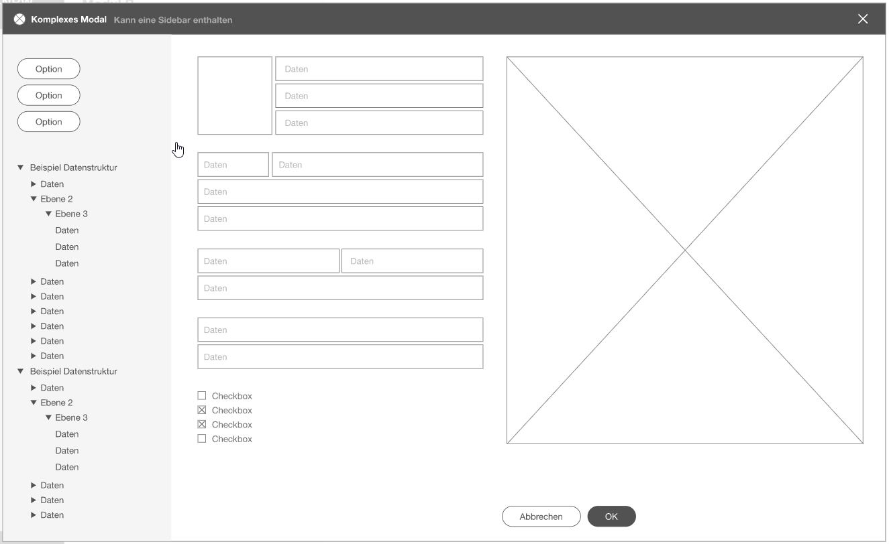
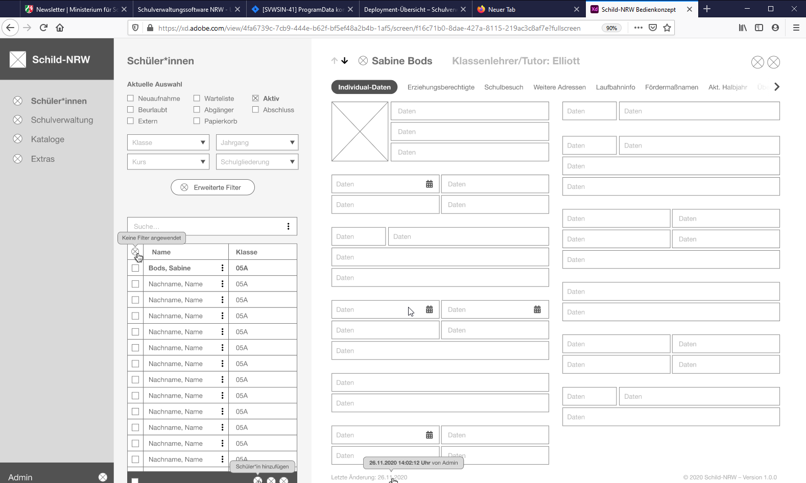
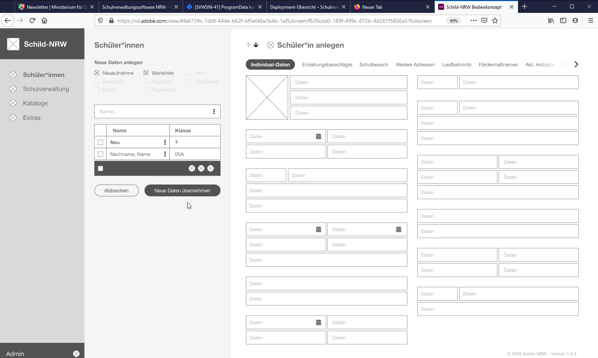

# SVWS Bedienkonzept
In diesem Artikel soll das grundlegende Bedienkonzept, das für die Web-Applikationen erstellt wurde, vorgestellt werden.
Dieses Bedienkonzept beruht auf einigen strategischen Überlegungen und soll in allen vom MSB beauftragen WebApps umgesetzt werden.
Es beschreibt die Menüführung, die Art der Objekte und die Bereiche, die bei der Bedienung vorkommen dürfen. 
Von diesem Konzept darf bei der Umsetzung grafischer Oberflächen dann nicht mehr abgewichen werden, 
um eine einheitliche Bedienführung in allen Komponenten zu gewährleisten.

[WireFrame-Modell](https://xd.adobe.com/view/4fa6739c-7cb9-444e-b62f-bf5ef48a2b4b-1af5/?fullscreen)

Die neue Oberfläche ist in drei Bereiche unterteilt: Navigation, Sidebar und Content.

Generell soll bei der gesamten Bedienoberfläche auf Modale verzichtet werden. 
In den meisten Fällen kann alles in der Sidebar und dem Content-Bereich stehen. 
Beispiele für den Einsatz eines Modals sind Erweiterte Filter und die Druck-Vorschau.

## Navigation
Um den Platz auf dem Bildschirm bestmöglich zu nutzen, ist die Navigation am linken Rand positioniert und kann verkleinert werden. In diesem Fall sind dort nur die Icons einzelner Module bzw. Perspektiven sichtbar. Mit einem Tooltip beim Hover wird die Bezeichnung eingeblendet. Oben Links ist das Logo und der Titel der Software sichtbar. Am unteren Rand der Navigation stehen der Username und ein Button zu den allgemeinen Software-Einstellungen (User Management, Rollenzuweisung usw.).

## Sidebar
Die Sidebar kann unterschiedliche Zwecke erfüllen. Zum einen kann dort eine Tabelle mit Datensätzen eingesetzt werden oder aber eine Subnavigation eines einzelnen Moduls. In der Sidebar wie auch im Content-Bereich kann die Navigation auf mehreren Ebenen realisiert werden. In diesem Fall erscheint neben dem Titel der aktuellen Ebene ein Pfeil, um eine Ebene zurück zu navigieren.
Filterung und Suche von Datensätzen steht immer zugehörig zur entsprechenden Tabelle. Je nach Kontext können hier verschiedene Filter zur Verfügung stehen. Um einzelne Datensätze zu bearbeiten, steht in der jeweiligen Zeile ein Icon für das "Rechtsklick-Menü". Technisch sind Aktionen durch einen Rechtsklick zusätzlich umsetzbar – hier sollte aber immer auch eine Möglichkeit für einen einfachen Klick gegeben werden. Erstellen und Löschen eines Datensatzes ist immer direkt an der unteren Kante einer Tabelle möglich. Dieser Bereich bleibt immer im Viewport stehen. Längere Listen sind dahinter scrollbar. Um einen oder mehrere Datensätze zu markieren, gibt es in jeder Reihe eine Checkbox. Im feststehenden Bereich können durch eine Checkbox alle Einträge markiert werden. Im leeren Feld einer Tabelle (oben links) kann ein Indikator platziert werden, ob und wie die aktuelle Ausgabe gefiltert ist.

## Content
In der gesamten Oberfläche sollte alles Wichtige auf einen Blick erkennbar sein und nicht zu sehr mit Informationen überladen werden. Detaillierte Informationen können mit einem Tooltip angezeigt werden (z. B. "Letzte Änderung: 1.12.2020", der Tooltip zeigt dann ergänzend die genaue Uhrzeit und den User).
Der Content-Bereich kann alle möglichen Ansichten darstellen. Oben angefangen steht dort der Titel – wenn möglich mit einem entsprechenden Icon davor. Vor dem Titel kann eine kontextabhängige Navigation platziert werden, z. B. einen Datensatz vor/zurück oder eine Ebene zurück. Auf der rechten Seite des Headers können Aktionen zur aktuellen Ansicht stehen – Drucken, Datenaustausch usw.
Um Übersichtlichkeit zu schaffen sind Sektionen im Content-Bereich in verschiedene Tabs unterteilt. Diese Navigation kann beliebig lang sein und kann horizontal gescrollt werden.
Je nach Bildschirmbreite können Input-Felder im Content-Bereich auf 1–3 Spalten verteilt werden. Bei einer Mehrfachauswahl wird der Content-Bereich automatisch in eine Navigation verwandelt, die verschiedene Aktionen übersichtlich darstellt und einfach erreichbar macht. Auch hier können mehrere Navigationsebenen verschachtelt werden. Hinter dem Titel gibt es die Möglichkeit, in diesem Beispiel die Anzahl der ausgewählten Datensätze anzuzeigen – hier könnten auch andere sinnvolle Informationen zu einer Ansicht stehen.

## Der Main-Frame

Das Hauptfenster mit den Daten orientiert sich an der bisherigen Nutzerführung von Schild-NRW, jedoch bettet sich dieses Fenster in das Konzept mit der Sidebar ein, so dass der User ohne großen Platzverlust auch an die anderen Perspektiven (Einstellungen, andere Module) gelangen kann.
Visuelle Elemente verdeutlichen dem User, wo Funktionen hinterlegt werden und werden auch über Tool-Tips angezeigt, so dass Funktionalitäten nicht "undokumentiert" sind.
Die Vielzahl der Daten wird in den Tabs dargestellt. Im oberen Bereich werden wichtige Informationen und Hinweise dazu eingeblendet, an welcher Stelle im Programm man sich befindet.
Passende Iconsets müssen hierfür dann gefunden werden.

## Weitere Navigations-Ebenen

Weitere Ebenen können für die Aufgaben verwendet werden, die z.B. nicht an das Daten-Panel gebunden sind. Hier können bestimmte Gruppenprozesse, Einstellungen, Import/Export-Funktionen hinterlegt sein.
Der User hat immer eine Übersicht, auf welcher Navigationsebene er sich befindet, kann aber über die Sidebar auch sehr schnell wieder auf die Hauptebene zurück kehren.

<!--  -->

## Modale Fenster
Modale Fenster sind in diesem Konzept eher vermieden worden. An einigen Stellen wird man aber um solche Abfragen nicht herum kommen. Dazu sind drei Arten von Modalen Fenstern freigegeben worden, die folgende Funktionen nutzen.

### Einfaches Modales Fenster
Für schnelle optionale Entscheidungen, die der User während eines Use-Case zu treffen hat.

### Großes Modales Fenster
Für komplexere Abfragen, wie zum Beispiel den Filter I, der aus dem Hauptfenster aufgerufen werden kann.

### komplexes Modales Fenster
Datenintensive Use-Cases, wie das Reporting mit Vorschau oder die Einstellungen für die Importe und Exporte können mit dieser Variante umgestezt werden.

### Beispiel der Hauptanwendung

### Use-Case Neuaufnahme

