# Styleguide und Screendesign

Der [Styleguide](https://xd.adobe.com/view/3732c0ae-f55d-4974-b991-ecfcfe413200-6261/) wurde mit Adobe XD erstellt. 

Hier wurden auch Klickdummies im SVWS-Desing erstellt: 

+ Link zum Beispiel für das [Screendesign](https://xd.adobe.com/view/4be71403-a5fa-471d-82aa-d2eda66341d7-1eb4/?fullscreen).
+ Link zum überarbeiteten Beispiel für das [Screendesign](https://xd.adobe.com/view/cf4e4968-71bb-4b5c-a416-8c8c4c33e14e-9a1d/?fullscreen). 

In diesem Beispiel für das Screendesign sieht man die Umsetzung der in den zuvor festgelegten Planungsschritten. 
Eine Ausprägung der wichtigsten Elemente und Menüstrukturen sind zu sehen. 
Das Konzept der Trenung der Bereiche und erste Use-Cases können dem Screendesign entnommen werden.

Im Styleguide werden die Farben und die Typographie, Abstände von Fenstern und das Aussehen von Elementen wie Schaltflächen und Buttons festegelegt.
Dabei richtet sich das Aussehen nach den im Bedienkonzept festgelegten Grundwerten.

# Farben
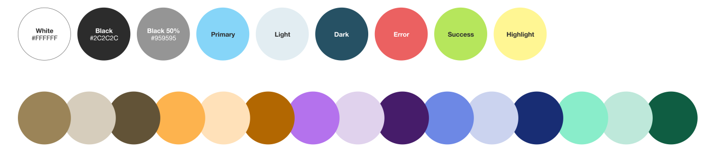

# Fonts

## Type
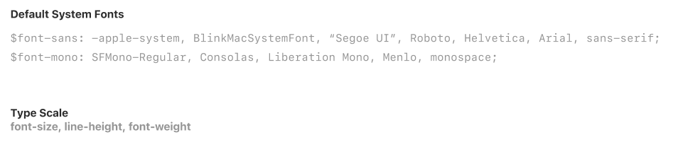

## Size
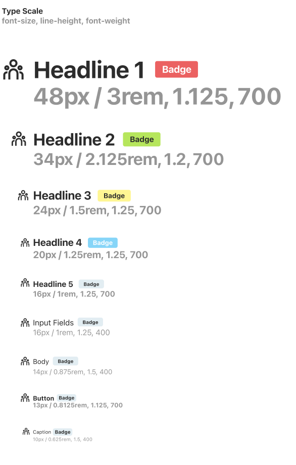

# Icons
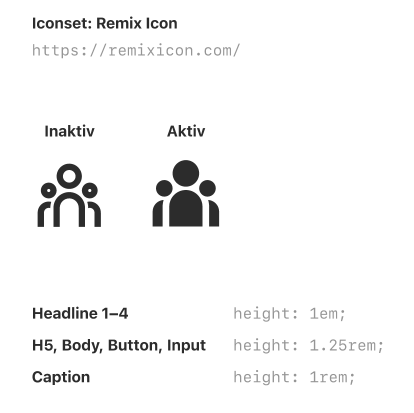
Benutz wurden hier die Remix icons: https://github.com/Remix-Design/RemixIcon

# Input Fields
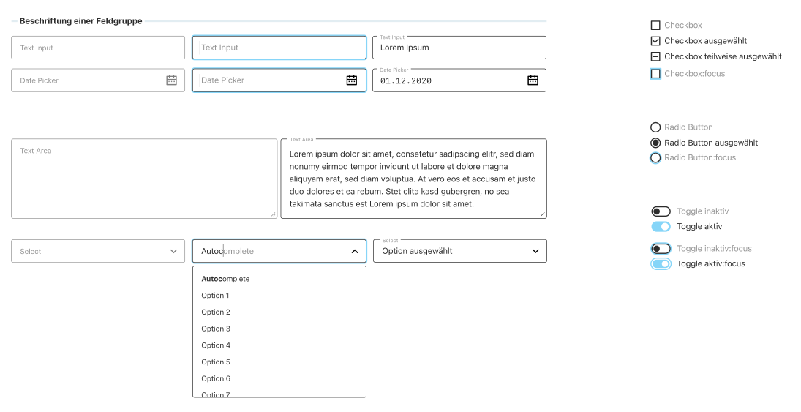
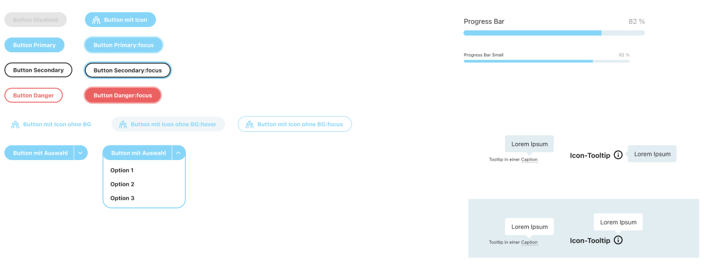

# Geometrie

## Landscape
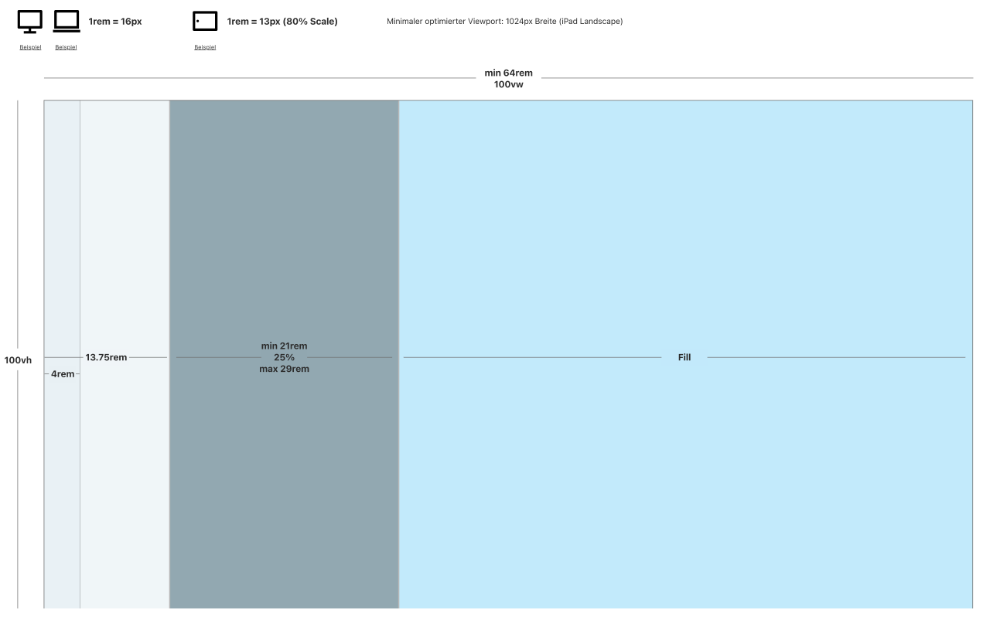

## Modal-Fenster
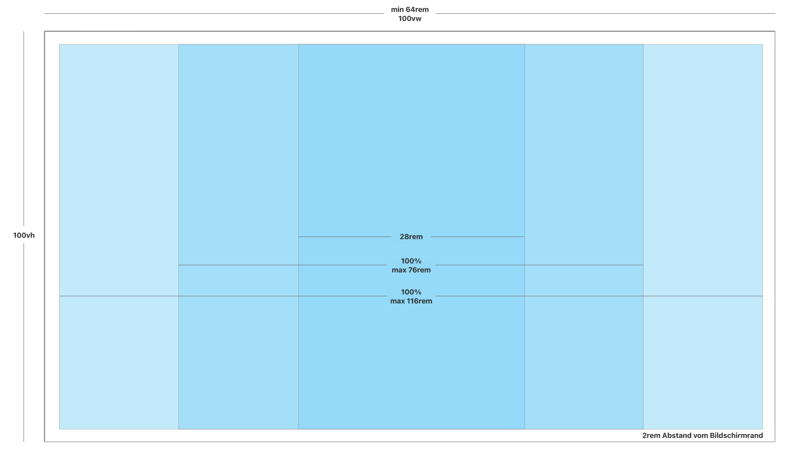

# Screenshots

## Basisfenster 
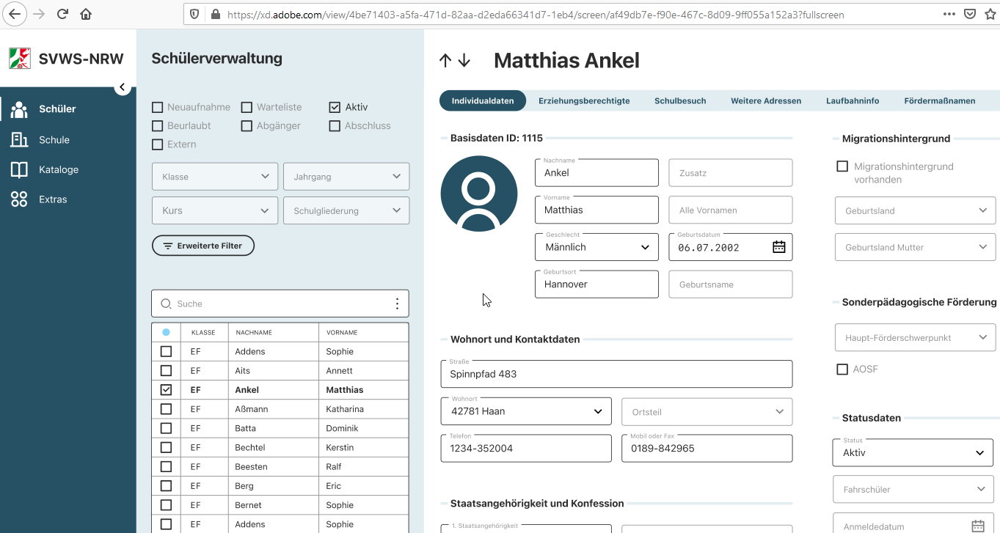

## Schülerneuaufnahme
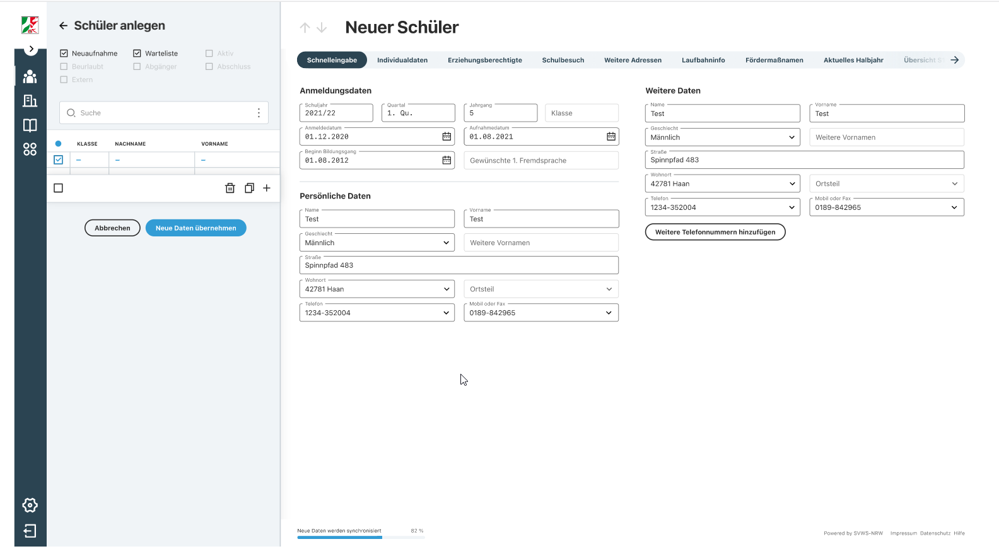

## Einfaches Modales-Fenster
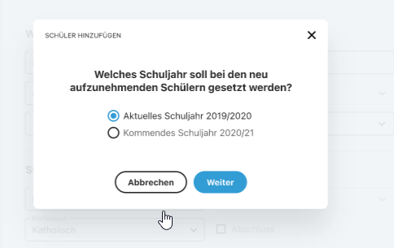

## Multiselect
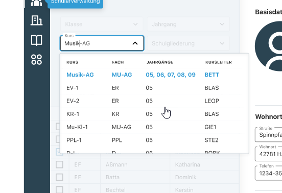

## Der Anmeldebildschirm
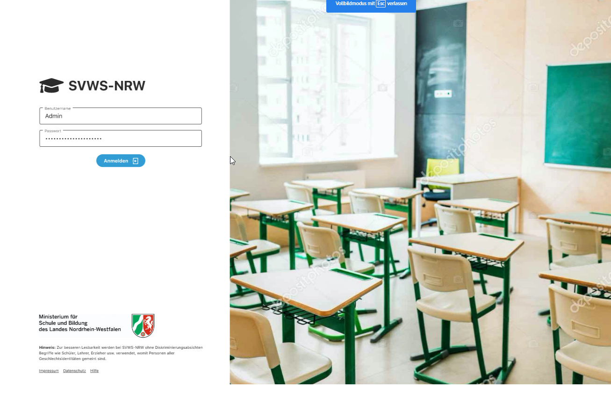

