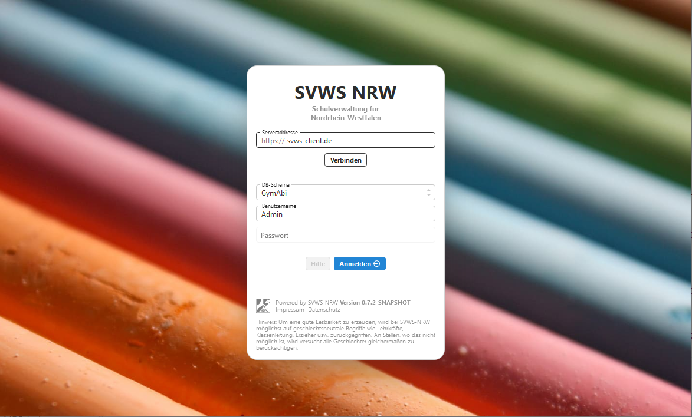

# Der SVWS-Client

Der SVWS-Client ist die graphische Oberfläche über die die Eingaben in den SVWS-Server erfolgen.
Zum Einsatz kommen node.js und VUE.js.
Der Cleint selbst wird in Typescript programmiert.

[Auswahl von VUE.js](./GUI-Auswahl.md)

## Entwicklung der Oberfläche

Zu Beginn der Arbeiten wurde ein [Styleguide und Screendesign](./Styleguide.md) vorgestellt und das [Bedienkonzept der GUI-Komponenten](./Bedienkonzept.md) wird erläutert.

Die UI-Komponenten werden von SVWS-NRW selbst entwicklelt.
Diese stehen unter folgender URL zur Verfügung:

https://ui.svws-nrw.de

Diese Seite wird mit histoire generiert.

## Mitarbeit 

Hier können interessierte Entwickler und Programmierer weitere Informationen zur [Mitarbeit](Mitarbeit.md) erhalten. 

