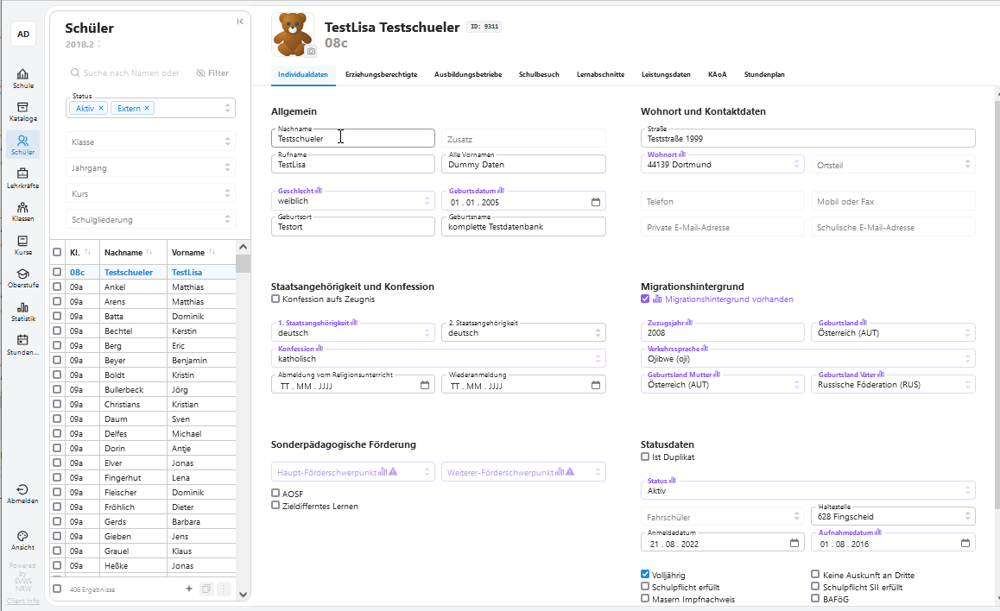

# Der SVWS-Client

Der SVWS-Client ist eine grafische Web-Oberfläche, über die die Eingaben in den SVWS-Server über die REST-Schnittstelle erfolgen. Es ist eine Referenzimplementierung, die notwendige Funktionen bereitstellt, die z.B. über SchILD-NRW 3.0 nicht verfügbar sind (z.B. die Kurs- und Laufbahnplanung). 

Die browserbasierte Oberfläche wird in TypeScript/JavaScript programmiert und setzt auf das Web-Framework Vue. Da im Client sehr viele moderne Technologien verwendet werden, ist die Nutzung eines aktuellen Browsers Voraussetzung. In der Regel werden alle Evergreen-Browser unterstützt, die nicht älter als acht Wochen sind. Regelmäßige Tests werden mit FireFox und Chrome gemacht.

[Auswahl von Vue](./GUI-Auswahl.md)

## Entwicklung der Oberfläche

Zu Beginn der Arbeiten wurde ein [Styleguide und Screendesign](./Styleguide.md) vorgestellt und das [Bedienkonzept der GUI-Komponenten](./Bedienkonzept.md) erläutert.

Die UI-Komponenten werden von SVWS-NRW selbst entwickelt und stehen unter folgender URL zur Verfügung:

https://ui.svws-nrw.de

## Mitarbeit 

Hier können interessierte Entwickler und Programmierer weitere Informationen zur [Mitarbeit](Mitarbeit.md) erhalten. 

