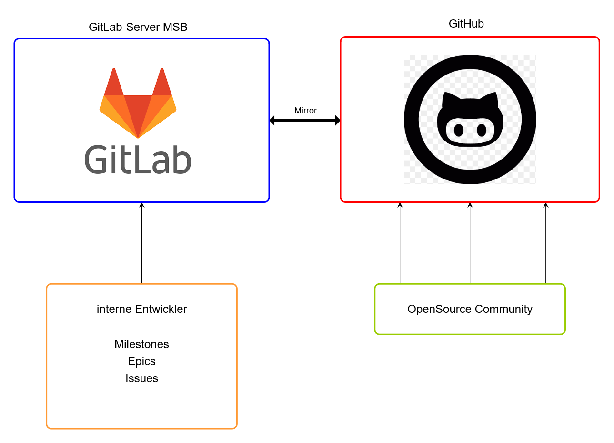

# Gitlab und GitHub

Der Code wird auf dem Gitlab-Server der MSB entwickelt.

Jedes Repository wird automatisch nach Github gespiegelt.
https://github.com/SVWS-NRW

Entwickelt wird auf dem Gitlab-Server. Hierzu benötigen Entwickler die entsprechenden Zugänge.

## Information für Entwickler im SVWS-Server-Projekt

### Dokumentation:

Hier wird die gesamte Dokumentation - Entwickler- und Anwenderdokumentation - des Projekts erstellt.
Diese wird mittels VitePress auch auf https://doku.svws-nrw.de öffentlich bereitgestellt.

