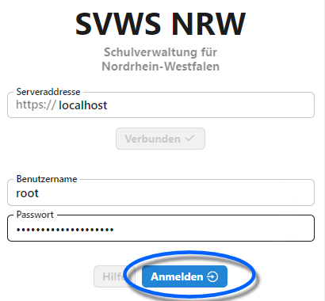
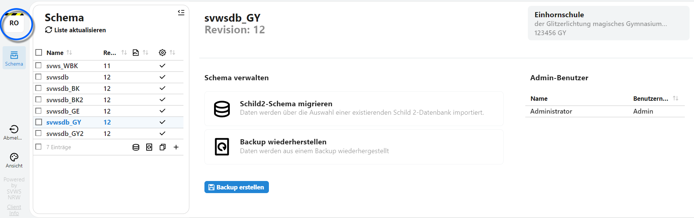

# Admin Client

## Login und Übersicht
Rufen Sie den _[Server]/admin_ auf, um den **Admin Client** zu starten.

Bei einer lokalen Installation wäre dies _localhost/admin_. Sie können an dieser Stelle einen IP-Adresse oder einen Hostnamen verwenden.

*Loggen Sie sich mit dem root-Nutzer Ihrer MariaDB und dem root-Paswort ein. Klicken Sie auf **Anmelden***.

*Die Übersicht über die Schemata im Admin Client.*

Oben links zeigt **Ro** an, dass der Rootuser angemeldet wurde.

Melden Sie sich unten links mit einem Klick auf **Abmelden** ab.

Wie im Client gewohnt, lässt sich hier auch die **Ansicht** ändern.

In der Kopfzeile finden sich die Apps für das **Schemata**-Management und weitere **Konfiguration** des SVWS-Servers.

