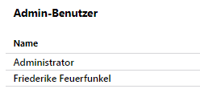
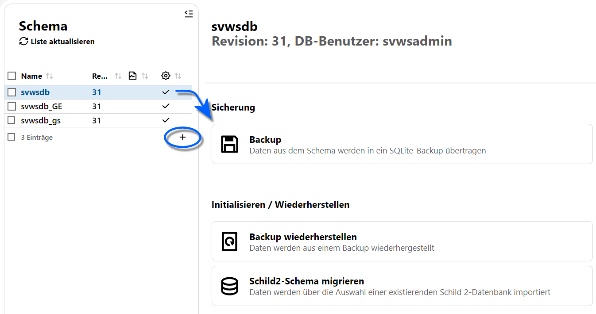

# Schematamanagement

Im Bereich **Schema** lassen sich die auf dieser MariaDB laufenden Schemata auswählen.

::: info MariaDB-root und Schema-Admin
Hat man sich mit einem Schema-Admin und nicht mit dem MariaDB-root eingloggt, stehen nur die Schemata zur Verfügung, auf die dieser Schema-Admin Zugriff hat.
:::

Zu jedem Schema werden dann rechts der **Name** und und weiter rechts die **Daten der Schule** angezeigt. Weiterhin werden die **Admin-Benutzer** der jeweiligen Datenbank mit ihrem Namen und Benutzernamen aufgeführt. 

Im mittleren Bereich lässt sich ein bisheriges **SchILD-NRW-2-Schema** in dieses Schema **migrieren**. Dieser Vorgang überschreibt die im Schema aktuell vorliegenden Daten.

Weiterhin lässt sich in das aktuelle Schema ein **Backup wiederherstellen**. Hierbei wird in eine .sqlite-Datei eingelesen und in die MariaDB migriert. Das aktuelle Schema wird hierbei mit dem Backup überschrieben.

Sollte die Revision nicht dem aktuellen Stand entsprechen, kann über einen erscheinenden Schalter versucht werden, die Revision auf die aktuelle hochzuschreiben.

## Admin-Benutzer

Auf der rechten Seite werden alle Datenbank-Admin-Benutzer angezeigt, die in diesem Schema eingerichtet sind.

Hierbei handelt es sich um die "tatsächlichen Datenbanknutzer", nicht den Schema-Admin oder den Datenbank-root.

::: info Nutzerverwaltung
Diese Nutzer werden in der Datenbank selbst über Client-Anwendungen verwaltet.
:::

## Weitere Information zu einem Schema

In der Schema-Übersicht links finden sich Angaben zur **Revision**, **Tainted** und **Config**.

* Die **Revision** kennzeichnet die technischen Struktur der Datenbank. Diese kann relevant sein, wenn externe Programme direkt auf die Datenbank zugreifen und diese Programme relativ zum Datenbankschema veralten. Über die Revision kann auf Kompatibilität geprüft werden, um Fehler zu vermeiden. Normalererweise liegt jedoch die API zwischen der Datenbank und dem zugreifenden Programm.
* Ein Schema, das für die Entwicklung und zum Testen neuer Features gedacht ist, kann als  **Tainted** oder **Verschmutzt** markiert werden, damit dieses mit ihren Datenbanken nicht im echten Produktivbedtrieb zum Einsatz kommt.
* Weiterhin ist es möglich, dass sich auf der MariaDB Schemata befinden, die aber nicht zum SVWS-Server gehören. Diese werden dann als nicht zur **Config** des SVWS-Servers gehörend markiert und werden von diesem bezüglich SVWS-Server und SVWS-Client ignoriert. Ein Beispiel könnte etwa ein Stundenplanprogramm eines anderen Herstellers oder die Datenbank der kommunalen Führerscheinstelle sein.

## Operationen für Schemata

*Die Schaltflächen der Schemaverwaltung.*

Das **+** legt ein neues, leeres Schema an, in das im Anschluss migriert, Backup eingespielt und so weiter werden kann.

Über die **Checkboxen ☑** lassen sich eine Schema oder mehrere Schemata anwählen und über einen dann darunter auftauchenden **Mülleimer 🗑** löschen.

Über **Backup** lässt sich eine .sqlite-Datei abspeichern. Diese Dateien lassen sich über **Backup wiederherstellen** wieder in das gewählte Schema einlesen.

## Datenbank-Migration
Klickt man auf **SchILD2-Schema migrieren**, öffnet sich der Dialog zur Auswahl von *Quelle* und *Ziel*:

*Die Migrationsoptionen im Admin Client.*

Hierbei besteht die Auswahl aus den Quellen *MS Access*, *MySQL*, *MariaDB*, *MSSQL* und es sind die Daten einzugeben, um die Quelldatenbanken zu erreichen und das intendierte Ziel, das nun neu angelegt wird.

Hier im Beispiel wird ein Schema mit dem Namen "schildDB" einer fiktiven IP-Adresse abgerufen, um diese in in ein "svwsdb_FS" genanntes Schema zu migrieren. Hier wird das *_FS* angehängt, um kenntlich zu machen, dass es sich um eine Förderschule handelt.

Bei einer Migration aus SchILDzentral ist eine *Schulnummer* zu übergeben.

## Weiteres Datenbankmanagement für ITler

Weitere Informationen zu technischerem Datenbankmanagement, das nicht über die grafische Oberfläche durchgeführt wird, wie Backups per Skript, finden IT-Dienstleister bei den [Informationen für IT-Administratoren](../../../deployment/).