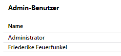
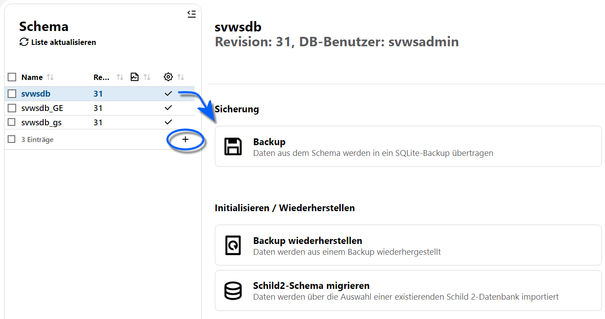

# Schematamanagement

Im Bereich **Schema** lassen sich die auf dieser MariaDB laufenden Schemata auswählen.

::: info MariaDB-root und Schema-Admin
Hat man sich mit einem Schema-Admin und nicht mit dem MariaDB-root eingloggt, stehen nur die Schemata zur Verfügung, auf die dieser Schema-Admin Zugriff hat.
:::

Zu jedem Schema werden dann rechts der **Name** und und weiter rechts die **Daten der Schule** angezeigt.

## Admin-Benutzer

Auf der rechten Seite werden alle Datenbank-Admin-Benutzer (mit der *Administrator*-Markierung) angezeigt, die in diesem Schema eingerichtet sind.

Hierbei handelt es sich um die "tatsächlichen Datenbanknutzer" mit Administrationszugang, die in der Datenbank selbst angelegt sind, nicht den Schema-Admin oder den Datenbank-root, die dazu dienen, das Schema oder die ganze Datenbank zu verwalten.

::: info Nutzerverwaltung
Diese Nutzer werden in der Datenbank selbst über Client-Anwendungen verwaltet.
:::

## Weitere Information zu einem Schema

In der **Auswahlliste der Schemata** links finden sich Angaben zur **Revision**, **Tainted** und **Config**.

* Die **Revision** kennzeichnet die technischen Struktur der Datenbank. Diese kann relevant sein, wenn externe Programme direkt auf die Datenbank zugreifen und diese Programme relativ zum Datenbankschema veralten. Über die Revision kann auf Kompatibilität geprüft werden, um Fehler zu vermeiden. Normalererweise liegt jedoch die API zwischen der Datenbank und dem zugreifenden Programm.
* Ein Schema, das für die Entwicklung und zum Testen neuer Features gedacht ist, kann als  **Tainted** oder **Verschmutzt** markiert werden, damit dieses mit ihren Datenbanken nicht im echten Produktivbetrieb zum Einsatz kommt. Dies sollte im Produktivbetrieb an Schulen nicht vorkommen.
* Weiterhin ist es möglich, dass sich auf der MariaDB Schemata befinden, die nicht zum SVWS-Server gehören. Diese werden dann als nicht zur **Config** des SVWS-Servers gehörend markiert und werden von diesem bezüglich SVWS-Server und SVWS-Client ignoriert. Ein Beispiel könnte etwa ein Stundenplanprogramm eines anderen Herstellers oder die Datenbank der kommunalen Führerscheinstelle sein.

## Operationen für Schemata

Das **+** legt ein neues, leeres Schema an, das im Anschluss weiter bearbeitet werden kann.

Über die **Checkboxen ☑** lassen sich ein oder mehrere Schemata anwählen und über einen dann darunter auftauchenden **Mülleimer 🗑** löschen.

## Datenbank-Migration

Sie können unter **Sicherung** ein SQLite-Backup als Datei aus der MariaDB herausschreiben. Wählen Sie das Feld an und klicken Sie auf `Backup starten`. Nachdem die Backup-Datei generiert wurde, können Sie einen Speicherort auswählen.

Die Datei wird nach dem Format 

`SchemaName_YYYYMMDD_HHNN.sqlite` erstellt, also zum Beispiel `svwsdbBK_20260530_0938.sqlite`.

Entsprechend können Sie unter **Initialisieren/Wiederherstellen** eine solche SQLite-Datei in das gewählte Schema einlesen. Hierbei werden alle im Schema existierende Daten überschrieben. Wählen Sie nach einem Klick auf **Backup wiederherstellen** Ihre Datei aus.

Über **SchILD2-Schema migrieren** können Sie eine SchILD2-Datenbank auswählen.

Hierbei wählen Sie im Dropdown-Menü
* MySQL
* MaridaDB
* MSSQL
* MS Access (.mdb)

Bei MS Access wählen Sie die .mdb-Datei an, bei den anderen Optionen müssen Sie den *Host*, unter dem die DB zu erreichen ist, das *Datenbank-Schema* (den "Datenbanknamen") und einen *Datenbanknutzer* und das zugehörige *Passwort* angeben.

::: warning Host und Datenbanknutzer
Achten Sie darauf, dass der SVWS-Server den Host auch erreichen kann, etwa über Grenzen eines virtuellen Servers hinweg.

Beim **Datenbanknutzer** handelt es sich um einen **Zugang auf den Datenbankserver**, also etwa einen Root-Administrator oder sonstwie einen Zugang zur Datenbank selbst, nicht um einen *Nutzer-Administrator* oder *SchILD-Benutzer* innerhalb der Datenbank!
:::

## Weiteres Datenbankmanagement für ITler

Weitere Informationen zu technischerem Datenbankmanagement, das nicht über die grafische Oberfläche durchgeführt wird, wie Backups per Skript, finden IT-Dienstleister bei den [Informationen für IT-Administratoren](../../../deployment/).
