# Anlage einer Schule in einem neuen Schema

Die Verwaltung von Schemata und die Migration einer existierenden Datenbank in ein existerendes Schema sind im vorherigen Artikel beschrieben.

In diesem Artikel wird beschrieben, wie Sie eine Schule vollständig neu im SVWS-AdminClient anlegen, ohne dass ein existierendes Schema eingelesen oder migriert wird.

>[!CAUTION]Installation und AdminClient
>Zuerst muss der SVWS-Server installiert werden, anschließend loggen Sie sich mit dem SVWS-AdminClient als *root* ein.
>Gehen Sie zu *https://SERVERADRESSE/admin* und geben Sie den Nutzernamen *root* das *root-Kennwort* ein. Dieses Kennwort haben Sie bei der Installation des SVWS-Servers gesetzt.

## Legen Sie ein Schema an

Wählen Sie in der Schema-Liste das `+` an und legen Sie ein neues Schema an.

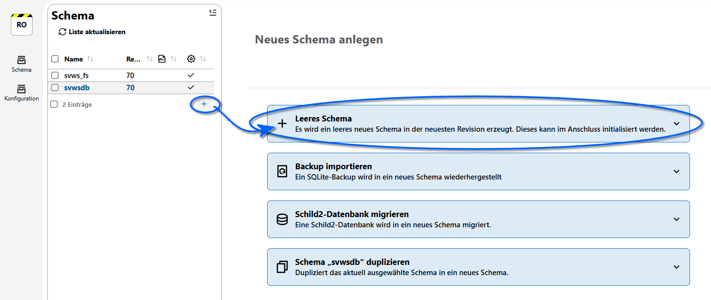

Wenn Sie ein neues Schema erzeugen, werden Ihnen einige Optionen angeboten.

Keine der unteren Optionen sind hier gewünscht: Wählen Sie `Leeres Schema` an, denn es soll eine neue Datenbank angelegt werden.

Geben Sie nun die grundlegenden Daten für das neue Schema ein.

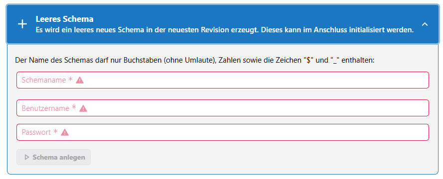

Vergeben Sie einen sinnvollen **Schemanamen**, einen **Schema-Admin-Benutzernamen** und ein **Passwort** für diesen Schema-Admin-Benutzer.

>[!TIP]Schema-Admin
>Hierbei ist zu beachten, dass der Schema-Admin nur zum technischen Zugriff verwendet wird. Sie können einen existierenden Schema-Admin verwenden, der dann das bekannte Passwort verwendet. In den Beispielen auf dieser Seite wird üblicherweise *svwsadmin* verwendet. Ihre Bezeichnungen sind aber frei wählbar.
>Es handelt sich NICHT um einen tatsächlichen Datenbank-Benutzer.
>Der Datenbank-root hat immer Zugriff auf alle Schemata, diesen geben Sie hier NICHT an, den brauchten Sie nur weiter oben zum Einloggen im SVWS-AdminClient.

Klicken Sie anschließend auf `Schema anlegen`.

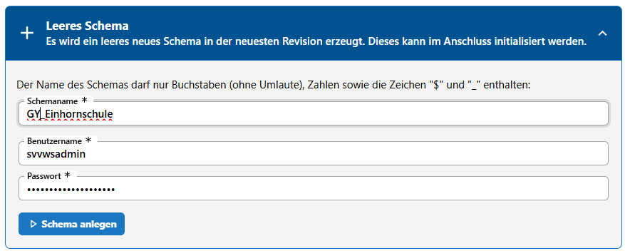

Hier im Beispiel wurde ein sprechender Schulname gewählt, der Schema-Admin bleibt hier im Beispiel der Standard des Autoren für Beispieldatenbanken.

Nachdem `Schema anlegen` geklickt wurde, dauert es einige Momente, in der die Struktur der Datenbank mit allen Tabellen und Datenfeldern angelegt wird. Diese sind natürlich noch alle leer.

## Initialisieren Sie das Schema

Das neue Schema ist nun in der Auswahlliste links zu sehen.

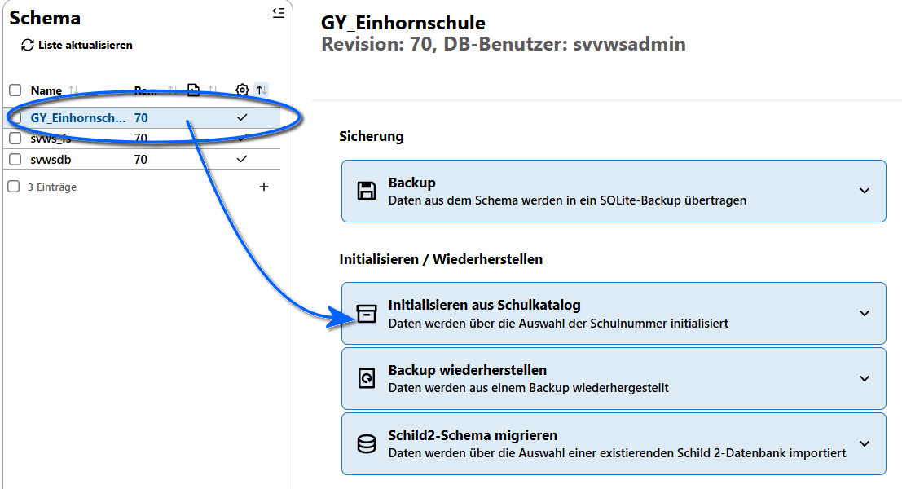

Für dieses Schema werden wieder Optionen angeboten, die hier nicht verwendet werden sollen.

Wählen Sie `Initialisieren aus dem Schulkatalog` aus. Der Schulkatalog enthält alle Schulen in NRW.

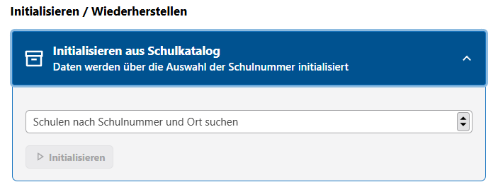

Sie können eine **Schulnummer** oder einen **Ort** eingeben um die Dropdown-Liste zu filtern.

Wählen Sie nicht die Schule mit dem besten Namen, sondern die Schule, die Sie anlegen möchten.

Klicken Sie dann auf `Initialisieren`. 

Das Schema - also Ihre neue Schuldatenbank - ist nun initialisiert und kann verwendet werden.

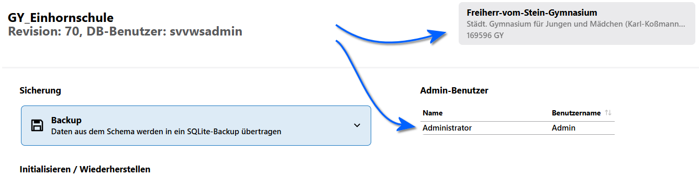

Sie sehen nun oben rechts die grundlegenden Daten Ihrer Schule wie die Bezeichung und die Schulnummer.

Ebenso wurde ein erster Datenbanknutzer angelegt. Es handelt sich um einen **Administrator** mit dem Login **Admin** und **KEINEM PASSWORT**.

## Starten Sie das Schema

Starten Sie nun das Schema und nehmen Sie die ersten Einstellungen vor.

Beenden Sie hierfür den SVWS-AdminClient und starten Sie den SVWS-Client.

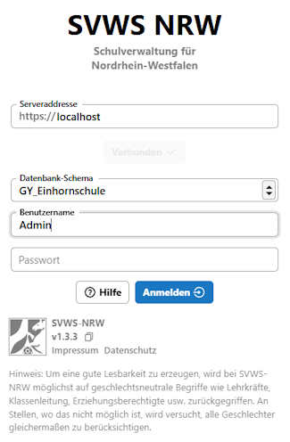

Loggen Sie sich mit dem **Admin** ein. Das Kenntwort bleibt leer.

Klicken Sie dann auf `Anmelden`.

Sie sehen eine leere Datenbank. Navigieren Sie als erstes zum Admin-Nutzer und vergeben Sie ein modernen Standards entsprechendes Passwort von ausreichender Länge und Groß-, Kleinbuchstaben und Zahlen. Sie können für mehr Sicherheit auch Sonderzeichen verwenden.

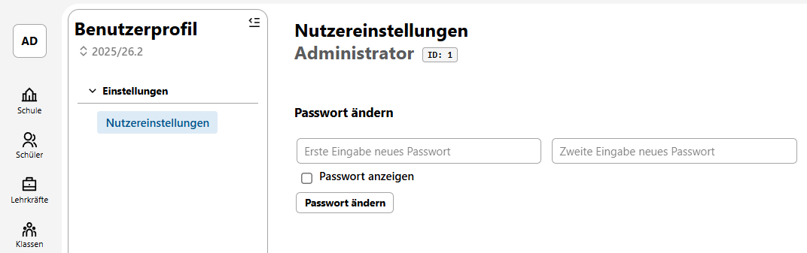

Vergeben Sie ein gutes Kennwort und klicken Sie auf ``Passwort ändern``.

>[!CAUTION]Admin-Passwort
>Nutzen Sie auf gar keinen Fall eine Datenbank im Produktivbetrieb, bei der ein Admin-Nutzer ein schwaches oder sogar gar kein Kennwort hat!
>Hinterlegen Sie das Passwort sicher.

## Weitere Schritte

Ihre Datenbank ist nun angelegt und verwenbar. Die nächsten Schritte können sein:

* Kontrollieren Sie in der **App Schule** die Stammdaten der Schule.
* Legen Sie über die **App Einstellungen** in der **Benutzerverwaltung** weitere Benutzergruppen und Benutzer mit passenden Rechten an.
* Hinterlegen Sie Emaildaten.
* Legen über die **App Schule** unter **Kataloge** grundlegende Katalogeinträge an, etwa

    * eventuelle Abteilungen
    * die Jahrgänge
    * Fächer
    * Klassen
    * ...
* Erfassen Sie anschließend ihre Lehrkräfte
* Kontrollieren Sie alle Kataloge und befüllen Sie diese
* ... 

## SchILD-NRW 3

Anschließend können Sie sich mit dem **Admin** oder mit einem der gegebenfalls neu angelegten Datenbankbenutzern in SchILD-NRW 3 anmelden und auch diesen Client verwenden.

SchILD-NRW 3 und der SVWS-Client greifen beide auf das gleiche Schema mit den gleichen Daten zu und Änderungen über das eine Programm stehen damit auch im anderen zur Verfügung.

Sie müssen zuerst eine Datei anlegen, in der die Anmeldedaten für das Schema hinterlegt ist. Diese Datei liegt im Ordner 

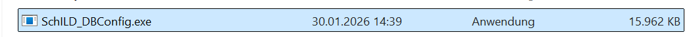

Gehen Sie hierzu in das *Installationsverzeichnis von SchILD-NRW 3*. Starten Sie dort die *SchILD_DBConfig.exe*. Per Standard blendet MS Windows die Dateiendung aus, daher wird eventuell nur *SchILD_DBConfig* angezeigt.

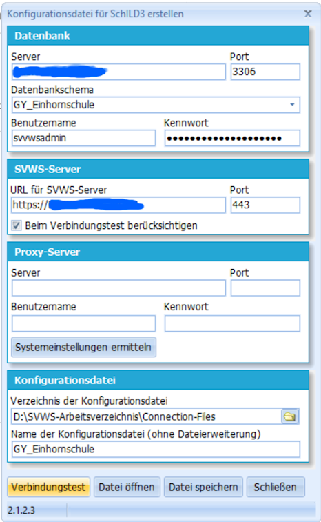

Geben Sie die Daten für Ihren **Server** ein. Wählen Sie das **zu konfigurierende Schema** und geben Sie den **Schema-Admin** mit dem **passenden Passwort** ein. Eventuell ist dieser schon ausgefüllt.

>[!TIP]Ausgefüllte Felder
>Sind die Felder nicht vorausgefüllt kann es sich lohnen auszuprobieren, die *SchILD_DBConfig* als Windows-Admin über das `Kontextmenü der rechten Maustaste` zu starten. Möglicherweise führt dies dazu, dass Felder schon befüllt sind.

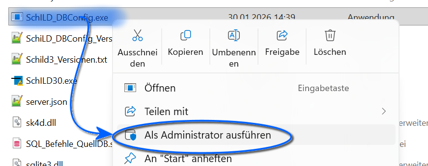

Kontrollieren Sie die übrigen Daten wie das SVWS-Arbeitsverzeichnis.

Klicken Sie auf `Verbindungstest`.

Wenn alles funktioniert, können Sie auf `Datei speichern` klicken.

Starten Sie anschließend SchILD-NRW-3 und loggen Sie sich in Ihrem neuen Schema ein. In der Regel gibt es an Ihrer Schule auch nur ein Schema, so dass SchILD-NRW-3 dieses sofort lädt.