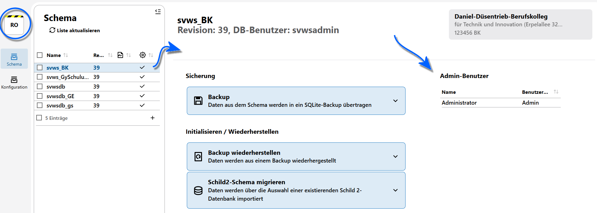

# Bedienkonzept des SVWS-Adminclient

Der SVWS-Server kann sehr flexibel konfiguriert werden. Dies soll dazu führen, dass der Server an die vielen verschiedenen Systemumgebungen anpassen und je nach Bedarf skaliert werden kann.

## Administration in der eigenen Schule

Der SVWS-Server kann auch weiterhin an der eigenen Schule auf einem Windows- oder Linux-Server betrieben werden.

Weitere Hinweise zur Installation befinden sich im Bereich *Administration/Entwicklung* ➜ **SVWS-Installation**. 

Es können verschiedene Schemata, also "Datenbanken", für eine Schule eingerichtet werden, zum Beispiel für den Produktivbetrieb, einen Testbetrieb und Schulungsbetrieb.

Um die Verwaltung der verschiedenen Systeme zu unterstützen, liefert der SVWS-Server einen *Admin-Client* aus.

Der Admin-Client kann auch genutzt werden, um Backups zu erzeugen, wieder einzuspielen und eine Migration in die MariaDB anzustoßen.

## Administration an zentraler Stelle

Der SVWS-Server kann auch an zentraler Stelle betrieben werden und mehrere Schulen auf einem MariaDB-Server zur Verfügung stellen.

Dazu bekommt jede Schule ein eigenes Schema, das auch einen eigenen Schema-Datenbankbenutzer bekommt. Dadurch wird schon auf der Ebene der Schemata, der "Datenbanken" ausgeschlossen, dass Schulen auf Daten fremder Schulen zugreifen können.

Die Verwaltung der verschiedenen Schemata kann auch mit dem Admin-Client geschehen. Ebenso stehen den Schulträgern hierzu auch API-Endpunkte zur Verfügung, die die Schema-Verwaltung über eine priviligierte API ermöglichen.

Hierzu findet sich mehr unter https://doku.svws-nrw.de/deployment/, konkret wird dies https://doku.svws-nrw.de/deployment/IT-Umgebungen/ ausgeführt.

## Login und Übersicht
Rufen Sie den _[Server]/admin_ auf, um den **Admin Client** zu starten.

Bei einer lokalen Installation wäre dies _localhost/admin_. Sie können an dieser Stelle einen IP-Adresse oder einen Hostnamen verwenden.

::: Warning Einloggen mit dem MariaDB-root
Loggen Sie sich mit dem root-Nutzer Ihrer MariaDB und dem **MaridaDB-root-Passwort** ein. Klicken Sie auf **Anmelden**.
:::

Im Admin-Client selbst gibt es wieder **Apps**, die zu unterschiedlichen Administrationsbereichen führen.

Derzeit finden sich Apps zum Schemata-Management und zur Konfiguration des SVWS-Servers.

Oben links zeigt **Ro** an, dass der Rootuser angemeldet wurde.

Melden Sie sich unten links mit einem Klick auf **Abmelden** ab.

Wie im Client gewohnt, lässt sich hier auch die **Ansicht** ändern.

In der Kopfzeile finden sich die Apps für das **Schemata**-Management und weitere **Konfiguration** des SVWS-Servers.

