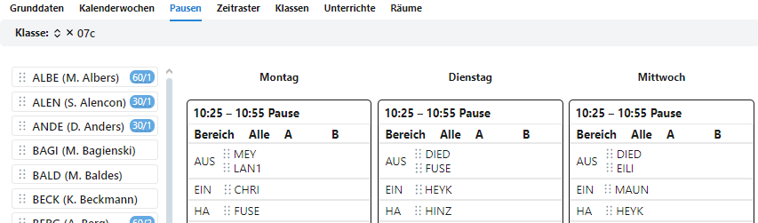
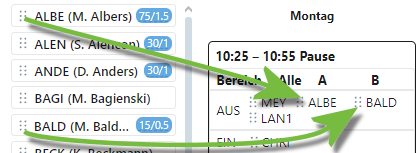
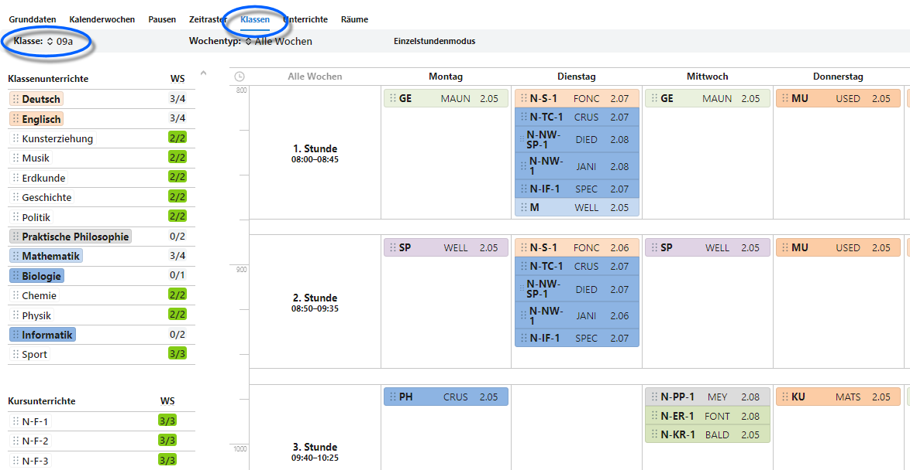
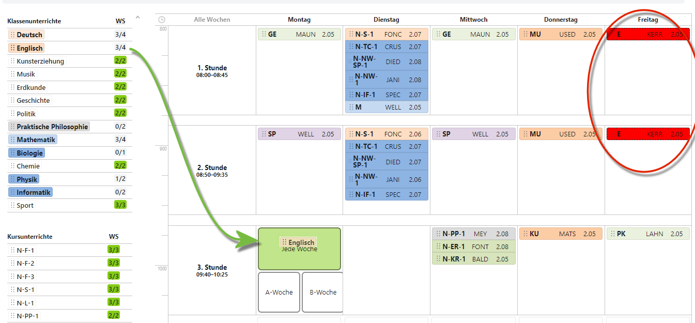
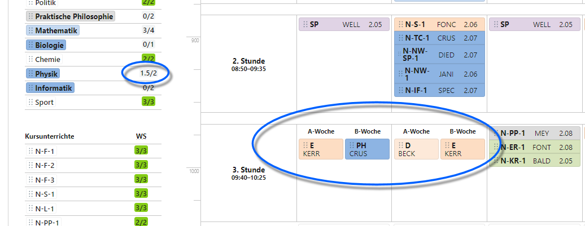
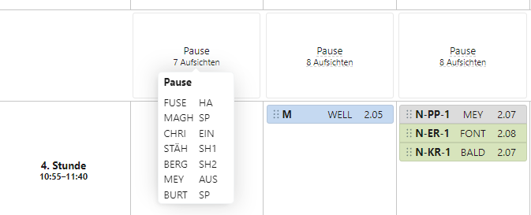

# Stundenpläne erstellen und bearbeiten

Ein neuer Stundenplan kann einfach über *Drag & Drop* erstellt werden, ebenso lassen sich existierende, auch aus einem Stundenplanprogramm importierte, Stundenpläne verändern.

Lesen Sie bitte den Artikel der ````App Stundenplan```` für eine ausführlichere Erkläuterung der einzelnen Elemente eines Stundenplans.

Wird ein neuer Stundenplan erstellt, müssen zuerst die **Grunddaten**, **Kalenderwochen**, **Pausenzeiten**, **Zeitraster** und **Räume** entsprechend der Kriterien erstellt werden. Konsultieren Sie hierzu die Artikel der jeweiligen Themen und den Artikel zur *App Stundenplan*.

Weiterhin müssen **Unterrichte** für die Schülergruppen, Klassen oder Jahrgänge in der Oberstufe, vorhanden sein.


Sie können nun Pläne für die **Pausen**aufsichten und **Klassen** erstellen und bearbeiten.

Bearbeiten Sie eine Klasse, wählen Sie die betreffende ````Klasse````, hier im Screenshot grün dargestellt.

**Hinweis:** Der Stundenplan im Beispiel arbeitet exemplarisch mit A- und B-Wochen.

## Pausen bearbeiten und Erklärung des Interfaces



Auf der linken Seite sind alle Lehrkräfte zu sehen, die per ````Drag & Drop````in den *Kacheln* rechts in die *Zeitplätze* gezogen werden können.

Bei einer Aufsicht kann eine Lehrkraft zum Beispiel im Bereich **AUS**gang in *Alle* für beide Wochentypen oder nur in die *A-* oder *B-Woche* gezogen werden.

Ebenso ist zu sehen, dass Montag in der Aufsicht AUS jeweils zwei Lehrkräfte hinein gezogen wurden. Mehrfachbelegungen sind somit möglich.



Hier im Beispiel werden die Lehrkräfte *ALBE* und *BALD* Montags in der Aufsicht AUS in die A- und die B-Woche gezogen.

Um eine Aufsicht zu entfernen, ziehen wir sie aus dem Plan einfach nach links in die Auswahlliste zurück.


Der rot gestrichelte Rand um die Auswahliste zeigt beim Entfernen an, dass eine Lehrkraft aus der Aufsicht ausgetragen wird.

Da nun die A- und B-Wochen mit anderen Lehrkräften belegt sind, wird *LAN1* aus dem Bereich *Alle*, der für beide Wochentypen gilt, entfernt.


In der endgültigen Planung ist nun zu sehen, dass Montag in der Pause 10:25 - 10:55 im Bereich AUS die Lehrkraft Mey in beiden *(Alle)* Wochen eingesetzt ist, und ALBE und BALD jeweils in der A- und B-Woche.

In der Übersichtsliste werden auch die Einsätze der Lehrkräfte gezeigt.


In der Übersichtsliste sind nun auch die Summen der Aufsichtseinsätze zu sehen. Hierbei zeigt das Feld **Minute/Zahl der Aufsichten** an.

Im Beispiel von ALBE ist zu sehen, dass diese Lehrkraft 75 Minuten in 1.5 Aufsichten eingesetzt ist. Diese Lehrkraft hat hier eine Stundenaufsicht mit *60 Minuten* und einer Wertigkeit von *1* sowie eine halbe Stunde alle zwei Wochen, daher werden *15 Minuten* und eine *0,5*-Aufsicht angerechnet. 

## Stundenpläne bearbeiten

Im **Klassen**modus lassen sich für Klassen Stundenpläne anlegen. Die Jahrgänge der Oberstufe werden hierbei technisch auch als Klassen behandelt.

Hier im Beispiel wird der Stundenplan der *09a* fertig gestellt. 



Der Ausschnitt aus dem Stundenplan wurde hier so gewählt, dass zum einen die Untertabs der **Klassenauswahl**, der Auswahl des **Wochentyps** und der Modus **Einzelstunden** oder **Doppelstunden** zu sehen sind.

Wird der Doppelstundenmodus angewählt, werden per Drag & Drop gleich zwei aufeinander folgende Stunden verplant.

Weiterhin wird in der *Auswahlliste* links die Aufteilung in **Klassenunterrichte** und **Kursunterrichte** deutlich. Bei jedem Unterricht ist auch das **Ist/Soll** zu sehen, so dass deutlich wird, ob alle Unterrichte schon korrekt verplant sind *(grün)*, ob noch Stunden verplant werden müssen *(weiß)* oder ob zu viele Stunden verplant wurden *(rot)*.

Hier im Beispiel sollen nun die fehlenden Stunden für *Deutsch* und *Englisch* verplant werden.

Hierzu entfernen wir erst Physik aus der 3. Stunde am Montag, die Stunde schieben wir in den Freitag in der 7. Stunde (hier im Screenshot nicht abgebildet). Dazu muss der Unterricht aus der Auswahlliste links in *Freitag, 7. Stunde* gezogen werden. Der Unterricht am *Physik, Montag, 3. Stunde* wird links zurück in die Auswahlliste gezogen, um ihn zu entfernen.


Der Zeitbereich *Montag, 3. Stunde* ist nun frei. Für die zweite Stunde Physik wird ein anderer Platz gefunden werden müssen.

Nun wird *Englisch* aus der Auswahlliste in den Montag, 3. Stunde gezogen.



Hierbei ist gut zu sehen, dass die existierenden Stunden *English* am Freitag in *rot* hervor gehoben werden. Somit ist deutlich zu sehen, wo schon Stunden verplant sind.

Ebenso ist gut zu sehen, dass Englisch für *Montag, 3. Stunde* sowohl in beide Wochentypen gezogen werden kann. Dies ist im Screenshot abgebildet.

So lange man die linke Maustaste beim Drag & Drop aber nicht loslässt, werden auch die anderen Wochen eingeblendet und man könnte Englisch nun auch für jeweils den halben Stundenwert in der A- oder B-Woche ablegen.

Das folgende Beispiel dürfte in der Praxis unnötig komplex werden, dient hier in diesem Hilfeartikel aber als rein exemplarische Erklärung der Nutzeroberfläche:



Die 3. Stunde am Montag und Dienstag sind nun in A-B-Wochen am Montag mit Englisch in der A-Woche und Physik in der B-Woche und am Dienstag mit Deutsch in der A-Woche und Englisch in der B-Woche verplant.

Links in der Auswahliste ist zu sehen, dass bei Physik noch eine halbe Stunde fehlt. Bei Mathematik fehlt eine Stunde, weiterhin sind Praktische Philosphie, Biologie und Informatik noch gar nicht verplant. Der Vollständigkeit halber findet sich noch Deutsch, dem ebenfalls noch eine halbe Stunde fehlt.

## Anzeigen der Aufsichten

Wird der Mauszeiger über eine **Pausenzeit** bewegt, werden in dieser Ansicht die eingelanten Aufsichten angezeigt. Diese sind hier nicht zu bearbeiten.



## Räume zuweisen

Ganz gleich, ob Stundenpläne verändert oder neu erstellt wurden, sind nach dem Hineinziehen von Unterrichten in das Klassenraster noch keine **Räume** zugewiesen.

Diese Zuweisung kann im Anschluss über den Tab **Unterrichte** vorgenommen werden.

Hierzu wird über **Klassen** die passende Klasse ausgewählt, um die Zahl der Unterrichte in der Auswahlliste zu reduzieren.

Hier ist beim Unterricht des *Fachs* und des *Zeitrasterplatzes* mit einem Klick auf ````...```` ein Raum zu wählen.

Ebenso können hier existierende Räume für andere Unterrichte verändert werden.