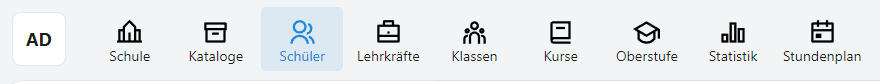
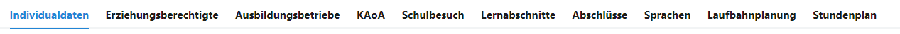
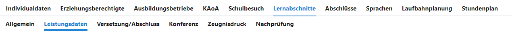
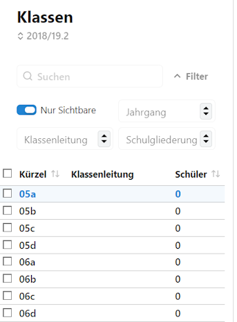
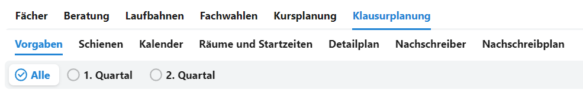
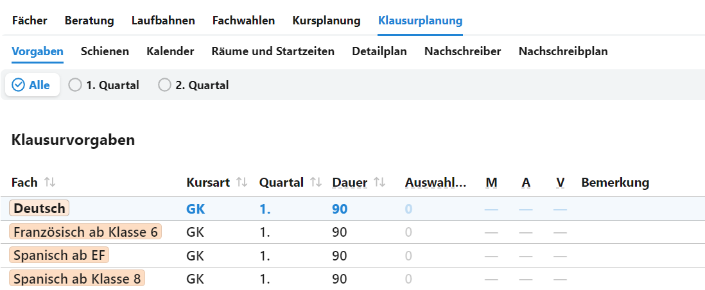

# Apps

## Wesentliche Bedienbereiche des SVWS-Clients

Die Programmpunkte im SVWS-Client heißen **Apps**.

Je nach Schulform werden mitunter andere Apps angezeigt.

In einer App werden nach Bedarf **Tabs** angezeigt.

Die Tabs können sich auch dymanisch ändern, etwa je nach Jahrgang wird KAoA ein- oder ausgeblendet.

Verzweigen sich die Tabs, werden **Untertabs** eingeblendet.

Hier die Untertabs können sich dynamisch verändern, zum Beispiel werden bei den Lernabschnitten je nach Bedarf die Untertabs zu Abschlussberechnungen eingeblendet.

Gibt es etwas in einer Hauptliste auszuwählen, ist dies die **Auswahlliste**.

Eventuell kann es auch zwei Auswahllisten geben. In der zweiten Auswahllisten wird eine weitere Unterauswahlen getroffen. In der Klausurplanung zum Beispiel wäre erst ein Jahrgang, dann ein Halbjahr für diesen zu wählen.

## Weitere Bedienbereiche

In einigen Bereichen gibt es nach den Untertabs noch eine weitere Unterteilung. Diese Zeile ist die **Schaltflächenleiste**.

Eventuell stehen dann noch weitere Auswahllisten zur Verfügung. Hier im Beispiel nimmt diese Liste die Form einer **Tabelle** an, aus der die Fächer gewählt werden können.

Weiterhin können manche Bereiche als **Kacheln** oder auch **Cards** angeordnet und anwählbar sein.

