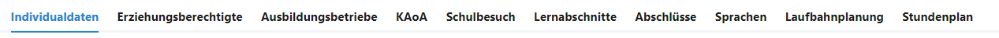

# Informationen zum SVWS-Client

Die offiziell unterstützte minimale Auflösung für die Verwendung des SVWS-Clients ist FullHD (1920 * 1080 Pixel). Nach modernen ergonomischen Gesichtspunkten für Bildschirmarbeitsplätze werden Monitore mit einer Mindestgröße von 21", besser 23", empfohlen.

## Wesentliche Bedienbereiche des SVWS-Clients

Die Programmpunkte im SVWS-Client heißen **Apps**.

Je nach Schulform werden mitunter andere Apps angezeigt.

In einer App werden nach Bedarf **Tabs** angezeigt.

Die Tabs können sich auch dymanisch ändern, etwa je nach Jahrgang wird KAoA ein- oder ausgeblendet.

Verzweigen sich die Tabs, werden **Untertabs** eingeblendet.

Hier die Untertabs können sich dynamisch verändern, zum Beispiel werden bei den Lernabschnitten je nach Bedarf die Untertabs zu Abschlussberechnungen eingeblendet.

Gibt es etwas in einer Hauptliste auszuwählen, ist dies die **Auswahlliste**.

Eventuell kann es auch zwei Auswahllisten geben. In der zweiten Auswahllisten wird eine weitere Unterauswahlen getroffen. In der Klausurplanung zum Beispiel wäre erst ein Jahrgang, dann ein Halbjahr für diesen zu wählen.

## Weitere Bedienbereiche

In einigen Bereichen gibt es nach den Untertabs noch eine weitere Unterteilung. Diese Zeile ist die **Schaltflächenleiste**.

Eventuell stehen dann noch weitere Auswahllisten zur Verfügung. Hier im Beispiel nimmt diese Liste die Form einer **Tabelle** an, aus der die Fächer gewählt werden können.

Weiterhin können manche Bereiche als **Kacheln** oder auch **Cards** angeordnet und anwählbar sein.

## Bedienung des SVWS-Clients

Der SVWS-Client wird über einen üblichen Internet Browser ausgeführt und arbeitet mit den großen Render-Engines für Browser zusammen.

### Navigation

* Kehren Sie über den Browser über die **zurück**-Schaltfläche zu einer vorherigen Seite zurück.
* Wurde über das linke Inhaltsverzeichnis ein Unterpunkt aufgerufen, lässt sich darüber eine vorherige Ebene anwählen.

 

### Zoom

Die Funktionen des Browsers werden somit direkt unterstützt, zum Beispiel können Sie das Fenster **zoomen**. Klicken Sie hierzu auf die Zoom-Schaltflächen Ihres Browers oder drücken Sie **Strg und +** oder **Strg + und -**. Über die Maus können Sie Zoomen, indem Sie **Strg** und mit dem **Mausrad hoch** oder **runter** rollen.

### Skalierung

In der SVWS-Oberfläche lässt sich weiterhin unter **Ansicht** die **Skalierung** auf *kleiner*, *normal* oder *größer* stellen.

### Kontraste

**Dark Mode:** Ebenso lässt sich im SVWS-Client ein *helles* oder *dunkles* Thema wählen. 

### Fensterbreite des SVWS-Clients

Das Fenster passt sich an die Breite des Browserfensters an. 

Die Schaltflächen zum Abmelden und Ändern der Ansicht finden sich je nach Broweserbreite oben rechts oder unten links. Weitehrin wird hier die Version des SVWS-Clients über die Client-Info angezeigt.

### Statistikrelevante Felder

Im SVWS-Client werden Felder, die für die **Amtliche Schulstatistik** relevant sind, farblich und mit einem kleinen Icon gekennzeichnet:

Hier im Beispiel wäre die *Straße* eines Lernenden nicht relevant für die Statistik, der *Wohnort* hingebgen schon. 

Bitte füllen Sie diese Felder direkt so korrekt wie möglich aus und korrigieren Sie Einträge im Vorfeld der Statistik, um dann im Statistikzeitraum schon im Vorfeld für Entlastungen gesorgt zu haben.

::: tip Tipp
Schauen Sie in die Schüsseltabellen und Eintragungshilfen von IT.NRW zur Statistik, oftmals lassen sich Fragestellungen durch eine klare Vorgabe direkt lösen.
:::

### Plausibilitätsfehler

An manchen Stellen werden offensichtliche Plausbilitätsfehler durch ein rotes Feld markiert. 

Hier im Beispiel ist ein Geburtsjahr in einer Datenbank von 2022 nicht plausibel.

### Plugins im Browser

Im Browser installierte Plugins, etwa Screenreader, lassen sich somit auch mit dieser Webseite und im SVWS-Client verwenden.

::: info Drittsoftware
Für Drittsoftware wird kein Support unternommen und ein reibungsloses Funktionieren eines externen Plugins mit den Inhalten des SVWS-Clients kann nicht garantiert werden.
:::