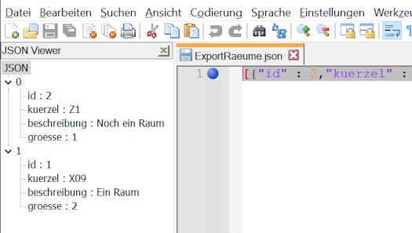

# Das JSON-Dateiformat

Der SVWS-Server und SVWS-Client nutzen die *JavaScript Object Notation*, kurz JSON, für Im- und Exportdateien.

Dieses Format ist kompakt und noch immer recht gut von Menschen zu lesen und im Bedarfsfall zu bearbeiten.

JSON-Dateien können beliebig verschachelt werden und enthalten folgende Typen von *Elementen*:

* Den **Nullwert**, ```null```. Dieser wird wie die Wahrheitswerte unten ohne Anführungszeichen eingetragen.
* Die **Boolschen Werte** ```true```und ```false```.
* Positive oder negative **Zahlen**. Bitte beachten: Das deutsche Komma in Dezimalmalen ist hier ein Punkt "**.**". ```42``` oder ```3.1415926```. 
* **Zeichenketten**, diese werden durch doppelte Anführungszeichen **"** eingeschlossen: ```"Dies ist ein Satz"```.
* **Arrays** werden in eckige Klammern **[** und **]** eingeschlossenen. Die einzelnen Elemente sind durch Kommata getrennt. Leere Arrays sind zulässig.
* **Objekte** werden durch geschweifte Klammern, **{** und **}**, eingeschlossen und enthalten eine durch Kommata getrennte, ungeordnete Liste von Eigenschaften.
    * Die **Eigenschaften** bestehen aus einem **Schlüssel**, der eine Zeichenkette ist und dem zugehörigen **Wert** eines beliebigen Datentyps.

## Beispiel: Kataloge ➜ Räume

Die json-Datei enthält zum Beispiel die Informationen zu Räumen in folgender Weise:

``` json
[{"id" : 2,"kuerzel" : "R2","beschreibung" : "Ein zweiter Raum","groesse" : 1},{"id" : 1,"kuerzel" : "R1","beschreibung" : "Ein erster Raum","groesse" : 2}]
```

Der komlette Datensatz ist hier ein Array, das mit eckigen Klammern **[]** eingefasst ist. Jeder Raum ist ein Objekt, das  in geschweifte Klammern **{}** eingefasst wurde. Folgende Räume werden durch ein Komma **,** getrennt.

Innerhalb eines Eintrags finden sich die **Schlüssel** mit den jeweils passenden Daten als **Werte**. Nach einem Doppelpunkt hinter dem Schlüssel **:** folgt der jeweilige Wert.

Zahlen werden direkt geschrieben. Text, also Zeichenfolgen, in Anführungszeichen **""** eingefasst.

Jeder neue Eintrag ist ein neues Objekt, die mit einem Komma getrennt werden.

Manche Editoren erlauben das besser lesbare Anzeigen von json-Files:



Hier im Screenshot wurde das Programm *Notepad++* mit dem Plugin *JSON Viewer* verwendet.