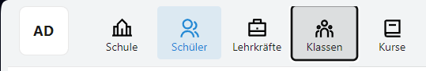
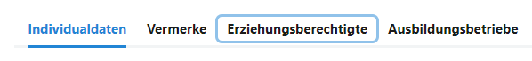
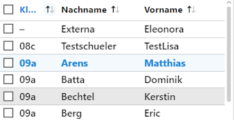
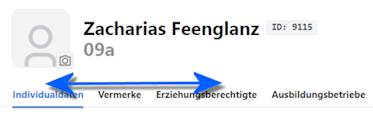

# Navigation über die Tastatur

Der SVWS-Client lässt sich auch über die Tastatur bedienen.

## Schneller Bereichwechsel

Mit der Tastenkombination ````Strg + Alt + Page Up```` beziehungweise ````Strg + Alt + Page Down```` kann zwischen den Bereichen **Apps** und vorhandenen Bereichen wie **Auswahllisten** oder unterschiedliche **Bereiche der Inhalte** in der aktuellen App hin- und herwechseln.

Ohne die Tastatursteuerung ist der aktuell fokussierte Bereich nicht erstichtlich drücken Sie ````Tab````, um durch die einzelnenen Elemente in einem Bereich vorwärts durchzuschalten.

Drücken Sie ````Shift + Tab```` um die Bereiche rückwärts durchzuschalten.

Drücken Sie ````Strg + Alt + Page Up```` beziehungsweise ````Page Down````, um die **Bereiche** zu wechseln. Ein neuer Druck auf ````Tab```` hebt das aktuell fokussierte Element hervor und weitere Drücke auf ````Tab```` und ````Shift + Tab```` werden verwendet, um die Elemente durchzugehen.



Hier im Screenshot wurde mit ````Strg + Alt + Page Up```` der **App**-Bereich erreicht, dann wurde mit ````Tab```` der Fokus aktiviert. Die blaue Hervorhebung um *Schüler* zeigt an, dass dieser gerade angezeigt wird. Der schwarze Rahmen um *Klassen* ist der Fokus. Mit einem Druck auf ````Enter```` kann nun zu *Klassen* gewechselt werden.



Im Beispiel oben wurde auf den **Tab**-Bereich gewechselt. Aktuell sind die *Individualdaten* angezeigt. Schaltet man die Tabs mit mit ````Tab```` durch, zeigt der blaue Rahmen den jeweiligen Fokus an. Mit ````Enter```` kann dieser Tab nun aktiviert werden.

Die Tasten ````Page Up```` und ````Page Down```` heißen auf deutschen Tastaturen manchmal auch ````Bild auf```` und ````Bild ab```` oder ````Bild```` mit einem kleinen Pfeil hoch oder runter. 

## Navigation in Auswahllisten

In **Auswahllisten**, also Schüler, Lehrkräfte, Kurse und so weiter, kann mit ````Pfeiltaste hoch```` und ````Pfeiltaste runter```` durch die Listenelemente oder die zugehörigen Auswahlboxen geschaltet werden.

Ist ein *Listenelement* fokussiert, wird durch die Pfeiltasten das nächste beziehungsweise das vorherige Listenelment fokussiert.

Ist eine *Auswahlox* fokussiert wird durch die Pfeiltasten der Fokus auf die nächste beziehungsweise vorherige Auswahlbox gesetzt.

Mit ````Tab```` kann zwischen der Wahl der *Auswahlboxen* und der *Listenelemente* umgeschaltet werden. Das heißt, ist eine Auswahlbox fokussiert, kann mit den Pfeiltasten direkt zu den Auswahlboxen gesprungen werden. Ist ein Listenelemnt ausgewählt, wird mit den Pfeiltasten nur das nächste beziehungsweise vorherige Listenelement erreicht. 

Mit der ````Eingabetaste```` werden bei Fokus auf einem Listenelement die zugehörigen Daten im Inhaltsbereich rechts geladen.

Mit der ````Leertaste```` wird bei Fokus auf einem Listenelement oder einer Auswahlbox das Element für die Ausführung von Gruppenprozessen ausgewählt. Somit lassen sich also Auswahlboxen an- oder abwählen.

 

Im Beispiel sind die zwei Modi zu sehen. Links werden die *Listenelemente* durchgegangen, rechts sind die *Auswahlboxen* aktiv und werden mit den ````Pfeiltasten hoch```` und ````Pfeiltaste runter```` direkt angesprungen.

## Schneller Tab-Wechsel im Inhaltsbereich

Mit der Tastenkombination ````Strg + Alt + Pfeiltaste links```` beziehungsweise ````Strg + Alt + Pfeiltaste rechts```` kann der aktuelle *Tab* im Inhaltsbereich gewechselt werden. 



Hierbei wird dann der zugehörige Inhalt geladen.