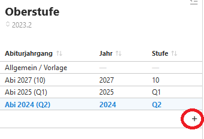
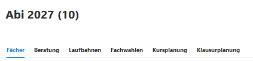

# Einrichtung der Jahrgänge
Bevor Sie einen Jahrgang hinzufügen, können Sie unter **Allgemein/Vorlage** die Vorlage für zu generierende Jahrgänge konfigurieren, auf welcher neu erzeugte Jahrgänge basieren.

Durch einen Klick auf das **+** können basierende auf den an der Schule aktiven Jahrgangsstufen kommende Abiturjahrgänge erzeugt werden.

Nach dem Anlegen kann ein Jahrgang aus der Liste unter **Oberstufe** ausgewählt werden.

Es können im Anschluss die **allgemeine Vorlagen** oder individuell **ein konkreter Abiturjahrgang** bearbeitet werden hinsichtlich der folgenden Punkte:
1. Fächereigenschaften
2. Ausschlussregeln
3. Weitere Kombinationsbedingungen
4. Beratungslehrkräfte
5. ...

Nach Anklicken eines angelegten Jahrganges erweitert sich die Auwahl im rechten Fenster des Jahrganges:

Konfigurieren Sie nun den Jahrgang über die Einstellungen in den Reitern.