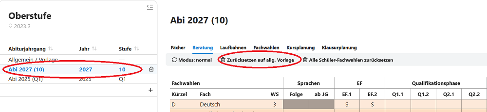
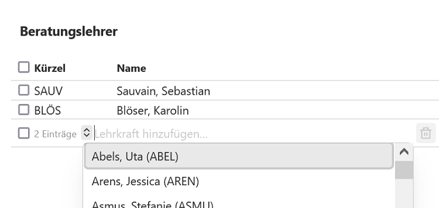
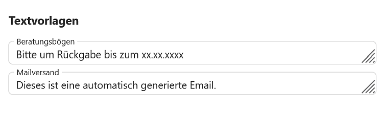

# Beratung

## Vorlage Beratungsbogen
Im Beratungsbogen kann unter **Allgemein/Vorlage** eine Standardvorlage erstellt werden.

Im Beispiel sind *M* und *Sp* belegt, da diese Fächer - ebenso wie *D* - eine Pflichtbelegung darstellen.

Der Einsatz solcher Vorlagen ist optional.

 

## Vorlage in Abschnitt übernehmen
Nach Auswahl einer der angelegten Abiturjahrgänge kann für diesen die **Vorlage geladen** werden.  
Ebenso kann diese Vorlage jetzt noch einmal **individuell für die ausgewählte Jahrgangsstufe angepasst** werden.
Diese Vorlage wird beim späteren Export der Schülerdateien, etwa in die \*.lp-Dateien, die nun die alten LuPO-Schülerdateien ersetzen, übernommen werden.  

 

Klicken Sie in einem gewählten Jahrgang auf **Zurücksetzen auf allg. Vorlage**, um die aktuell konfigurierte Vorlage in einem Jahrgang zu aktivieren.

## Beratungslehrer hinterlegen
Im Feld rechts neben der Beratungsbogenvorlage können **Beratungslehrer der Stufe** hinterlegt werden.  

 

Ganz unten können für den Ausdruck der Beratungsbögen oder einen Email-Versand **Textverlagen** eingetragen werden.

 

