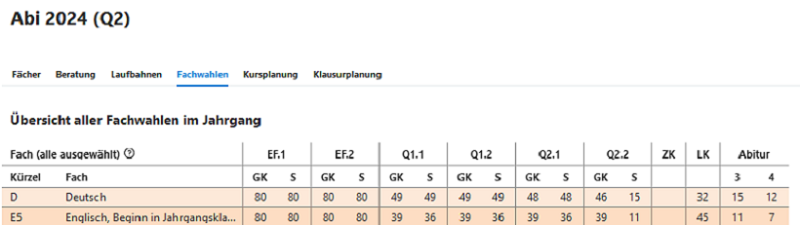
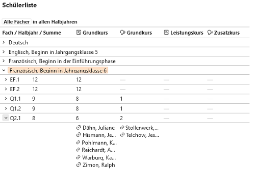

# Fachwahlen

Hier finden Sie eine Übersicht über die Fachwahlen des ausgewählten Jahrgangs zum ausgewählten Lernabschnitt. 

Es werden tabellarisch die Anwahlzahlen für eine Jahrgangsstufe in den jeweiligen Abschnitten angezeigt:

Rechts in der Schülerliste finden sich diese Werte nocheinmal genauer aufgelistet, zusätzlich sind auch jeweils entsprechende Namenslisten hinterlegt.
Von diesen Listen kann **direkt zur individuellen Schülerlaufbahn** navigiert werden.

