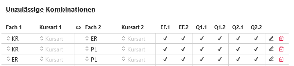
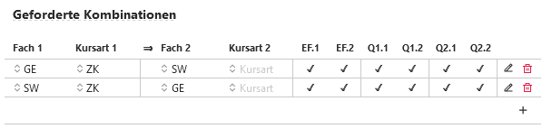

## Angebotene Fächer

Unter Fächer wird als Vorlage oder individuell für jeden Jahrgang festgelegt, in welchem Abschnitt ein Fach angeboten wird und ob es als Abiturfach im GK oder LK belegbar ist.


 


## Unzulässige Kombinationen

Sind an Ihrer Schule manche Kombiniationen unzulässig, lassen sich diese unter **unzulässige Kombinationen** hinterlegen.

Es genügt, eine unzulässige Kombinationen einmal einzutragen, schließt Fach A das Fach B aus, gilt dies auch automatisch andersherum. 

Hinweis: Durch Importe wird eventuell eine Kombination doppelt eingetragen.

**Beispiel:**

```
KR schließt ER aus
und
ER schließt KR aus.
```

In einem solchen Fall kann eine der Eintragungen gelöscht werden.

 

## Geforderte Kombinationen 

Bedingt die Wahl eines bestimmten Faches die Wahl eines anderen Faches, kann die Bedingung in der logischen Reihenfolge unter **geforderte Kombinationen** eingetragen werden.

Die Gründe für geforderte Kombinationen können eine möglichen Profilbildung, aber auch organisatorisch bedingt sein.

Zum Beispiel könnte bei einem sprachlichen Profil ein Deutsch-LK zwangsläufig an den Englisch-LK gekoppelt sein oder bei einem biochemischen Profil könnte das Belegen eines Bio-LKs erfordert auch das belegen eines Chemie-GKs.

Hier ist zu beachten, dass ein *Fach* jeweils mit einer *Kursart* anzugeben ist. Daher könnten und müssen GKs, LK, ZKs, PKs oder ähnlich getrennt verwaltet werden.

Wird die *Kursart* frei gelassen, ist die Kursart beliebig.



## Hinweis zur Festlegung von Kombinationen

Legen Sie nur so wenige Kombinationen fest, die gefordert beziehungsweise unzulässig sind, wie nötig.

Alle von der APO GOSt festgelegten Rahmenbedingungen sind nicht hier einzustellen, sondern sollten im System hinterlegt sein.

## Beispiele

*ER schließt KR aus*: Daher erhalten im Beratungsbogen beide Fächer einen Warnhinweis.

*GE-ZK fordert SW-GK*: Daher erhält *SW* bei Wahl von *GE-ZK* einen Warnhinweis.

Anmerkung: Derzeit besteht keine Möglichkeit von **oder**-Forderungen, also beispielsweise *GE-ZK fordert SW-LK* **oder** *SW-GK*


 