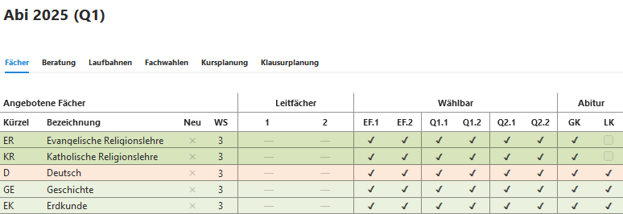

## Angebotene Fächer

Hier wird (als Vorlage oder auch individuell für jeden Jahrgang) festgelegt, in welchem Abschnitt ein Fach und ob es als Abiturfach (GK oder LK) angeboten wird.

 

## Unzulässige Kombinationen
Hier können an Ihrer Schule unzulässige Kombinationen festgelegt werden. 
Es genügt, Kombinationen einmal einzutragen. Durch Importe ist evtl. eine Kombination doppelt eingetragen.  
Beispiel:
KR schließt ER aus  
und 
ER schließt KR aus. 
In einem solchen Fall kann eine der Eintragungen gelöscht werden.

 

## Geforderte Kombinationen 
Bedingt die Wahl eines bestimmten Faches die Wahl eines anderen Faches, so kann die Bedingung in der logischen Reihenfolge hier eingetragen werden. 
Die Gründe für solche Bedingungen können eine möglichen Profilbildung aber auch organisatorisch sein. 

 

## Beispiele

*ER schließt KR aus*. Daher erhalten im Beratungsbogen beide Fächer einen Warnhinweis. 

*GE-ZK fordert SW-GK*. Daher erhält *SW* bei Wahl von *GE-ZK* einen Warnhinweis. 

Anmerkung: Derzeit beteht keine Möglichkeit von **oder**-Forderungen, also z.B.*GE-ZK fordert SW-LK* **oder** *SW-GK*

 