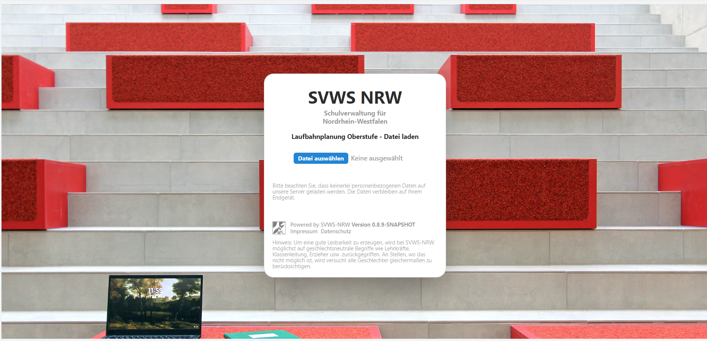

# WebLuPO 

Ein webbasiertes Tool zur Laufbahnberatung und -planung für die gymnasiale Oberstufe in NRW.

## Kurze Funktionsbeschreibung:

Schülerinnen und Schüler erhalten eine .lp-Datei zur Erfassung ihrer Fachwahlen und Laufbahnplanung in der gymnasialen Oberstufe. Diese Datei enthält die grundlegenden Rahmenbedingungen für Wahlmöglichkeiten und Kurskombinationen, die von der Schule festgelegt wurden, sowie die erforderlichen individuellen Daten (Name, E-Mail usw.). Die Datei kann über eine Webseite entschlüsselt und geöffnet werden. Ein Testserver ist unter [weblupo.svws-nrw.de](https://weblupo.svws-nrw.de) verfügbar.

Nach erfolgreicher Bearbeitung kann die Datei durch Drücken des 'Exportieren'-Buttons wieder verschlüsselt auf dem Client-Endgerät gespeichert und von den Oberstufenkoordinatoren eingesammelt werden. Informationen zur Installation des WebLuPO-Servers und weitere technische Hintergrundinformationen finden Sie unter [doku.svws-nrw.de](https://doku.svws-nrw.de/Projekte/weblupo/). 

## Erzeugen der Laufbahnplanungsdateien

### Einzelne Dateien

Sie können bei Bedarf individuell für jeden Schüler oder jede Schülerin die jeweilige Laufbahnplanungsdatei exportieren. Hierzu wählen Sie bitte unter 'Schüler' den Tab 'Laufbahnplanung' aus. Im oberen Menü finden Sie den Punkt 'Exportieren', durch den eine .lp-Datei vom Server in Ihren Downloadordner gespeichert wird. Falls der Tab 'Laufbahnplanung' dort noch nicht zu sehen ist, muss für diesen Jahrgang unter 'Oberstufe' ein neuer Abiturjahrgang angelegt werden. Nach entsprechender Bearbeitung kann diese Datei durch den 'Import'-Button wieder ins System eingelesen werden.

## Stufenweise 

Der Download einzelner Dateien kann auch für eine ganze Jahrgangstufe durchgeführt werden. Gehen Sie hierzu auf den Tab 'Laufbahnen' unter 'Oberstufe' und drücken Sie den Button 'Exportiere alle'. Eine .zip Datei wird daraufhin in Ihrem Downloadordner gespeichert. Diese Datei enthält die eindeutig benannten, individuellen .lp Dateien für jede Schülerin und jeden Schüler dieser Stufe.
Nach der Bearbeitung können Sie diese Dateien wieder ins System importieren, indem Sie auf die Schaltfläche 'Importieren' klicken.

# Berabeitung im WebLuPO

Die Webanwendung WebLuPO ermöglicht das Laden individueller Schülerdateien im Format .lp.
Dabei wird das ausführbare Programm effektiv aus dem Netz geladen, sodass die Schülerdaten das Endgerät, an dem der Schüler arbeitet, nicht verlassen. 
Die folgende Grafik zeigt die vier Bereiche der Laufbahnberatungstools.

Im ersten Bereich können Sie den Modus einstellen und haben Zugriff auf Speicher- und Bearbeitungsmöglichkeiten.   

Der Modus 'normal' und 'hochschreiben' füllt automatisch die im zweiten Bereich angegebenen Fachwahlen auf und passt sie sinnvoll an die höheren Jahrgänge an. Durch einen Doppelklick auf die einzelnen Felder der Tabelle im zweiten Bereich können Sie zwischen Grundkurs, Leistungskurs, etc. wählen.  

Im dritten Bereich wird automatisch die Anzahl der belegten und anrechenbaren Kurse berechnet. Die Farbgebung von rot bis dunkelgrün gibt Ihnen direkt Feedback zur Anzahl der Kurse. Im vierten Bereich werden die Regeln für die Oberstufenbelegung algorithmisch ausgewertet und die noch zu erfüllenden Bedingungen angezeigt. Hier kann der Modus EF.1, Gesamtprüfung oder automatisch gewählt werden.   

Interessant ist auch die Einstellung "Planung merken" im ersten Bereich, die das Festhalten einer Einstellung in der Tabelle ermöglicht. Somit können Schülerinnen und Schüler von einem Ausgangspunkt aus schnell mehrere Planungen ausprobieren und wieder zurücksetzen. 