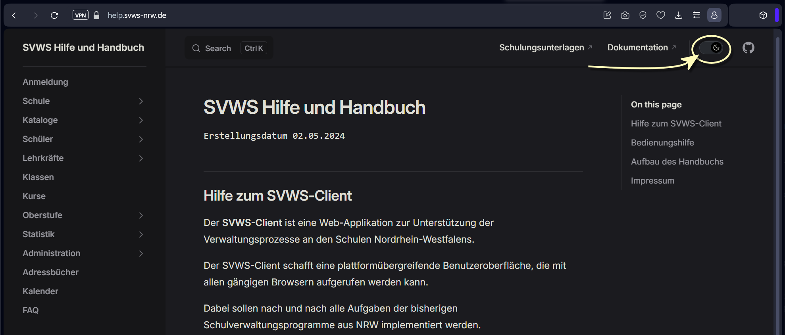
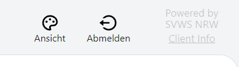

# SVWS Benutzerhandbuch

## Hilfe zum SVWS-Client 

Der **SVWS-Client** ist eine Web-Applikation zur Unterstützung der Verwaltungsprozesse an den Schulen Nordrhein-Westfalens.  

Der SVWS-Client schafft eine plattformübergreifende Benutzeroberfläche, die mit allen gängigen Browsern aufgerufen werden kann.

Dabei sollen nach und nach alle Aufgaben der bisherigen Schulverwaltungsprogramme aus NRW implementiert werden.

* Der SVWS-Client ersetzt bereits die Programme **LuPO** zur Laufbahnberatung in der gymnasialen Oberstufe und
* **Kurs42** zur Erstellung von Blockungen.
* Er die **Individual- und Leistungsdaten der Schülerinnen und Schüler** verwalten.
* Die **Verwaltung der Lehrkräfte** ist ebenfalls möglich.
* Zusätzlich zu den bisherigen Angeboten ist im SVWS-Client eine komfortable Anzeige von **Stundenplänen** hinzugekommen.

Das Gesamtprojekt _SVWS-Server_ ist ein Open-Source-Projekt des Landes Nordrhein-Westfalen.

## Aufbau des Handbuchs 

# Bedienungshilfe

## Diese Webseite

Auf der **linken** Seite des Fensters befindet sich das Inhaltsverzeichnis dieser Seite. In der **Mitte** sind die Informationen angezeigt. **Rechts** ist das *Inhaltsverzeichnis des Artikels* angezeigt.

Oben rechts können Sie die Webseite je nach Belieben vom *Hellen* Modus in den *Dunklen* Modus umstellen.

*Hinweis:* Ist das Browserfenster zu schmal eingestellt, wird der rechte Bereich ausgeblendet.

## Der SVWS-Client

Der SVWS-Client wird über einen üblichen Internet Browser ausgeführt und arbeitet mit den großen Render-Engines für Browser zusammen.

### Navigation

* Kehren Sie über den Browser über die **zurück**-Schaltfläche zu einer vorherigen Seite zurück.
* Wurde über das linke Inhaltsverzeichnis ein Unterpunkt aufgerufen, lässt sich darüber eine vorherige Ebene anwählen.

 

### Zoom

Die Funktionen des Browsers werden somit direkt unterstützt, zum Beispiel können Sie das Fenster **zoomen**. Klicken Sie hierzu auf die Zoom-Schaltflächen Ihres Browers oder drücken Sie **Strg und +** oder **Strg + und -**. Über die Maus können Sie Zoomen, indem Sie **Strg** und mit dem **Mausrad hoch** oder **runter** rollen.

### Skalierung

In der SVWS-Oberfläche lässt sich weiterhin unter **Ansicht** die **Skalierung** auf *kleiner*, *normal* oder *größer* stellen.

### Kontraste

**Dark Mode:** Ebenso lässt sich im SVWS-Client ein *helles* oder *dunkles* Thema wählen. 

### Fensterbreite des SVWS-Clients

Das Fenster passt sich an die Breite des Browserfensters an. 

Die Schaltflächen zum Abmelden und Ändern der Ansicht finden sich je nach Broweserbreite oben rechts oder unten links. Weitehrin wird hier die Version des SVWS-Clients über die Client-Info angezeigt.

### Statistikrelevante Felder

Im SVWS-Client werden Felder, die für die **Amtliche Schulstatistik** relevant sind, farblich und mit einem kleinen Icon gekennzeichnet:

Hier im Beispiel wäre die *Straße* eines Lernenden nicht relevant für die Statistik, der *Wohnort* hingebgen schon. 

Bitte füllen Sie diese Felder direkt so korrekt wie möglich aus und korrigieren Sie Einträge im Vorfeld der Statistik, um dann im Statistikzeitraum schon im Vorfeld für Entlastungen gesorgt zu haben.

**Tipp:** Schauen Sie in die Schüsseltabellen und Eintragungshilfen von IT.NRW zur Statistik, oftmals lassen sich Fragestellungen durch eine klare Vorgabe direkt lösen.

### Plausibilitätsfehler

An manchen Stellen werden offensichtliche Plausbilitätsfehler durch ein rotes Feld markiert. 

Hier im Beispiel ist ein Geburtsjahr in einer Datenbank von 2022 nicht plausibel.

### Plugins im Browser

Im Browser installierte Plugins, etwa Screenreader, lassen sich somit auch mit dieser Webseite und im SVWS-Client verwenden.

*Hinweis:* Für Drittsoftware wird kein Support unternommen und ein reibungsloses Funktionieren eines Plugins mit den Inhalten des SVWS-Clients kann nicht garantiert werden.

## Impressum

Ministerium für Schule und Bildung des Landes Nordrhein-Westfalen

Völklinger Straße 49, 40221 Düsseldorf

Telefon: +49 211 5867 40

 
