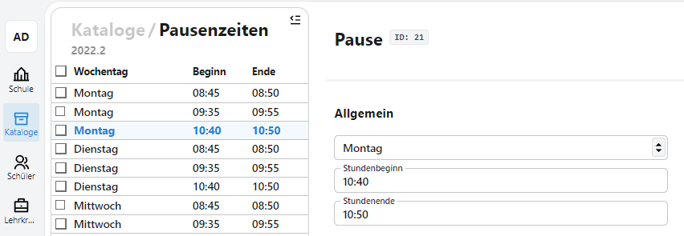
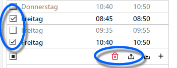

# Pausenzeiten

Die Katalogeinträge für *Räume*, *Pausenzeiten*, *Zeitraster*, *Klassen* und *Aufsichtsbereiche* werden bei der Stundenplanerstellung zusammengeführt.

Über den Katalog lassen sich die Pausenzeiten der Schule definieren.



Im rechten Bereich lassen sich exitierende Pausenzeiten bearbeiten.

Über das **+** lassen sich neue Pausenzeiten hinzufügen.

Im Dropdown-Menü können Wochentage angehakt werden, für die hier angegebene Pausenzeiten gelten sollen.


Geben Sie die Pausenzeiten ein. Bestätigen Sie mit ```Pausenzeit hinzufügen```, anschließen wird für einen Tag eine Pause im gewählten Zeitraum angelegt.


Über die Checkbox lassen sich Pausenzeiten anwählen und **löschen** oder **exportieren**. Die Zeiten werden als json-Datei gespeichert.



Über das Icon rechts daneben werden Pausenzeiten aus einer json-Datei **importiert**. Noch einmal daneben befindet sich das **+**, um Zeiten hinzuzufügen.

Konsultieren Sie die Anleitung für json-Dateien.

