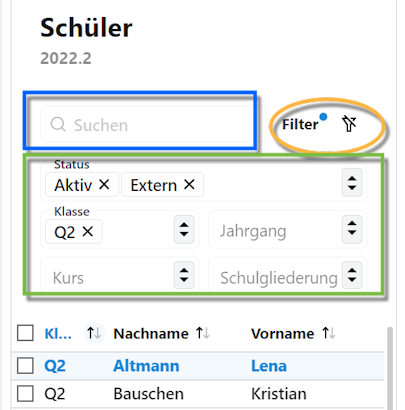
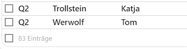

# Schüler

## Aufteilung des Bildschirms
Über die Schaltfläche **Schüler** erreichen Sie alle für einen Schüler oder Schülerin relevanten Daten. Diese reichen von den Individualdaten über die Daten zu Stundenplan, Laufbahn bis hin zu den Leistungsdaten.  

Der Schülerbildschirm zeigtauf der **linken Seite** alle ausgew#hlten Schüler, per Standard ist hier zuerst einmal die ganze Schule ausgewählt.

Auf der **rechten Seite** erscheinen die Daten zum ausgewählten Datensatz einer Person.

## Die Schülerauswahl

Um die angezeigten Schüler einzugrenzen, bietet die Schülerauswahl auf der linken Seite eine Reihe von Möglichkeiten:

Über das hier im Screenshot blau markierte Feld lässt sich **suchen**. Hierbei wird die Eingabe mit sowohl den *Vor-* wie auch mit den *Nachnamen* abgeglichen und die Schülerauswahl wird auf die Funde reduziert.

Im grünen Viereck sind die **Filter** aufgeführt.
* Ein Filtern auf den **Status** lässt aktive oder auch Schüler mit Abschluss auswählen. Per Standard werden hier die Aktiven und Externen Schüler angezeigt, welche im normalen Schulbetrieb befindlichen Personen abbilden.
 Es lassen sich hier auch mehrere Status gleichzeigt anwählen.

  * Im Zuge der Aufnahme lassen sich Personen im Status *Warteliste* parken. Personen, die für das kommende Schuljahr aufgenommen wurden, erhalten den Status *Neuaufnahme*.
  * Schüler, die ihre Bildungslaufbahn an der Schule hinter sich haben, verfügen über den Status *Abgang* oder *Abschlus s*. Letzteren Status erhalten Sie, wenn sie einem von ihrem vorgesehenen BIldungsgang erhaltenen Abschluss erlangt haben.

* Weiterhin lassen sich auf **Jahrgänge** und/oder **Klassen** filtern.
* Ebenso stehen die eingerichteten **Kurse** zur Auswahl.
* Verfügt die Schule über mehrere **Gliederungen**, ist eine Filterung auf diese ebenfalls möglich.

Im organen Oval lässt sich der Filter wieder aufheben. Dass die aktuelle Auswahl gefiltert wurde, wird über einen blauen Punkt hinter *Filter* kenntlich gemacht. Klicken Sie auf den durchgestrichenen Filter, um den Filter zurückzusetzen und wieder die ganze Schule angezeigt zu bekommen.

  Weiterhin bekommen Sie im Fuß der Schülerliste die Summe der Personen in der Auswahl angezeigt.

  

  **Tipp:** Wenn die Schülerzahl der Schule oder des Jahrgangs bekannt ist, ist hier auch ersichlich, dass gerade ein Filter aktiv ist.

  ----

  Manche Funktionen lassen eine **Operation über mehrere Personen** zu.

  Wählen Sie dafür die betreffenden Schülerinnen und Schüler über die Checkboxen ☑ an oder ab.